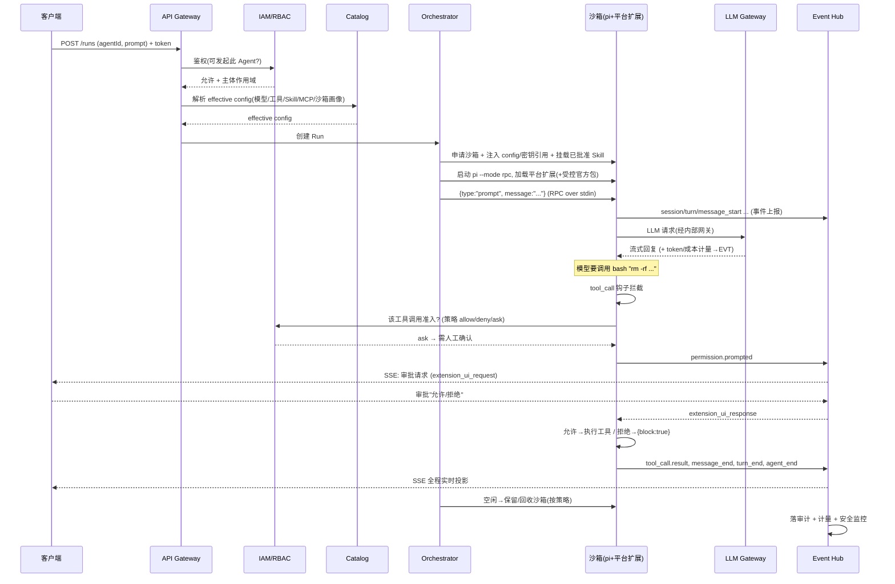
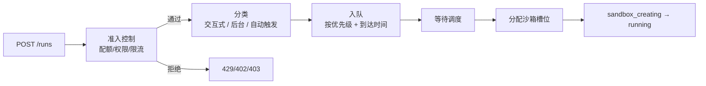
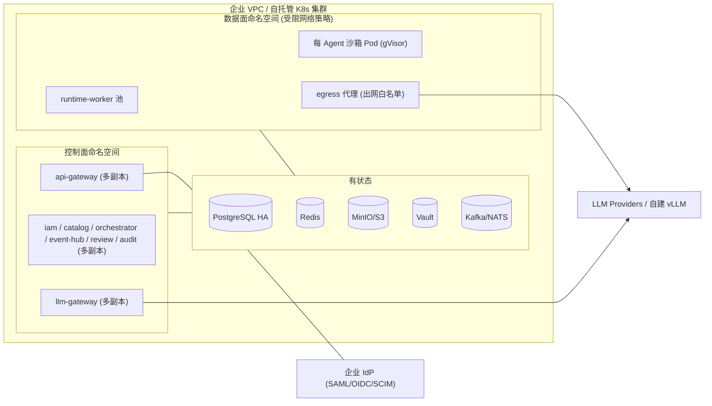

# 03 · 系统架构

本文给出总体架构（控制面 / 数据面 / 客户端三分）、核心组件职责、一次 Agent Run 的端到端时序、技术栈与部署拓扑。

---

## 1. 总体分层

```mermaid
flowchart TB
    subgraph Clients["客户端层 Clients（瘦客户端，不依赖本地环境）"]
        Web["Web 控制台<br/>(管理 + 工作台)"]
        Desktop["桌面端<br/>(Tauri/Electron)"]
        CLI["Polaris CLI"]
        SDKc["SDK (TS/Python)"]
        Ext["IDE / Slack / CI 集成"]
        ThirdCLI["第三方 CLI/工具<br/>(Claude Code/Codex CLI/Continue…)"]
    end

    subgraph Control["控制面 Control Plane（无状态、可水平扩展）"]
        GW["API Gateway / BFF<br/>(REST + SSE 出口)"]
        IAM["身份与 RBAC 服务<br/>Org/Group/Project/User/Role/Policy"]
        Catalog["目录服务 Catalog<br/>Agent/Model/MCP/Skill 定义+版本+可见域"]
        Review["Skill 安全评估服务<br/>静态扫描 + LLM 风险判定 + 人审工作流"]
        Orch["运行编排器 Orchestrator<br/>调度 Run、分配沙箱、驱动 pi"]
        EventHub["事件中枢 Event Hub<br/>事件溯源 + SSE 扇出"]
        Audit["审计 + 计量服务"]
        Secrets["密钥服务 (Vault/KMS)"]
        LLMGW["LLM Gateway<br/>Polaris GW (鉴权+白名单+审计)<br/>+ LiteLLM 引擎 (协议适配+代理)"]
    end

    subgraph Data["数据面 Data Plane（隔离执行）"]
        subgraph Sandbox1["Agent 沙箱 #1 (容器/microVM)"]
            Pi1["pi 进程 (--mode rpc)"]
            PExt1["平台扩展 + 受控官方包<br/>闸门/上报 + pi-mcp-adapter/pi-subagents"]
            WS1["工作区 FS"]
            MCP1["MCP sidecars"]
            Proxy1["出网代理(白名单)"]
        end
        SandboxN["Agent 沙箱 #N ..."]
        Pool["沙箱预热池 + 编排<br/>(K8s + gVisor/Kata/Firecracker)"]
    end

    subgraph Stores["存储 Stores"]
        PG[("PostgreSQL<br/>元数据/RBAC/目录/审计")]
        Redis[("Redis<br/>队列/PubSub/SSE/缓存")]
        OS[("对象存储 S3<br/>会话JSONL/Skill包/产物")]
        Bus[("事件日志<br/>Redis Streams→Kafka/NATS")]
    end

    Providers["外部/自建 LLM Providers"]

    Clients -->|HTTPS| GW
    ThirdCLI -->|HTTPS (OpenAI/Anthropic 兼容 API)| LLMGW
    GW --> IAM
    GW --> Catalog
    GW --> Review
    GW --> Orch
    GW --> EventHub
    GW --> Audit
    Orch --> Pool
    Pool --> Sandbox1
    Pool --> SandboxN
    Orch <-->|RPC stdin/stdout| Pi1
    Pi1 --- PExt1 --- WS1
    PExt1 --- MCP1
    Sandbox1 -->|egress| Proxy1 --> Providers
    PExt1 -->|工具调用鉴权| IAM
    PExt1 -->|事件| EventHub
    Pi1 -->|LLM 请求| LLMGW --> Providers
    EventHub --> Bus
    EventHub -->|SSE| GW
    LLMGW --> Audit
    Catalog --> OS
    IAM --> PG
    Catalog --> PG
    Audit --> PG
    EventHub --> Redis
    Orch --> Redis
    Secrets -.间接下发.-> Sandbox1
    Review --> Catalog
```

**三面职责一句话**：
- **控制面**：决定"谁能用什么、跑什么、看什么"，编排但不亲自执行 Agent 逻辑。无状态，水平扩展。
- **数据面**：真正跑 Agent 的隔离沙箱；pi 进程在此，平台扩展与受控官方包（`pi-mcp-adapter`/`pi-subagents`）在此，工具在此执行。
- **客户端**：瘦客户端，只通过 REST+SSE 与控制面对话；无本地密钥/算力/环境依赖。桌面端/CLI 是遥控器而非引擎——Agent 永远在云端沙箱中执行，本地不做 Agent 运行时。
- **第三方 CLI/工具**：Claude Code、Codex CLI、Continue 等工具可将 `base_url` 指向 LLM Gateway 的 OpenAI/Anthropic 兼容端点，配合用户自己的 API Key 直接调用 LLM（纯模型调用，无 Agent/Run 能力）。调用全量经 Gateway 审计。

---

## 2. 核心组件职责

### 控制面

| 组件 | 职责 | 关键点 |
|---|---|---|
| **API Gateway / BFF** | 统一入口；认证、限流、路由；REST 应答 + SSE 长连接出口 | SSE 在此终结，按 RBAC 过滤后下发 |
| **身份与 RBAC (IAM)** | 组织/业务组/项目/用户/角色/策略；SSO/SCIM；签发会话与服务账号令牌；**工具调用鉴权决策点（PDP）** | 平台扩展（PEP）实时回调 IAM 做工具准入裁决 |
| **目录服务 (Catalog)** | Agent/Model/MCP/Skill 的定义、版本、可见域、继承与锁定；解析"某用户在某项目的有效配置" | 配置解析器输出沙箱可消费的 effective config |
| **Skill 安全评估** | 发布工作流状态机；静态扫描器、LLM 风险判定、能力清单核对、人审分配 | 见 [06](./06-capabilities-skills-mcp-subagents.md) |
| **运行编排器 (Orchestrator)** | 受理 Run 请求、申请沙箱、注入 effective config、启动并驱动 pi RPC、管理生命周期 | 维护 RPC 子进程会话；崩溃恢复/续跑 |
| **事件中枢 (Event Hub)** | 收敛 pi 事件 + 平台事件 → append-only 日志 → SSE 扇出 / 审计 / 计量 / 安全监控 | 事件溯源唯一事实源（见 [08](./08-observability-and-sse.md)） |
| **审计 + 计量** | 不可篡改审计；token+沙箱时长归一计费；配额/预算告警 | 从事件流派生 |
| **密钥服务** | provider key、MCP 凭据、用户/项目密钥的托管与间接下发 | 明文绝不过客户端/会话 |
| **LLM Gateway** | 所有模型流量的统一出口。双层架构：**Polaris Gateway** 负责用户 Key 鉴权 + 模型白名单校验（四级作用域继承）+ 审计日志；**LiteLLM 引擎**（内嵌）负责 100+ provider 协议适配、流式代理、故障切换/重试、速率限制、成本追踪。对外暴露 OpenAI `/v1/chat/completions` 与 Anthropic `/v1/messages` 兼容 API | pi 经自定义 provider 指向它；第三方 CLI 可直接接入。LiteLLM 不直接面向用户——Polaris Gateway 是唯一入口 |

### 数据面（单个 Agent 沙箱内部）

| 元素 | 职责 |
|---|---|
| **pi 进程** | `pi --mode rpc`，执行 Agent 循环与内置工具（read/bash/edit/write…） |
| **平台扩展 + 受控官方包** | 平台扩展承载 `tool_call` 闸门、事件上报、Gateway provider；并受控装载 `pi-mcp-adapter`（MCP）与 `pi-subagents`（子 Agent），其工具调用同样过闸门 |
| **工作区 FS** | Agent 的隔离文件系统（仓库、产物） |
| **MCP sidecars** | 按需启动的 MCP server 进程，受能力清单约束 |
| **出网代理** | 默认拒绝 + 白名单的 egress 网关 |

---

## 3. 一次 Agent Run 的端到端时序



要点：**鉴权在控制面（PDP=IAM），强制在数据面（PEP=平台扩展的 `tool_call` 钩子）**；审批走 pi 原生的 `extension_ui_request/response` 往返，由 Event Hub 桥接到客户端 SSE。

---

## 4. Agent 任务队列与优先级

当并发 Run 请求超过沙箱池容量时，需要一个明确的排队与调度策略。

### 4.1 排队模型



### 4.2 优先级定义

| 优先级 | 名称 | 适用场景 | QoS |
|---|---|---|---|
| **P0 (Critical)** | 紧急审批响应 | 管理员触发的 `extension_ui_response`（审批返回） | 抢占式（可抢占 P3 的沙箱槽位） |
| **P1 (High)** | 交互式 Run | 用户在 Web/桌面端发起的实时 Agent 任务 | 优先排队（权重 4×） |
| **P2 (Normal)** | 后台 Run | API/SDK 发起的异步任务、CI 触发的 Run | 默认（权重 1×） |
| **P3 (Low)** | 批量/定时 Run | 定期安全扫描、批量代码审查 | 尽力而为（权重 0.25×），可被 P0 抢占 |
| **P4 (Best-effort)** | 后台非紧急 | 子 Agent 的独立 Run（可降级到 P3） | 最低优先，使用闲置容量 |

### 4.3 排队策略

```yaml
queueConfig:
  maxQueueDepth: 100          # 全局最大排队 Run 数
  maxQueueTime: 600s          # 最大排队等待时间（超时 → rejected）
  
  priorityWeights:
    interactive: 4            # P1 权重
    background: 1             # P2 权重
    batch: 0.25               # P3 权重
  
  preemption:
    enabled: true
    preemptiblePriorities: [P3, P4]   # 可被抢占的优先级
    preemptingPriorities: [P0]        # 可执行抢占的优先级
    gracefulShutdown: 30s             # 抢占前给 30s 保存现场
  
  fairness:
    maxConsecutiveDispatches: 10      # 同一用户连续分配上限
    starvationTimeout: 300s           # P3 排太久自动升权到 P2
```

### 4.4 准入控制

```
准入检查（入队前）:
  1. 用户级并发限制: 单用户最多 N 个 running Run (默认 5)
  2. 项目级并发限制: 单项目最多 M 个 running Run (默认 20)
  3. 全局并发限制: 系统总 running Run ≤ 沙箱池最大容量 × 1.2 (允许排队)
  4. 配额检查: 用户/项目信用余额 > 0
  5. 速率限制: 单用户每 10s 最多创建 3 个 Run

排队等待检查（分配前）:
  1. 沙箱池有空闲槽位
  2. 项目/用户配额仍然充足 (排队期间可能已被消费)
  3. 等待超时未到
```

### 4.5 队列满的行为

| 条件 | 行为 | HTTP 状态码 |
|---|---|---|
| 队列满 (≥100 等待) | 返回 `Retry-After` header + 建议稍后重试 | 503 |
| 用户并发超限 | 返回当前 running 列表 + 等待数 | 429 |
| 项目并发超限 | 返回项目当前 running 数 + 限制值 | 429 |
| 配额不足 | 返回剩余配额 + 建议充值 | 402 |
| 等待超时 | 返回等待时间 + 建议增大超时或降低优先级 | 408 |

### 4.6 子 Agent 的特殊处理

| 场景 | 策略 |
|---|---|
| 父 Agent 派生子 Agent | 子 Agent 默认继承父的优先级；不经过全局队列（父已持有资源） |
| 独立沙箱子 Agent | 若需独立沙箱 → 走正常队列（优先级=父优先级-1），单独排队 |
| 扇出上限 | 父 Agent 同时最多派生 N 个子 Agent（默认 5），超限排队 |
| 成本保护 | 子 Agent 派生前，Orchestrator 检查配额（token+沙箱时长），不足则拒绝派生 |

### 4.7 监控指标

| 指标 | 说明 |
|---|---|
| `queue_depth` | 当前排队 Run 数（按优先级分桶） |
| `queue_wait_time_p95` | 各优先级排队等待时间 p95 |
| `preemption_count` | 抢占次数（按小时） |
| `starvation_count` | 饥饿自动升级次数 |
| `reject_rate` | 因队列满/超限/配额的拒绝率 |

---

## 5. 技术栈建议

| 层 | 选型 | 备注 |
|---|---|---|
| **数据面运行 Worker** | **Node.js / TypeScript（强制）** | 必须为 Node 才能嵌入 pi SDK / 驱动 pi RPC、装载 pi 官方包（pi 是 TS） |
| **控制面服务** | 推荐 **TypeScript（NestJS）**；性能敏感的 Gateway 可用 Go | 与 pi 同语言、复用类型与 pi-ai；团队若偏 Go 可控制面 Go + 运行 Worker Node |
| **关系存储** | **PostgreSQL** | 元数据/RBAC/目录/审计；行级安全可选 |
| **缓存/队列/PubSub** | **Redis**（Streams 起步） | SSE 扇出、Run 队列、缓存 |
| **事件日志** | Redis Streams → 规模化换 **Kafka/NATS JetStream** | 事件溯源持久层 |
| **对象存储** | **S3 兼容**（MinIO 自托管） | 会话 JSONL、Skill 包、运行产物 |
| **密钥** | **HashiCorp Vault / 云 KMS** | 间接下发、轮转 |
| **沙箱编排** | **Kubernetes + gVisor / Kata / Firecracker**；小规模/自托管用 Docker | 见 [07](./07-sandbox-isolation.md) |
| **LLM Gateway** | **Polaris Gateway（自研，BFF 层）+ LiteLLM（内嵌代理引擎）**；前置 `pi-ai` | Polaris 负责鉴权/白名单/审计；LiteLLM 负责 provider 适配/流式代理/故障切换/成本追踪 |
| **前端** | React + TypeScript + Tailwind + shadcn/ui | 控制台 + 工作台 |
| **桌面端** | **Tauri**（轻）或 Electron | 瘦客户端 |
| **可观测基建** | OpenTelemetry + Prometheus + Grafana + Loki | 与业务事件流并存 |
| **部署** | Helm Chart（K8s）；docker-compose（开发/小规模） | VPC/on-prem 优先 |

> **关于 pi 的使用方式**：作为 npm 依赖消费（不 fork）。沉淀一个内部 `@polaris/pi-rpc` 客户端（强类型封装 RPC 命令/事件）+ 一个 `@polaris/platform-extension`（注入 pi 的核心扩展，并受控装载 `pi-mcp-adapter`/`pi-subagents`）。需要的内核改动尽量以 PR 回馈上游。

---

## 6. 部署拓扑



**部署形态**：
1. **单企业自托管 / VPC（主）**：一套部署 = 一个企业；内部按业务组/项目做逻辑多租户 + 沙箱物理隔离。数据不出企业边界。
2. **托管 SaaS 多租户（可选扩展）**：在租户维度做硬隔离（独立命名空间/网络/存储分区）。
3. **开发/小规模**：docker-compose 单机，Docker 沙箱后端。

**网络分区原则**：数据面命名空间默认无出网，仅经 egress 代理按白名单访问；控制面与数据面之间最小化端口；密钥经 Vault 间接下发，不入沙箱镜像。

---

## 7. 与需求的对应

- 控制面/数据面分离 + 瘦客户端 → 需求 10（不依赖本地、统一管理）、11（多端）。
- 平台扩展（闸门/上报）+ 受控官方包（MCP/子 Agent）→ 需求 2/3/5/9。
- LLM Gateway → 需求 1。
- 每 Agent 沙箱 + egress 白名单 → 需求 8。
- 任务队列与优先级调度 → 需求 7/9。
- Event Hub 事件溯源 → 需求 9。
- Catalog + IAM + Review → 需求 4/5/6。

> 下钻：pi 集成与多 LLM 见 [04](./04-pi-integration-and-multi-llm.md)；RBAC/治理见 [05](./05-rbac-and-governance.md)；能力层见 [06](./06-capabilities-skills-mcp-subagents.md)；沙箱见 [07](./07-sandbox-isolation.md)；可观测见 [08](./08-observability-and-sse.md)；Run 生命周期见 [21](./21-run-lifecycle-state-machine.md)；安全与威胁模型见 [11](./11-security-and-threat-model.md)；运维与恢复见 [13](./13-operations-manual.md)；成本优化见 [17](./17-cost-optimization.md)；容量规划见 [18](./18-capacity-planning.md)；多区域部署见 [19](./19-multi-region-deployment.md)；IDE 集成见 [20](./20-ide-integration-protocol.md)。
