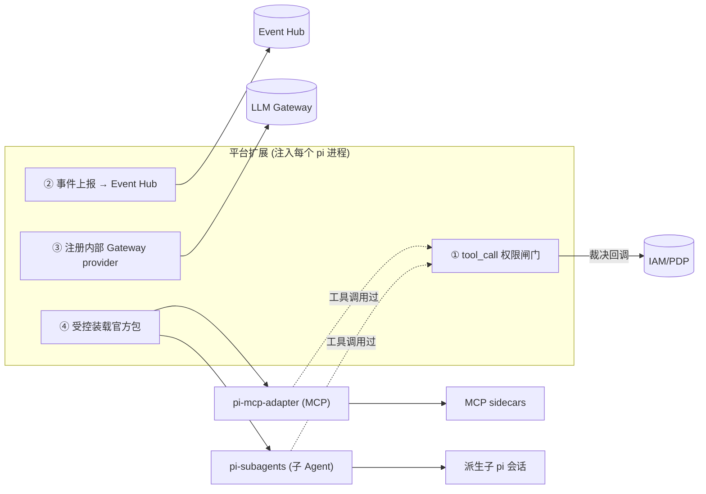
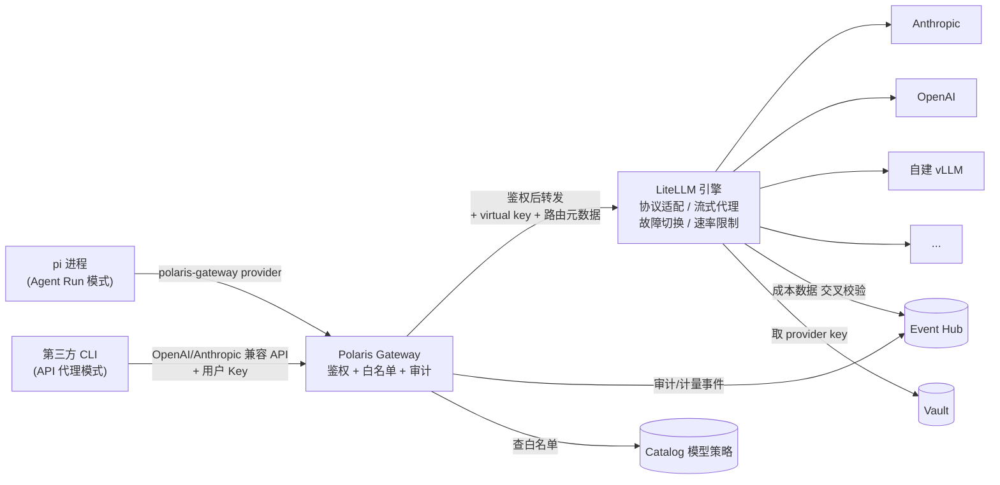

# 04 · pi 集成与多 LLM

本文是技术核心：如何把极简的 pi 改造成受治理的企业 Agent 运行时——**驱动方式（RPC 为主）**、**平台扩展（治理落点）**、**权限闸门接缝**、**LLM Gateway**、**会话**。

> ⚠️ 文中 pi 的命令/事件/API 名来自官方文档（高可信），但精确 TS 字段需在实施前对照 pi 源码 `rpc-types.ts` 与 `dist/*.d.ts` 核定，并固化成内部 `@polaris/pi-rpc` 类型库。

---

## 1. 驱动方式选型

pi 提供三种嵌入：

| 方式 | 形态 | 适用 | 取舍 |
|---|---|---|---|
| **RPC 模式** ⭐主 | `pi --mode rpc` 长驻子进程，stdin/stdout 行分隔 JSON | 交互式会话、长任务、需双向控制（改模型/中止/审批） | 进程级隔离、可双向驱动、契合沙箱边界 |
| **JSON 模式** | `pi --mode json "prompt"` 一次性，流式事件到 stdout | headless 自动化、CI、定时任务 | 简单但单向、一次性 |
| **SDK** | `createAgentSession()` 同进程嵌入 | 需要在 Worker 进程内深度集成时 | 与 Worker 同生命周期，隔离弱于子进程 |

**决策**：以 **RPC 模式为主**（沙箱内 pi 子进程 ↔ Orchestrator）。JSON 模式用于无状态一次性 Run。SDK 作为特定场景备选。

### 1.1 RPC 协议要点（务必正确实现）
- 传输：**stdin/stdout**，**行分隔 JSON（JSONL），不是 JSON-RPC**。`\n` 是唯一分隔符。
- ⚠️ **Node `readline` 不合规**（会按 U+2028/U+2029 切行）→ **自写行分割器**。
- 命令可带 `id` 用于关联；**事件无 `id`**。响应：`{"id","type":"response","command","success":bool,"error"?}`。
- 命令集（节选）：`prompt / steer / follow_up / abort / new_session / get_state / get_messages / set_model / cycle_model / get_available_models / set_thinking_level / compact / set_auto_compaction / set_auto_retry / bash / abort_bash / fork / clone / switch_session / get_session_stats / export_html`。
- 流式中再次 `prompt` 需带 `streamingBehavior: "steer" | "followUp"`。

```jsonc
// Orchestrator → pi (stdin)
{"id":"req-1","type":"prompt","message":"修复 login 的空指针并补测试"}
{"id":"req-2","type":"set_model","provider":"anthropic","modelId":"claude-..."}
{"id":"req-3","type":"abort"}
```

### 1.2 事件（与 SDK/JSON 同名）
`agent_start/end`、`turn_start/end`、`message_start/update/end`、`tool_execution_start/update/end`、`tool_call`（可拦截）、`tool_result`、`queue_update`、`compaction_start/end`、`auto_retry_start/end`、`extension_error`，以及扩展 UI 的 `extension_ui_request/response`。文本增量在 `message_update.assistantMessageEvent.type === "text_delta"` 的 `.delta`。

```jsonc
// pi → Orchestrator (stdout)
{"type":"tool_execution_start","toolCallId":"call_abc","toolName":"bash","args":{"command":"ls -la"}}
{"type":"message_update","message":{...},"assistantMessageEvent":{"type":"text_delta","delta":"正在"}}
{"type":"turn_end","message":{...},"toolResults":[]}
```

---

## 2. 平台扩展（Platform Extension）—— 治理的唯一落点

这是把"极简 pi"变"企业 Agent"的**linchpin**。它是一个由平台编写、注入**每个** pi 进程的 TypeScript 扩展（`-e` 加载或放进沙箱扩展目录），承载治理职责，并**受控装载** pi 官方能力包：



> **为什么是扩展而非 fork**：pi 扩展能 `registerTool`、`on("tool_call")`（可 `block`）、`registerProvider`、`registerCommand`，足以实现全部治理需求；MCP/子 Agent 直接复用官方包 `pi-mcp-adapter`/`pi-subagents`。免改 pi 内核、可随 pi 升级。
>
> **安全前提**：扩展与这两个官方包都运行有**完整系统权限**（任意 TS）→ 因此**只有平台/管理员能编写扩展、受控引入官方包**；用户产出物是 Skill（见 [06](./06-capabilities-skills-mcp-subagents.md) 信任边界）。

### 2.1 ① 权限闸门（PEP）
```ts
// 伪代码：平台扩展
export default (pi: ExtensionAPI) => {
  pi.on("tool_call", async (event, ctx) => {
    // event.input 可改、可阻塞；对内置工具、MCP 工具、子 Agent 工具一视同仁
    const decision = await policyClient.authorize({
      runId, subject, scope,                 // 来自注入的运行上下文
      tool: event.toolName, input: event.input,
      skill: ctx.activeSkill, capabilityManifest,
    });
    emit("tool_call.requested", { tool: event.toolName, input: redact(event.input) });

    if (decision === "deny") {
      emit("tool_call.denied", { tool: event.toolName });
      return { block: true, reason: "策略拒绝：" + decision.reason };
    }
    if (decision === "ask") {
      // 走 pi 原生 UI 往返 → Event Hub → 客户端 SSE 审批
      const ok = await ctx.ui.confirm({ title: `允许执行 ${event.toolName}？`, timeout: 120000 });
      emit(ok ? "permission.resolved" : "permission.denied", { tool: event.toolName, approved: ok });
      if (!ok) return { block: true, reason: "用户拒绝" };
    }
    // allow → 放行
  });

  pi.on("tool_result", async (event) => emit("tool_call.result", summarize(event)));
};
```
- **PDP/PEP 分离**：裁决在控制面 IAM（Policy Decision Point），强制在扩展（Policy Enforcement Point）。
- **审批往返**：`ask` 时 `ctx.ui.confirm` 在 RPC 下发 `extension_ui_request` 并阻塞，Event Hub 把它桥接成客户端 SSE 的审批卡片，用户应答回 `extension_ui_response`。
- **破坏性兜底**：危险模式（`rm -rf`、写 `.env`、破坏性 MCP 工具）默认 `ask` 或 `deny`，不依赖模型自觉。
- ⚠️ **核定点**：需验证 `pi-mcp-adapter` 的 `mcp` 代理工具调用、`pi-subagents` 的派生工具调用是否**都经过 `tool_call` 钩子**——若是，则治理"零缝隙"；若某些路径绕过钩子，平台扩展需在包的集成点补挂拦截（见 [01 §E](./01-research-and-landscape.md)）。

### 2.2 ②③④ 其余职责
- **② 事件上报**：把 pi 事件 + 平台语义事件统一发往 Event Hub（见 [08](./08-observability-and-sse.md)）。
- **③ Gateway provider**：`pi.registerProvider("polaris-gateway", {...})` 让 pi 所有模型流量走内部网关（见 §4）。
- **④ 受控装载官方包**：装载并配置 `pi-mcp-adapter`（MCP 接入，见 [06 §3](./06-capabilities-skills-mcp-subagents.md)）与 `pi-subagents`（子 Agent，见 [06 §4](./06-capabilities-skills-mcp-subagents.md)）；其可用范围由 effective config（目录解析）决定，调用过闸门。

---

## 3. 会话与状态

- pi 会话是 **JSONL 树状**（每条 `id`+`parentId`，叶子=当前）；`SessionManager` 提供 `create/open/forkFrom/inMemory/appendMessage（自动落盘）/buildSessionContext()`。
- **持久化策略**：沙箱内会话文件实时同步到**对象存储**（按 Run 归档）；Run 结束后沙箱可销毁而会话可回放。
- **分支/重跑/审计**：树状结构天然支持"从某步 fork 重跑"（调参对比、人审回溯）。会话树映射到控制台的"运行回放"视图（见 [08](./08-observability-and-sse.md)）。
- **续跑/恢复**：Orchestrator 记录 Run/RPC 子进程状态；崩溃后可由会话文件 `--fork/--session` 恢复到最近叶子继续。
- **隔离要求**：会话明文中**不得**含密钥；密钥经间接引用，闸门对 `read`/`bash` 触碰密钥路径做策略限制。
- **跨 Run 记忆**：上述持久化解决的是单个 Run 内的会话保存与恢复。Agent 在日常使用中还需要跨 Run 保持上下文——即"昨天做了什么、决策了什么"。见 §3.1。

### 3.1 跨 Run 记忆（Agent Memory）

#### 归属模型 —— 三级主键

```
记忆归属 = (user_id, project_id, agent_id)
```

| 维度 | 隔离原因 | 反例 |
|---|---|---|
| **自然人** | 记忆是个人的——"我昨天修到哪一步、我做了什么决策"。A 的调试进度不应污染 B 的上下文 | 共享记忆 → A 的误判被 B 的 Agent 当作事实 |
| **项目** | 同一人参与两个项目（Go vs Python），记忆完全不同 | 跨项目串记忆 → Agent 在 Go 项目里引用 Python 的决策 |
| **Agent** | 同一个项目里不同 Agent 职责不同——"Bug Fixer"的上下文不等于"Code Reviewer"的上下文 | 记忆混淆 → Reviewer 的审查笔记混进 Bug Fixer 的 prompt |

#### 记忆生命周期

```
Run 结束 ──→ auto-compaction 产出摘要 ──→ 追加到 (user, project, agent) 的 memory.jsonl
                                              │
用户主动 "记住 X" ─────────────────────────────┘

新 Run 启动 ──→ 加载该 Key 下的最近 N 条记忆 ──→ 注入系统提示（token 预算截断，如 ≤ 2000 tokens）
```

- **存储位置**：对象存储，路径 `memories/{user_id}/{project_id}/{agent_id}/memory.jsonl`
- **内容格式**：每条记忆 = `{timestamp, type: "compaction"|"manual", summary, run_id}`，一行一条
- **token 预算**：每次 Run 启动时按 token 预算截断（最近优先），默认 ≤ 2000 tokens（组织可配）
- **敏感信息防护**：记忆内容同样走脱敏规则（见 [14 §5](./14-data-retention-and-privacy.md)）；不应含密钥，密钥经间接引用
- **与项目知识库的区分**：记忆是个人私有上下文（不可共享）；若要作为项目共识，用户可"导出到项目知识库"（Catalog 中以项目作用域发布为 Skill/文档）——那是另一个操作，不走记忆系统

#### 用户操作

| 操作 | 说明 |
|---|---|
| **查看记忆** | 控制台可查看某 Agent 下自己的记忆列表（摘要 + 时间戳），可展开全文 |
| **删除单条** | 删除某条错误/过时记忆（"我那次的判断是错的，忘掉它"） |
| **清除全部记忆** | 一键清空某 Agent 的所有记忆（重置）。确认弹窗提示不可恢复 |
| **编辑记忆** | 修改某条记忆的摘要/正文（用户修正自动化产出的错误摘要） |
| **导出到项目知识库** | 将某条记忆转为项目级共享文档（发布到 Catalog，项目成员可见） |
| **记忆导出/导入** | 导出为 JSONL；可在迁移 Agent 或换项目时手动导入（需确认目标归属） |

> **清除全部记忆是用户的基本控制权**——用户应该随时能决定"这个 Agent 忘掉我从一开始到现在所有的事"。操作产生审计事件 `memory.cleared`，记录 (user, project, agent, timestamp)，方便合规追溯但不保留记忆明文。

---

## 4. 多 LLM：Polaris Gateway（控制面） + LiteLLM（代理引擎）

### 4.0 架构决策：为什么不重造 provider 适配层

业界已有成熟的开源 LLM 代理引擎 —— **LiteLLM**（100+ provider 适配、流式代理、故障切换、速率限制、负载均衡、成本追踪），以及在它之上包装了管理后台的 **New API**（one-api 后继）。但调研后的决策是：**不直接用 LiteLLM/New API 作为面向用户的 Gateway，也不从零自建 provider 适配层**。而是采用双层架构：

```
                    ┌─────────────────────────────────────────────┐
                    │             Polaris 控制面                    │
                    │                                             │
  sk-user-xxx ─────▶│  ┌─────────────┐  ┌──────────┐  ┌────────┐ │
  (用户自己的 Key)    │  │ API Gateway │  │ IAM      │  │Catalog │ │
                    │  │ (BFF)       │  │ (RBAC)   │  │(模型    │ │
                    │  │             │  │          │  │ 白名单) │ │
                    │  └──────┬──────┘  └──────────┘  └───┬────┘ │
                    │         │                           │      │
                    │         │ ① 鉴权: sk-xxx → 用户身份   │      │
                    │         │ ② 查 Catalog: 该用户在该     │      │
                    │         │   项目的有效模型白名单        │      │
                    │         │ ③ 写审计日志                 │      │
                    │         ▼                            │      │
                    │  ┌──────────────────────────────────┐ │      │
                    │  │     LiteLLM (内嵌代理引擎)         │ │      │
                    │  │  · Provider 协议适配 (100+)       │ │      │
                    │  │  · 流式代理 / 故障切换 / 重试     │ │      │
                    │  │  · 速率限制 / 负载均衡            │ │      │
                    │  │  · 成本追踪 (第二数据源)          │ │      │
                    │  └──────────────┬───────────────────┘ │      │
                    └─────────────────┼──────────────────────┘      │
                                      │                             │
                                      ▼                             │
                             Anthropic / OpenAI / 自建 vLLM / ...
```

| 层 | 负责 | 不负责 |
|---|---|---|
| **Polaris Gateway** | 用户 API Key 鉴权 → 解析身份/作用域；查 Catalog 模型白名单（四级作用域继承）；写审计日志（user, model, tokens, cost, mode）；API 代理模式下的端点暴露（`/v1/chat/completions`, `/v1/messages`） | Provider 协议适配；流式转发细节；故障切换 |
| **LiteLLM（内嵌）** | 接收 Polaris 转发后的请求 + 管理员配置的 provider 裸 key；适配 100+ provider 协议；流式代理；故障切换/重试/负载均衡；速率限制；回传 token/成本数据供 Polaris 交叉校验 | 用户身份体系；作用域模型白名单；审计日志 |

**为什么不直接用 LiteLLM 面向用户**：
- LiteLLM 的 key 模型简单（virtual key → provider），不直接支持"组织/业务组/项目/用户"四级作用域
- 无法实现 Polaris 特有的模型白名单继承（项目→业务组→组织 + 锁定不可覆盖）
- 用户直接调 LiteLLM 意味着审计链路缺失（Polaris 无法记录谁调了什么模型）
- 两种调用模式（Agent Run / API 代理）无法统一在一套鉴权体系下

**为什么不选 New API**：
- New API 定位偏向"面向用户的 API 分销/计费平台"，自带用户管理、充值、额度系统——与 Polaris 的 IAM + 信用计量体系重叠且冲突
- LiteLLM 更偏"开发者基础设施的代理层"，职责更聚焦，更适合作为内嵌引擎

### 4.1 为什么要 Gateway（而非让 pi 直连）
pi-ai 本身已支持 20+ provider 与统一 schema、密钥解析（`--api-key` → `auth.json` → env → `models.json`）。但企业要的是**集中治理**，所以在 pi-ai 之上加一层内部 Gateway（Polaris Gateway + LiteLLM 引擎）：

| Gateway 价值 | 说明 | 实现分工 |
|---|---|---|
| **密钥零暴露** | provider 真 key 只存 Vault、只在 LiteLLM 侧使用；开发者/客户端/沙箱永不接触 | Polaris 注入 LiteLLM virtual key |
| **模型白名单** | 按 组织/业务组/项目/角色 限制可用模型与默认模型；运行时 `set_model` 经白名单校验 | Polaris Catalog → Gateway 校验 |
| **成本/延迟计量** | 每次调用记 token/费用/时延 → 事件流 → 计量计费（归一信用单位） | Polaris 审计为主，LiteLLM 为交叉校验源 |
| **合规路由** | 敏感项目路由到 ZDR/私有/自建模型；区域数据驻留 | LiteLLM 按 Polaris 下发的路由规则执行 |
| **限流/缓存/降级** | 配额、速率、prompt 缓存、provider 故障切换 | LiteLLM 引擎执行 |

借鉴 OpenCode "强制走内部网关" 与 Cody Gateway。

### 4.2 pi 如何指向 Gateway
两种方式（推荐组合）：
1. **自定义 provider**（首选）：平台扩展 `pi.registerProvider("polaris-gateway", { baseUrl, authHeader, models, oauth? })`，Polaris Gateway 暴露 OpenAI/Anthropic 兼容接口；模型选择经 `set_model`/默认配置走它。
2. **环境/auth 注入**：沙箱内把 `*_BASE_URL` 指向 Polaris Gateway、注入短期作用域令牌（非真 key）。



### 4.3 模型治理数据流
- Catalog 维护 `ModelProvider`（接入的厂商）与 `ModelAllowlist`（各作用域可用模型/默认/上限）。
- 解析"某用户在某项目的有效模型集" → 注入 pi 的 `get_available_models` 视图。
- 运行时切换：客户端/模型→ RPC `set_model` → 扩展校验是否在有效集 → 否则 `deny` 并提示。

### 4.4 API 代理模式（第三方 CLI 直连 Gateway）

区别于 Agent Run 模式（pi 经自定义 provider 走 Gateway→LiteLLM），Polaris Gateway 同时对外暴露 **OpenAI 兼容 API** 与 **Anthropic 兼容 API**，第三方工具可直接接入：

```
第三方 CLI（Claude Code / Codex CLI / Continue / 任意 OpenAI 兼容客户端）
  │
  │  base_url = https://polaris.corp.com/v1
  │  api_key  = sk-user-xxx        ← 用户在 FR-4.11 中申请的 Key
  │
  ▼
Polaris Gateway
  ├── 鉴权：验证 API Key（sk-xxx）→ 解析出用户身份与作用域
  ├── 白名单：查 Catalog 获取该用户在该项目下的有效模型集
  ├── 审计：记录 (user, source=api, model, tokens, cost, timestamp)
  └── 转发：通过后转给 LiteLLM 引擎（携带 virtual key + 路由决策）
      │
      ▼
  LiteLLM 引擎
      ├── 协议适配：OpenAI ↔ Anthropic ↔ 各 provider 原生协议
      ├── 流式代理 / 故障切换 / 重试
      └── 成本数据回传 Polaris 交叉校验
          │
          ▼
      Anthropic / OpenAI / 自建 vLLM / ...
```

**与 Agent Run 模式的对比**：

| 维度 | Agent Run 模式 | API 代理模式 |
|---|---|---|
| 入口 | `POST /v1/runs` → Orchestrator → pi RPC | `POST /v1/chat/completions` 或 `/v1/messages` → Polaris Gateway 直转 |
| 能力 | 完整 Agent（工具、沙箱、审批、Skill、子Agent） | 纯 LLM 调用（无工具、无沙箱） |
| 运行时 | 沙箱内 pi 进程 | 无（Gateway → LiteLLM 直接代理） |
| 审计粒度 | Run + turn + tool_call 全事件 | 每次 API 请求 + token/成本 |
| 密钥暴露 | 沙箱内仅间接引用（短期令牌） | 用户自己的 API Key（`sk-...`） |
| 适用场景 | 需要 Agent 执行代码/工具的企业任务 | 开发者在本地 IDE/CLI 中使用 AI 辅助编码 |

**关键设计约束**：

- API 代理模式下，用户 key 只能调用**被管理员白名单允许的模型**——和 Agent Run 模式受同一套模型治理
- API 代理模式的 key 与 Agent Run 的 key 是**同一把 key**——用户不需要申请两把，Polaris Gateway 根据 endpoint 判断调用模式
- 第三方 CLI 发起的纯 LLM 调用**不经过闸门、不享受沙箱隔离**——用户需自行理解本地执行的风险。这是有意的分工：API 代理模式对标"企业版的 API proxy"，Agent Run 模式对标"企业版的云端 Agent"
- 所有调用全量进入审计日志，无论哪种模式——企业不因用户用了第三方 CLI 而失去可观测性

---

## 5. 实施清单（pi 集成相关）

- [ ] 拉取 pi 源码 + 安装 `pi-mcp-adapter`/`pi-subagents`，核定 RPC 命令/事件清单、扩展 API 类型、**两包工具调用是否都经 `tool_call`**，产出 `@polaris/pi-rpc`（含**自写行分割器**）。
- [ ] 实现 `@polaris/platform-extension`：闸门 / 事件上报 / gateway provider / 受控装载并配置两个官方包。
- [ ] Orchestrator 的 RPC 驱动器：进程管理、命令编解码、事件路由、超时/中止/恢复。
- [ ] LLM Gateway：**双层架构**——Polaris Gateway（API Key 鉴权、Catalog 白名单校验、审计事件、双模式端点暴露）+ LiteLLM 引擎（provider 协议适配、流式代理、故障切换/重试、速率限制、成本回传）。LiteLLM 不直接面向用户。
- [ ] 会话同步：沙箱 JSONL ↔ 对象存储；回放映射。
- [ ] 注入机制：把 effective config（模型/工具/Skill/MCP/子Agent/运行上下文/密钥引用）安全注入沙箱与扩展。
- [ ] 兜底：危险工具默认策略、`set_model` 白名单、密钥路径保护、子 Agent 深度/扇出/成本上限。

> 关联：闸门策略来源见 [05](./05-rbac-and-governance.md)；MCP/子 Agent/Skill 见 [06](./06-capabilities-skills-mcp-subagents.md)；事件 schema 见 [08](./08-observability-and-sse.md)。

> 💡 **如何阅读**：架构师看 §1（RPC 驱动 + 三种嵌入模式）+ §2（平台扩展与闸门）+ §4（LLM Gateway 双层架构）；平台工程师看 §5（实施清单）；安全评审看 §2.1（闸门 PEP）+ §4（密钥流向：裸 key 只在 LiteLLM/Vault 侧）；集成工程师看 §4.4（API 代理模式）+ §1（SDK/JSON 模式）。
