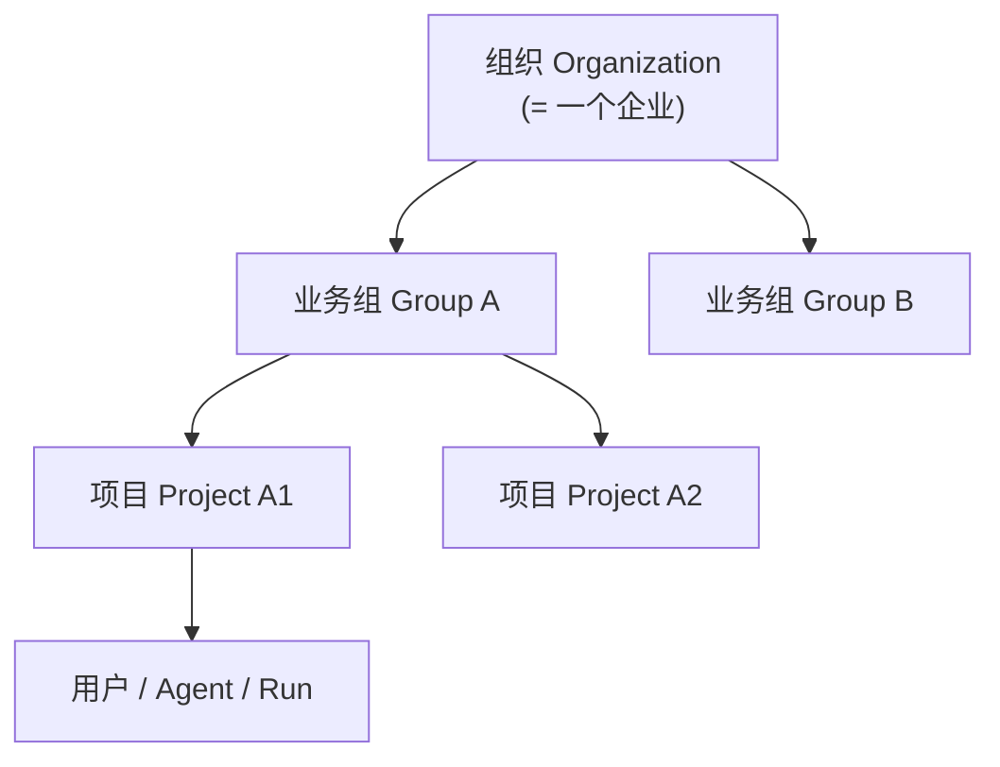
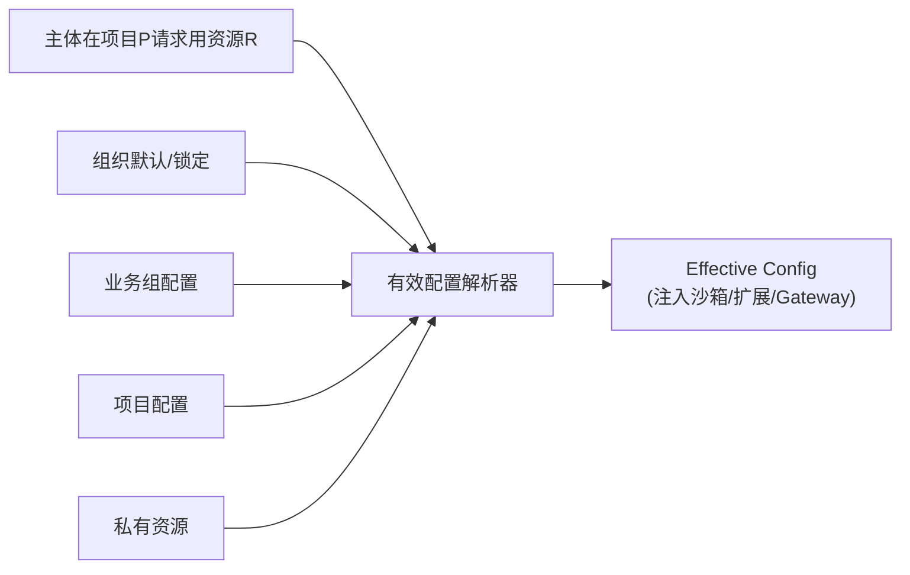

# 05 · 权限体系与统一治理

覆盖需求 5、6、部分 4、10。核心是：**四级作用域 + 角色权限矩阵 + 可见域继承与锁定 + 中央目录治理**。

---

## 1. 作用域层级（Scope Hierarchy）



- **组织 Organization**：一个企业一套。全局策略、provider 接入、组织级默认资源。
- **业务组 Business Group**：介于组织与项目之间的一等作用域（区别于多数竞品）。部门/事业部级共享。
- **项目 Project**：协作与交付单元；成员共享 Agent/工具/Skill/沙箱画像。
- **用户/Agent/Run**：最终主体与资源实例。

> 一个自然人可在多个业务组/项目持不同角色（多重 Membership）。

---

## 2. 角色（Roles）

内置角色（按作用域授予）+ 自定义角色：

| 角色 | 作用域 | 能力概述 |
|---|---|---|
| **Super Admin** | 组织 | 一切；provider 接入、全局策略、终审、品牌化 |
| **Org Admin** | 组织 | 组织级资源与成员、组织默认 Agent/MCP/Skill、模型白名单、审计/计量 |
| **Group Admin** | 业务组 | 本组资源与项目、组级默认与配额、组内 Skill 审批 |
| **Project Admin** | 项目 | 项目资源配置、成员邀请、项目权限/沙箱画像、项目运行与审计 |
| **Member / Developer** | 项目 | 发起 Run、用既有资源、创作私有 Skill、提交发布申请 |
| **Auditor / Security** | 任意 | 只读审计与回放；参与 Skill 安全人审；配安全规则 |
| **Service Account** | 项目/组织 | 程序化 API 调用，受同样 RBAC 约束 |

角色是**权限的命名集合**；支持自定义角色（勾选权限点）。

---

## 3. 权限模型（Permissions）

**权限 = 动作 × 资源类型（× 作用域）**。

- **动作**：`create / read / update / delete / use / run / publish / approve / manage`
- **资源类型**：`agent / skill / mcp / model / sandbox-profile / session(run) / user / role / policy / secret / audit / billing`

### 3.1 权限矩阵（示意，✅=默认具备）

| 资源\角色 | Super | Org Admin | Group Admin | Proj Admin | Member | Auditor |
|---|---|---|---|---|---|---|
| agent 定义 | CRUD+manage | CRUD（组织域） | CRU（组域） | CRU（项目域） | use+run；自建私有 | read |
| model/provider | manage | manage | 白名单（组内子集） | 白名单（项目子集） | use（白名单内） | read |
| mcp | manage | CRUD+审批 | CRU+审批（组域） | CRU（项目域） | use；申请接入 | read |
| skill | manage | CRUD+终审 | CRU+审批（组域） | CRU+审批（项目域） | **create 私有 + publish 申请** | read |
| sandbox-profile | manage | CRUD | CRU（组域） | CRU（项目域） | use | read |
| run/session | manage | read+manage | read+manage（组域） | read+manage（项目域） | **own + run** | read+回放 |
| user/role | manage | manage（组织内） | manage（组内） | invite（项目内） | — | read |
| policy | manage | manage | manage（组域） | manage（项目域受限） | — | read+propose |
| audit/billing | all | all | 组域 | 项目域 | own 用量 | read |

> 实际以可配置的细粒度权限点落库，矩阵仅为默认模板。

---

## 4. 可见域、继承与锁定（治理的关键语义）

每个目录资源（Agent/Model/MCP/Skill/Sandbox-Profile）都带：

```jsonc
{
  "id": "skill_xxx", "version": "1.3.0",
  "visibility": "group",            // private | project | group | org
  "ownerScope": {"group":"A"},
  "managed": true,                  // 上级托管：下级不可覆盖/禁用
  "status": "approved",             // 见 06 安全评估状态机
  "allowedVersions": [">=1.2.0"]    // 管理员可做版本白名单
}
```

### 4.1 继承（Inheritance）
- 上级作用域的资源**向下可见可用**：组织默认 → 所有业务组 → 所有项目 → 所有成员。
- 业务组可在组织默认之上**新增**本组资源；项目可在其上**再增**项目资源。
- "某用户在某项目"的**有效资源集** = 组织默认 ∪ 所属业务组资源 ∪ 项目资源 ∪ 本人私有（去重、按优先级合并）。

### 4.2 覆盖与锁定（Override & Managed-Lock）
- 默认下级可**覆盖**上级的非锁定项（如项目把默认模型从 A 换成 B）。
- 标记 `managed:true` 的项**不可被下级覆盖或禁用**（借鉴 OpenCode MDM "托管键不可覆盖"）。例：组织强制"所有 Agent 必须经内部 LLM Gateway"、"禁止 `danger-full-access` 沙箱画像"。

### 4.3 冲突裁决（Resolution）
1. **显式 deny 优先于 allow**。
2. **更具体作用域优先**（项目 > 组 > 组织），**除非上级锁定**。
3. 锁定项以上级为准。
4. 同级多来源取交集/并集按资源语义（白名单取交集、可见性取并集）。



---

## 5. 中央目录治理（统一管理默认资源）

**Catalog 服务**是所有可复用资源的单一事实源：

- **资源类型**：Agent 定义、Model/Provider 白名单、MCP server 定义、Skill（含版本/安审记录/能力清单）、Sandbox 画像。
- **管理动作**：管理员/项目管理员可把资源**设为某作用域的默认**并下发，成员**零重复配置**即用（需求 6/10）。
- **版本治理**：资源不可变@版本；管理员做版本白名单/灰度/回滚；撤销/熔断实时传播到运行中的 Agent。
- **解析输出**：Catalog 暴露"解析有效配置"API，供 Orchestrator 在创建 Run 时注入沙箱。

> Skill 的**用户创作 + 发布安全评估**是治理的重点子流程，独立成文：见 [06](./06-capabilities-skills-mcp-subagents.md)。

---

## 6. 运行时工具级策略（与 RBAC 协同）

RBAC 决定"能不能用某资源"；**工具级策略**决定"某次工具调用放不放行"，在 pi `tool_call` 闸门强制（见 [04 §2.1](./04-pi-integration-and-multi-llm.md)）。

```jsonc
// 策略示例（按作用域定义，解析后注入闸门）
{
  "rules": [
    {"tool": "bash", "match": "rm -rf *", "effect": "deny"},
    {"tool": "bash", "match": "git push *", "effect": "ask"},
    {"tool": "write", "match": "**/.env",  "effect": "deny"},
    {"tool": "mcp:*", "annotation": "destructive", "effect": "ask"},
    {"tool": "*", "effect": "allow"}
  ],
  "defaultMode": "ask",          // 未匹配时
  "networkEgress": ["*.internal.corp", "registry.npmjs.org"]
}
```
- 模式借鉴 Claude Code 的 `allow/deny/ask` 前缀规则 + Codex "破坏性 MCP 工具恒需审批"。
- 策略也是带作用域 + 可锁定的资源（组织可强制某些 deny 不可被项目放开）。

---

## 7. 身份接入（SSO / SCIM / MDM）

- **SSO**：SAML 2.0 / OIDC 对接企业 IdP；登录即按 IdP 组映射到业务组/项目与角色。
- **SCIM 2.0**：自动开通/回收用户与组（借鉴 Cursor），人员离职即时失权。
- **服务账号**：用于 API/CI；签发可限作用域、可限资源、可设 TTL 的令牌（借鉴 Cody 令牌 TTL）。
- **桌面端 MDM（可选）**：企业设备策略强制"只能登录本组织"、禁止个人账户（借鉴 Cursor Allowed Team IDs）。
- **审计**：所有授权/角色变更/登录/令牌签发进审计流。

---

## 8. 与需求对应
- 需求 5（权限体系）：§1–§3、§6、§7。
- 需求 6（统一管理 + 用户 Skill + 安审）：§4、§5 + [06](./06-capabilities-skills-mcp-subagents.md)。
- 需求 4（页面管理权限/角色/治理面）：控制台对应模块见 [09](./09-api-clients-and-data-model.md)。
- 需求 10（共享、不重复配置）：§4 继承 + §5 默认下发。
