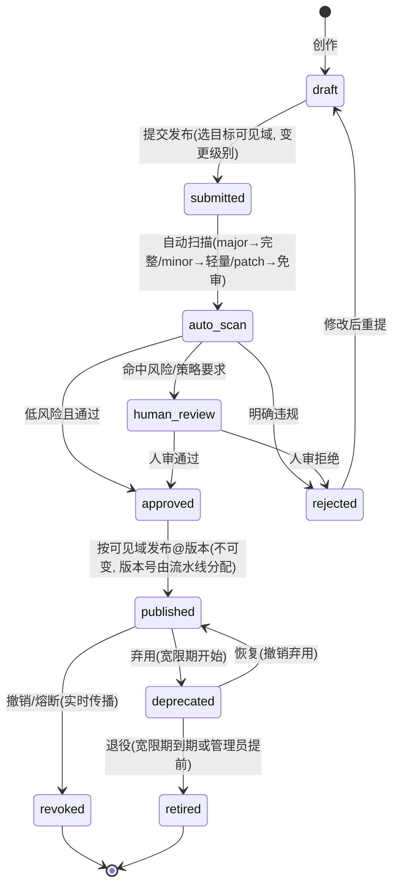
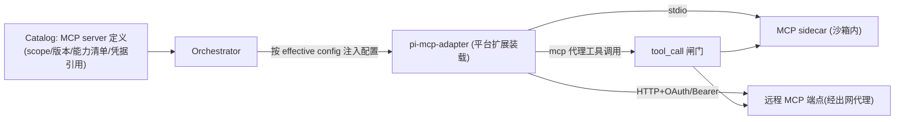
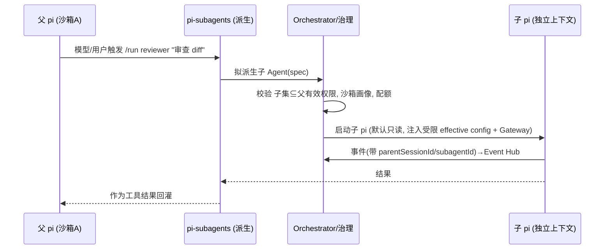
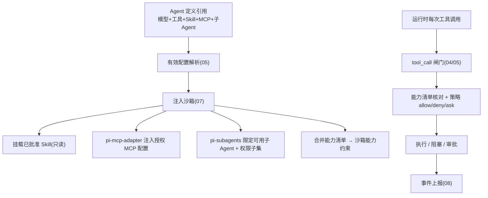

# 06 · 能力层：Skill、MCP、子 Agent（含安全评估流水线）

覆盖需求 2、3、6。本文先确立**信任边界**，再分别设计 Skill 生命周期与安全评估、MCP 接入治理、子 Agent 编排。

> 重要更正：MCP 与 sub-agent **不需要从零自建**——pi 生态已有官方包 **`pi-mcp-adapter`**（v2.8.0，调研时版本）与 **`pi-subagents`**（v0.27.0，调研时版本）。本平台的工作是**复用它们并套上企业治理**（目录、可见域、闸门、能力清单、审计、配额）。
>
> ⚠️ **版本声明**：以上版本号为 2026-06-02 调研时的最新版本。实施前需确认最新版本（`npm view pi-mcp-adapter pi-subagents version`），并核定其变更是否影响集成方案。版本锁定策略见 [10](./10-roadmap-and-open-questions.md)。

---

## 1. 三层信任边界（再次强调，因为它决定一切）

| 载体 | 运行权限 | 谁能创作/发布 | 治理手段 |
|---|---|---|---|
| **Extension（pi 扩展）** | **完整系统权限**（任意 TS） | **仅平台/管理员** | 平台核心能力以"平台扩展"形式存在 |
| **官方能力包**（`pi-mcp-adapter`、`pi-subagents`） | **完整系统权限**（任意 TS） | **仅平台/管理员受控引入** | 锁版本、审源码、由平台扩展装载与配置 |
| **MCP Server** | 沙箱 sidecar，受能力清单约束 | 管理员接入；用户可申请 | 接入审批 + 能力清单 + 破坏性工具强制审批 |
| **Skill** | 沙箱内运行，受能力清单约束 | **用户可创作** | 私有即用；发布到更大作用域**必经安全评估** |

> **核心约定**：用户产出的可发布单元是 **Skill**，绝不是 Extension 或官方包。`pi-mcp-adapter`/`pi-subagents` 虽强大，但属 Extension 级（全权限），只能由平台/管理员受控引入。这样"用户自定义 + 发布需安全评估"（需求 6）才落在一个安全、可审、可沙箱约束的载体上。

---

## 2. Skill：生命周期与安全评估流水线

### 2.1 Skill 是什么（沿用 pi/Agent Skills 标准）
- 一个目录：`SKILL.md`（YAML frontmatter：`name/description/allowed-tools/metadata/compatibility…`）+ 可选脚本/资源。
- pi 原生**渐进式披露**：启动只注入 name+description，模型按需 `read` 全文；`/skill:name` 可强制触发。
- **关键增强**：每个 Skill 携带**能力清单（Capability Manifest）**，声明其所需的工具、文件路径、出网域名、MCP、密钥——沙箱据此做 capability-based 强制。

```yaml
# SKILL.md frontmatter（含 Polaris 扩展字段）
name: gen-api-docs
description: 按公司模板从代码生成接口文档
version: 1.2.3                     # SemVer，发布时由安审流水线确定
allowed-tools: [read, write, bash]
x-polaris:
  capabilities:
    fs_read:  ["./src/**", "./openapi/**"]
    fs_write: ["./docs/api/**"]
    network:  ["templates.internal.corp"]   # 出网白名单
    mcp:      []                              # 需要的 MCP
    secrets:  []                              # 需要的密钥引用
  scripts: ["scripts/render.sh"]             # 随 Skill 的脚本（受扫描）
  minAgentVersion: ">=1.0.0"                 # 最低兼容的 Polaris 平台版本（可选）
```

### 2.2 版本控制策略

已发布 Skill 的版本控制解决四个问题：**可追溯**（每个 Run 记录精确 Skill 版本）、**渐进升级**（下游自主决定升级时机）、**安全响应**（按版本精确熔断，不影响其他安全版本）、**可对比**（多版本并存，同一 Agent 不同 Run 可指不同版本做 A/B 对比）。

#### 版本号约定 —— SemVer

采用 SemVer（`major.minor.patch`），版本号在通过安审时由流水线确定（非用户自填）：

| 变更级别 | 触发条件 | 安审范围 | 示例 |
|---|---|---|---|
| **major** | 能力清单变化（新增/删减工具、出网域名、MCP、secrets） | 完整评估（静态+LLM+能力清单核对），强制人审 | `1.2.0 → 2.0.0` |
| **minor** | prompt/指令/脚本变化，能力清单不变 | 轻量评估（静态扫描 + 能力清单核对），自动化为主，可配强制人审 | `1.2.0 → 1.3.0` |
| **patch** | 拼写修正、文档调整、不影响行为和能力的变更 | 免审自动通过（仅静态扫描确认无代码变化） | `1.2.0 → 1.2.1` |

**版本不可变**：任何已发布的版本永远不可修改。改一个字符 = 新版本。版本号在首次发布时由系统分配（按同一 Skill 的最大现有版本递增），不依赖用户声明。

#### Agent 引用 Skill 的版本策略

```yaml
# Agent 定义中
skills:
  - name: gen-api-docs
    version: "1.2.3"           # 锁定精确版本（生产推荐，可审计、可回滚）
    # version: "^1.2"          # 兼容范围（允许 patch 自动升级，适合开发）
    # version: "latest"        # 始终最新（仅适合个人使用，不推荐生产）
```

- `latest` 策略不推荐用于共享 Agent——静默升级不可追溯、不可审计
- 组织可配置策略强制生产 Agent 必须 `pin` 精确版本
- Run 创建时解析引用的精确版本，记录到 Run 元数据与审计日志

#### 版本生命周期

```
draft → published(active) → deprecated → retired
```

| 状态 | 含义 | 能否加载 | 说明 |
|---|---|---|---|
| **draft** | 创作中，未发布 | ❌（仅作者自己可用） | 私有作用域内的草稿 |
| **published (active)** | 已发布，正常可用 | ✅ | 通过安审、不可变 |
| **deprecated** | 已弃用，不推荐使用 | ✅（告警提示） | 建议迁移到替代版本；每次 Run 打 warning 事件 |
| **retired** | 已退役 | ❌（拒绝加载） | 旧 Agent 引用了 retired 版本 → Run 创建时直接拒绝，提示升级；比 revoked（紧急熔断）温和 |
| **revoked** | 安全熔断 | ❌（立即拒绝） | 紧急响应，实时传播到运行中 Agent（见 §2.6） |

deprecated → retired 之间有**宽限期**（默认 30 天，组织可配），给下游 Agent 迁移时间。

### 2.3 可见域与是否需要评估

| 操作 | 是否需评估 | 说明 |
|---|---|---|
| 在**私有**作用域创作并在**自己的** Agent 中用 | ❌ 不需要 | 仍在沙箱内、受能力清单约束、产生审计 |
| 发布到 项目/业务组/组织 | ✅ **必经安全评估流水线** | 因为会被他人加载执行 |
| 升级已发布 Skill 的版本 | ✅ 重新评估该版本 | 版本不可变，逐版本审 |

### 2.4 安全评估状态机



### 2.5 自动扫描阶段（auto_scan）做什么
对 `SKILL.md` + 随附脚本 + 能力清单做多重检查：

1. **静态分析**：扫描脚本中的危险模式——`rm -rf`、`sudo`、`curl|sh`、反弹 shell、混淆/编码执行、读写敏感路径（`.ssh`、`.env`、凭据）、未声明出网。
2. **能力清单核对（declared vs. actual）**：从脚本/指令推断实际需要的能力，与声明的 manifest 比对；**声明外的能力 = 红旗**。
3. **LLM 风险判定**：用一个 LLM 评审器对 Skill 内容打分 Low/Med/High（借鉴 OpenHands 风险打分 + Goose 对抗式审查器），输出理由。
4. **依赖治理**：若 Skill 拉外部依赖，强制**精确版本 + 最小发布年龄（min-release-age）+ `--ignore-scripts`**（沿用 pi 自身供应链加固实践）。
5. **提示注入检测**：检查 `SKILL.md` 是否含试图越权/篡改系统提示的注入文本。

**判定路由**：全绿且低风险 → 自动 `approved`；命中任一红旗或策略要求 → `human_review`；明确恶意 → `rejected`。组织可配"任何写权限/出网/MCP 的 Skill 一律人审"。

### 2.6 人审、批准、发布、弃用、撤销

- **人审**：Auditor/Security 或对应作用域 Admin 看扫描报告 + Diff，决定通过/拒绝，留痕。
- **批准@版本**：通过后该版本**不可变**，系统按同一 Skill 的最大现有版本自动递增分配版本号（major→major、minor→minor、patch→patch）。管理员可做版本白名单（`allowedVersions`）。
- **发布**：按目标可见域进入 Catalog，成员在该作用域内零配置可见可用（版本 pin 策略见 §2.2）。
- **弃用（deprecate）**：标记某版本不推荐使用。Agent 仍可加载但每次 Run 打 warning 事件。进入宽限期倒计时（默认 30 天，组织可配）；宽限期内可恢复为 active。
- **退役（retire）**：宽限期到期或管理员提前触发 → 版本退役。Agent 引用了 retired 版本 → Run 创建时直接拒绝并提示升级。退役不可逆（不同于 deprecated 可恢复）。
- **撤销/熔断（revoke）**：紧急安全响应，一键撤销某版本，**实时传播**到运行中的 Agent（下次工具调用/加载即拒绝），产生 `audit` + `security.flagged` 事件。revoke 不同于 retire——前者是紧急响应，后者是计划内淘汰。
- **运行时强制**：即便已批准，沙箱仍按能力清单约束（capability-based），声明外的访问被闸门拦截——**纵深防御，不只信审。**

> 差异化：这条"用户发布 Skill → 自动扫描 + 能力清单 + LLM 判定 + 人审 → 不可变版本 + 版本生命周期管理（deprecate/retire/revoke）+ 可熔断 + 运行时能力强制"流水线，是竞品普遍缺失的（见 [01 §D](./01-research-and-landscape.md)）。**注意：这是本平台真正自建、且最具差异化的部分；MCP/子 Agent 是复用官方包，而 Skill 安审 + 版本治理是我们的护城河。**

---

## 3. MCP 接入治理（复用 `pi-mcp-adapter` + 套治理）

### 3.1 复用什么
**`pi-mcp-adapter`（官方包，v2.8.0）** 已解决 MCP 接入的工程问题：
- 暴露**单个代理 `mcp` 工具**（约 200 token），模型按需 `search/describe/connect/call`，避免一次注册上百工具烧 10k+ token。
- Server **懒加载**：首次调用才连接，空闲超时断开；工具元数据缓存到磁盘。
- 支持 **stdio + HTTP 传输、OAuth**、`directTools`（把指定工具提升为一等 pi 工具）、`/mcp` 面板、从 `.mcp.json` / Cursor / Claude Code 导入配置。

### 3.2 平台治理增量（我们加的）



- **配置来源 = 控制面，不是本地文件**：平台**注入** adapter 的 server 配置（来自 Catalog 的 effective config），**不读**沙箱内的 `.mcp.json`——避免用户私自接入未审 MCP。
- **MCP server 是 Catalog 资源**：带可见域/版本/能力清单/凭据引用；接入需管理员审批；effective config 决定哪些 server 对该 Run 可见。
- **调用过闸门**：`mcp` 代理工具（及 `directTools` 提升的工具）调用统一过 `tool_call` 闸门做 allow/deny/ask；**破坏性工具（destructive 注解）默认强制审批**（借鉴 Codex）；只读工具可并行。
- **凭据**：OAuth/Bearer 凭据经密钥服务间接注入，不落会话；远程 MCP 经出网代理白名单。
- **沙箱**：stdio MCP server 作为沙箱内 sidecar，受能力清单约束。
- ⚠️ **核定点**：确认 adapter 的 `mcp` 代理工具与 `directTools` 调用**都经 `tool_call` 钩子**；若某路径绕过，平台扩展在 adapter 集成点补挂拦截（见 [04 §2.1](./04-pi-integration-and-multi-llm.md)）。
- **用户贡献 MCP**：走类似 Skill 的安全评估（能力清单核对 + 人审）。

---

## 4. 子 Agent 编排（复用 `pi-subagents` + 套治理）

### 4.1 复用什么
**`pi-subagents`（官方包，v0.27.0）** 已提供完整子 Agent 能力：
- **内置子 Agent**：`scout`（代码侦察）、`researcher`（带来源的资料研究）、`planner`、`worker`、`reviewer`、`context-builder`、`oracle`（挑战假设的第二意见）、`delegate`。
- **编排**：`/run <agent> [task]`、`/chain a "t1" -> b "t2"`（串行）、`/parallel`（并行）、`/run-chain`（保存的工作流）、`--bg`（后台）、`--fork`（分叉会话）。
- **隔离/护栏**：**worktree 隔离**（并行编辑不冲突）、**递归/深度护栏**（限制嵌套）、acceptance gates（证明产出达标）、`pi-intercom`（子父运行中通信）。
- 每个子 Agent 是**独立上下文**的子 pi 会话，结果回灌父会话。

### 4.2 平台治理增量（我们加的）



- **权限收窄 + 不可提权**：子 Agent 有效权限 **⊆ 父**；默认**只读**，写/执行/破坏性操作交回父或显式授权（借鉴 Claude Code 子 Agent 模型）。落在 effective config + 闸门。
- **沙箱选项**：子 Agent 可在**父沙箱内**（轻量、共享工作区）或**独立嵌套沙箱**（强隔离，按画像）；并行编辑用 `pi-subagents` 的 **worktree 隔离**。
- **配额/护栏叠加**：复用 `pi-subagents` 的递归/深度护栏，**再叠加**平台的扇出/并发/成本/墙钟上限，防递归爆炸与成本失控。
- **可观测**：子 Agent 事件带 `parentSessionId/subagentId`，纳入控制台"运行树"视图；结果与 acceptance gate 结论入审计。
- **模型/Skill/MCP 子集**：由 Agent 定义 + effective config 约束，不超过父集；子 Agent 同样经内部 LLM Gateway。
- **自定义子 Agent**：用户定义的子 Agent 角色本质是"受限 Agent 定义 + 提示"，走 Agent 定义治理；若内含脚本/Skill 则同样安审。
- ⚠️ **核定点**：确认 `pi-subagents` 派生的子会话其工具调用经我们的闸门、用我们的 Gateway provider、并上报事件；若其内部直接 spawn 进程，需在集成点适配以保证治理与隔离不被绕过。

### 4.3 典型用途
并行的"探索/评审/检索/批处理"子任务保持主上下文干净；如"主 Agent 修 bug，派生 `reviewer` + `worker` 并行跑测试与修复并汇总"。

---

## 5. 能力层与权限/沙箱的协同



- **声明（manifest）+ 强制（sandbox）+ 裁决（policy）+ 审计（events）** 四件事环环相扣：审是事前，能力约束是事中纵深防御，事件是事后追溯。

---

## 6. 与需求对应
- 需求 2（sub-agent）：§4（复用 `pi-subagents` + 治理）。
- 需求 3（MCP + Skill）：§2（Skill）、§3（MCP via `pi-mcp-adapter`）。
- 需求 6（用户自定义 Skill + 发布需安全评估）：§2.2–§2.5（**本平台自建的护城河**）。
- 关联：信任边界贯穿 [04](./04-pi-integration-and-multi-llm.md)/[05](./05-rbac-and-governance.md)/[07](./07-sandbox-isolation.md)；安全评估对抗测试见 [12](./12-testing-strategy.md)（§5.3 安审对抗样本）；LLM 风险判定与评估框架见 [15](./15-prompt-management-and-evaluation.md)；安审通知与审批升级见 [16](./16-notification-system.md)。
