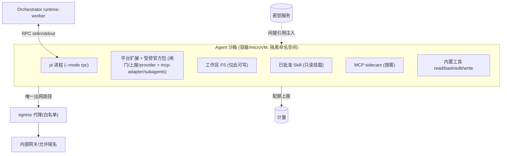
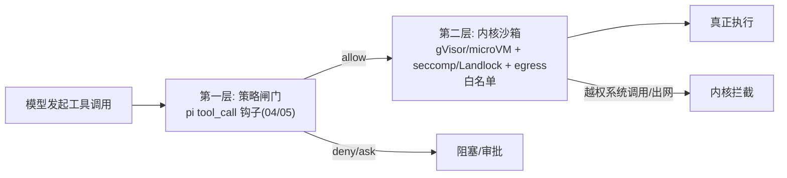
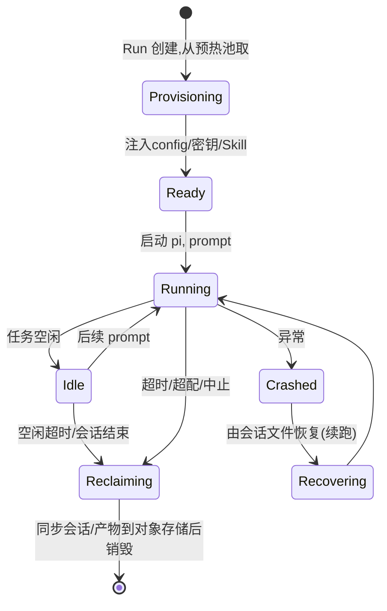

# 07 · 沙箱与隔离

覆盖需求 8（独立沙箱：每 Agent 一隔离环境）。核心：**Workspace 后端抽象 + 一 Agent 一沙箱 + 双层防御 + 资源/网络/密钥治理 + 生命周期管理**。

---

## 1. 设计原则（来自调研教训）

| 原则 | 依据 |
|---|---|
| **一个 Agent 运行 = 一个沙箱**（非每用户共享） | OpenHands V0 用共享容器导致多租户"邻居噪声"崩溃；改为按会话隔离 |
| **Workspace 后端可插拔** | OpenHands V1：同一 Agent 代码切换 Local/Container/RemoteAPI 后端 |
| **双层防御**：进程内策略闸门 + 内核级沙箱 | Claude Code / Codex：权限与沙箱**分离**、互为补充 |
| **默认拒绝出网 + 白名单代理** | Claude Code localhost 代理 + CONNECT 403 模式 |
| **密钥间接下发，不过客户端/会话** | OpenHands `LookupSecret` 加固 |
| **能力清单运行时强制** | 即使 Skill/MCP 已批准，也按声明能力做 capability-based 约束 |

---

## 2. Workspace 后端抽象

定义统一接口，按部署形态/隔离等级切换实现：

```ts
interface Workspace {
  start(spec: SandboxSpec): Promise<Handle>;     // 拉起隔离环境
  exec(action): Promise<Observation>;            // 在内部执行(由 pi 工具触发)
  putFiles(/* 注入仓库/Skill */): Promise<void>;
  getFiles(/* 取产物/会话 */): Promise<...>;
  stop(handle): Promise<void>;
}
```

| 后端 | 隔离强度 | 适用 |
|---|---|---|
| **LocalWorkspace** | 弱（同机进程） | 本地开发/调试 |
| **ContainerWorkspace** | 中（容器 + gVisor） | 自托管/默认生产 |
| **MicroVMWorkspace** | 强（Firecracker/Kata） | 高敏感、强多租户 |
| **RemoteAPIWorkspace** | 取决于后端 | 跨集群/外部执行服务 |

> Orchestrator 按 effective sandbox-profile 选择后端，对上层透明。

---

## 3. 单个沙箱的解剖



**约束**：
- **文件系统**：仅工作区可写；Skill 只读挂载；系统区/敏感路径不可写。写越界被内核与闸门双拦。
- **进程**：pi + 平台扩展 + 按需 MCP sidecar；无 host 访问。
- **网络**：默认无出网；唯一出口是 egress 代理，按 effective 白名单（含 LLM Gateway、允许的内部域、必要的包源）放行，其余 CONNECT 403。
- **密钥**：经间接引用注入（短期令牌/引用，非明文真 key）；会话明文不含密钥。

---

## 4. 双层防御



- **第一层（策略，事中裁决）**：RBAC + 工具策略 + 能力清单核对，允许/拒绝/审批。可被绕过的逻辑层。
- **第二层（内核，兜底强制）**：即便策略层有漏洞或 Skill 越界，内核级隔离 + 出网白名单 + 只写工作区仍兜底。
- 二者**互不替代**：策略层语义丰富但可被提示注入/逻辑漏洞绕过；内核层粗粒度但难绕过。

---

## 5. 资源、配额与计量

| 维度 | 控制 |
|---|---|
| CPU / 内存 | 按 sandbox-profile 设 limit/request；超限 OOM 隔离不影响他人 |
| 磁盘 | 工作区配额；产物大小上限 |
| **墙钟时长** | Run 超时自动中止 + 回收（防失控长跑） |
| 并发 | 每用户/项目/组织的并发沙箱数上限 |
| **计量单位** | token 成本 + 沙箱时长归一为**信用单位**（借鉴 Devin ACU）→ 计费/配额/预算告警（见 [08](./08-observability-and-sse.md)） |

沙箱画像（profile）是带可见域 + 可锁定的 Catalog 资源：镜像、预装工具链、资源配额、网络白名单、隔离后端、是否允许子 Agent 嵌套沙箱。组织可锁定"禁止 full-access 画像"。

---

## 6. 生命周期与弹性



- **冷启动**：维护**预热池**降低启动延迟；镜像分层缓存。
- **崩溃恢复**：会话 JSONL 实时同步对象存储；崩溃后可 `--fork/--session` 恢复到最近叶子续跑（见 [04 §3](./04-pi-integration-and-multi-llm.md)）。
- **回收**：空闲超时/结束即同步产物与会话后销毁，释放资源；不留残留数据。
- **隔离故障域**：单沙箱崩溃/超限不影响控制面与其它沙箱。

---

## 7. 安全加固清单
- [ ] 数据面命名空间默认无出网；仅 egress 代理白名单放行。
- [ ] gVisor（默认）/ Firecracker（高敏感）运行时；seccomp/Landlock 收窄系统调用。
- [ ] 工作区外只读；敏感路径黑名单 + 闸门保护。
- [ ] 密钥经 Vault 间接下发、短 TTL、用后失效；镜像内不含 key。
- [ ] 能力清单运行时强制（capability-based），声明外访问拦截。
- [ ] 子 Agent 嵌套沙箱深度/扇出/配额上限。
- [ ] 所有沙箱事件（created/exec/limit_exceeded/destroyed）进可观测流。

---

## 8. 与需求对应
- 需求 8（独立沙箱）：全文。
- 关联：闸门见 [04](./04-pi-integration-and-multi-llm.md)/[05](./05-rbac-and-governance.md)；能力清单见 [06](./06-capabilities-skills-mcp-subagents.md)；事件见 [08](./08-observability-and-sse.md)。
