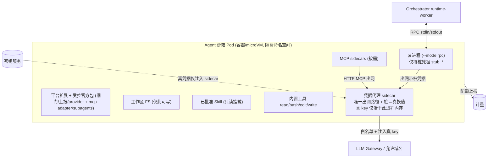
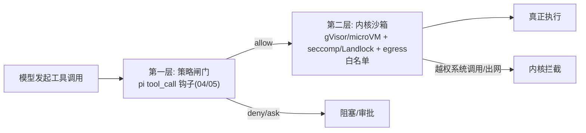
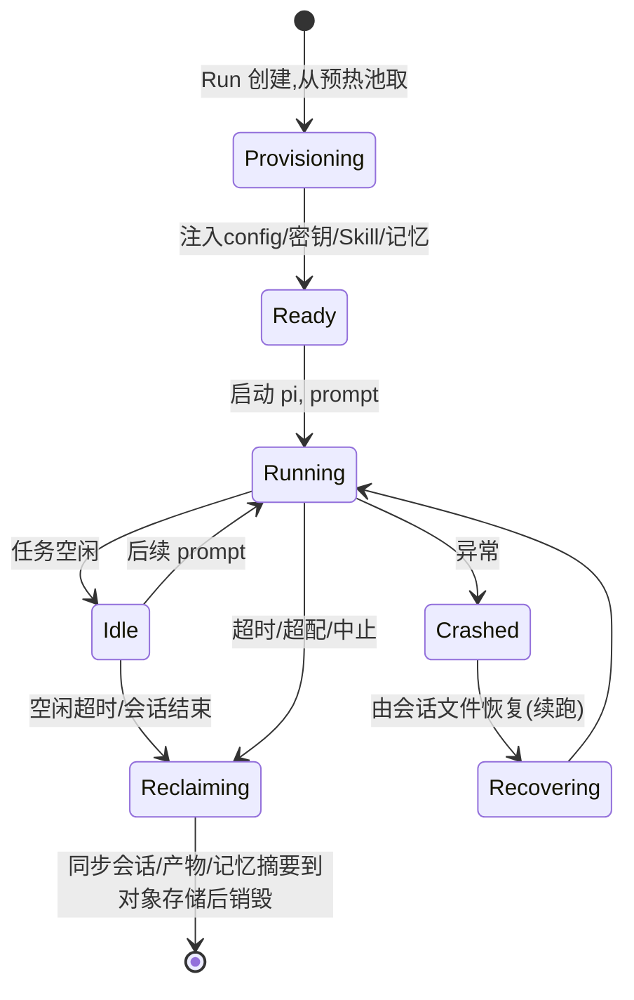

# 07 · 沙箱与隔离

覆盖需求 8（独立沙箱：每 Agent 一隔离环境）。核心：**Workspace 后端抽象（K8s 后端 reconcile `Sandbox` CR） + 一 Agent 一沙箱 + 双层防御 + 资源/网络/凭据治理（凭据代理 sidecar） + 生命周期管理**。

---

## 1. 设计原则（来自调研教训）

| 原则 | 依据 |
|---|---|
| **一个 Agent 运行 = 一个沙箱**（非每用户共享） | OpenHands V0 用共享容器导致多租户"邻居噪声"崩溃；改为按会话隔离 |
| **Workspace 后端可插拔** | OpenHands V1：同一 Agent 代码切换 Local/Container/RemoteAPI 后端 |
| **双层防御**：进程内策略闸门 + 内核级沙箱 | Claude Code / Codex：权限与沙箱**分离**、互为补充 |
| **默认拒绝出网 + 白名单代理（即凭据代理 sidecar）** | Claude Code localhost 代理 + CONNECT 403；egress 与凭据换值合一（见 §3.1） |
| **凭据零持有：注入桩凭据、出网在 sidecar 换真值** | 强化 OpenHands `LookupSecret`；借鉴 LAP vault-proxy——Agent 进程永不持有真凭据（见 §3.1） |
| **能力清单运行时强制** | 即使 Skill/MCP 已批准，也按声明能力做 capability-based 约束 |

---

## 2. Workspace 后端抽象

定义统一接口，按部署形态/隔离等级切换实现——**接口稳定，底层实现可换**：

```ts
interface Workspace {
  start(spec: SandboxSpec): Promise<Handle>;     // 拉起隔离环境
  exec(action): Promise<Observation>;            // 在内部执行(由 pi 工具触发)
  putFiles(/* 注入仓库/Skill */): Promise<void>;
  getFiles(/* 取产物/会话 */): Promise<...>;
  stop(handle): Promise<void>;
}
```

| 后端 | 隔离强度 | 实现 | 适用 |
|---|---|---|---|
| **LocalWorkspace** | 弱（同机进程） | 本机进程/容器 | 本地开发/调试 |
| **ContainerWorkspace** | 中（容器 + gVisor） | reconcile `Sandbox` CR（见 §2.1） | 自托管/默认生产 |
| **MicroVMWorkspace** | 强（Firecracker/Kata） | reconcile `Sandbox` CR + `runtimeClassName: kata` | 高敏感、强多租户 |
| **RemoteAPIWorkspace** | 取决于后端 | 外部执行服务 HTTP API | 跨集群/外部执行服务 |

> Orchestrator 按 effective sandbox-profile 选择后端，对上层透明。

### 2.1 K8s 后端：reconcile `Sandbox` CR（不自建编排）

`ContainerWorkspace` / `MicroVMWorkspace` 在 K8s 上**不手写沙箱编排控制器**，而是复用上游开源项目 **[`kubernetes-sigs/agent-sandbox`](https://github.com/kubernetes-sigs/agent-sandbox)**（SIG Apps 子项目，Go module `sigs.k8s.io/agent-sandbox`）——它正是为"有状态、单例、稳定身份的 Agent runtime Pod"设计的 CRD + 控制器。`Workspace` 抽象层保留不变，底层从"自研 K8s 编排"改为"创建/读写 `Sandbox` 自定义资源（CR）"：

| `Workspace` 方法 | 映射到 agent-sandbox |
|---|---|
| `start(spec)` | 创建 `Sandbox` CR（或 `SandboxClaim` 从预热池认领）；等待 `status` 就绪 |
| `exec(action)` | 经 CR 的稳定网络身份连到 Pod；pi RPC over stdin/stdout 仍由 runtime-worker 持有 |
| `putFiles/getFiles` | 注入仓库/Skill、取产物/会话（卷 / pod exec） |
| `stop(handle)` | 删除 CR（或预设定时删除时间，见 §6） |

**为什么复用而非自建**——它原生提供了我们 §5/§6 本来要手写的能力：

| 本文设计 | agent-sandbox 原生能力 | API group |
|---|---|---|
| 容器 + gVisor / microVM + Kata（§3） | `Sandbox` 支持 `runtimeClassName`（gVisor/Kata） | `agents.x-k8s.io/v1alpha1`（core） |
| 沙箱画像 = 带可见域/可锁定的 Catalog 资源（§5） | `SandboxTemplate` | `extensions.agents.x-k8s.io/v1alpha1` |
| 沙箱**预热池**降冷启动（§6、[17](./17-cost-optimization.md)、[18](./18-capacity-planning.md)） | `SandboxWarmPool`（认领预热实例，冷启 < 1s） | `extensions.agents.x-k8s.io/v1alpha1` |
| Idle 超时 → 回收销毁（§6 状态机） | 内置**定时删除**（给绝对终止时间）+ lifecycle 控制 | core |
| [21 §4](./21-run-lifecycle-state-machine.md) 标注的 **pause/resume P3+ 缺口** | 原生 **pause / resume** | core |

```yaml
# 示意（字段以上游 v1alpha1 schema 为准，实施前核定）
apiVersion: agents.x-k8s.io/v1alpha1
kind: Sandbox
metadata:
  name: run-7f3a9c                      # = runId，稳定身份/hostname
  namespace: data-plane
  labels: { polaris.io/run: "7f3a9c", polaris.io/project: "proj-42" }
spec:
  podTemplate:
    spec:
      runtimeClassName: gvisor          # 高敏感切 kata
      containers:
        - name: harness                 # pi --mode rpc + 平台扩展，仅持桩凭据
          image: registry.internal/polaris/harness:<digest>
        - name: cred-proxy              # 凭据代理 sidecar（见 §3.1）
          image: registry.internal/polaris/cred-proxy:<digest>
  # 墙钟超时由控制面写入绝对终止时间，到点由控制器回收（见 §6）
```

> ⚠️ **成熟度核定**：agent-sandbox 目前为 **`v1alpha1`（alpha）**，API 可能演进。实施前需决策：(a) **直接依赖**控制器 + CRD（`kubectl apply` 安装 `manifest.yaml` / `extensions.yaml`，或用其 Python SDK）；还是 (b) **借鉴其 CR 设计**自管一份精简控制器以锁定 API 面。建议 P2 先在非生产集群验证 `SandboxWarmPool` 冷启与 pause/resume 行为，再定 a/b。`RemoteAPIWorkspace` 与 `LocalWorkspace` 不依赖它，作为降级/可移植路径。

---

## 3. 单个沙箱的解剖



**约束**：
- **文件系统**：仅工作区可写；Skill 只读挂载；系统区/敏感路径不可写。写越界被内核与闸门双拦。
- **进程**：pi + 平台扩展 + 按需 MCP sidecar + 凭据代理 sidecar；无 host 访问。
- **网络 + 凭据（合一）**：默认无出网；唯一出口是**凭据代理 sidecar**，按 effective 白名单（含 LLM Gateway、允许的内部域、必要的包源）放行，其余 CONNECT 403。详见 §3.1。
- **凭据零持有**：harness（pi 进程及其工具/Skill/MCP）只拿**桩凭据**（`stub_*`），真凭据仅活于 sidecar 进程内存；会话明文不含密钥。

### 3.1 凭据代理 sidecar（egress + 桩→真换值）

把原本两个分开的机制——**出网白名单代理** 与 **密钥间接下发**——**合并为同一个 sidecar**，并采用更强的"桩凭据"模型（借鉴 LAP vault-proxy）：

> **核心不变量**：Agent（pi 进程、Skill、MCP、子 Agent）**自始至终只持有桩凭据，永不持有真凭据**。

```
注入时：harness env = { LITELLM_API_KEY=stub_litellm_bb20, GITHUB_TOKEN=stub_gh_a8f1, ... }
出网时：pi/工具 ──带 stub──▶ 凭据代理 sidecar ──换成真 key──▶ 目的地（白名单内）
真凭据：仅从 Vault 注入 sidecar 进程内存，从不进 harness env / 会话 / 产物
```

**威胁面收益**（对照 [11 §3.6](./11-security-and-threat-model.md)）：即便发生提示注入、恶意 Skill 读 env、甚至 Agent 跑在 bypass-permissions/越权模式，**也偷不到真凭据——它根本不在 Agent 进程里**。这比"短 TTL 真 token 注入"更强：后者在令牌有效窗口内仍可被外传。

**与 LLM Gateway 路径的关系**：[04 §4.2](./04-pi-integration-and-multi-llm.md) 已规定沙箱内注入"指向 Gateway 的短期作用域令牌（非真 provider key）"——这本就是桩模型的一个特例。凭据代理 sidecar 把它**推广到所有出网凭据**：provider 令牌、`git push`/`gh pr create` 的 Git token、HTTP MCP server 凭据、包仓库 token 等，统一走桩→真换值，不再有"某些凭据较直接地进 Agent env"的例外。

**凭据分轨**（借鉴 LAP）：克隆用的 `GIT_TOKEN` 由 entrypoint 用完即抹除；需持续到 agent shell 的（`git push`/`gh pr create`）走 `GITHUB_TOKEN`/`GH_TOKEN`，经 sidecar 正常换值。**保留环境变量名单**（如 `LITELLM_API_KEY`/`REPO_URL`/`BRANCH`/`GIT_TOKEN`）不允许 Skill/会话 env 覆盖，注入期校验违者拒绝（见 [09 §1.3](./09-api-clients-and-data-model.md) Run 创建输入校验）。

> ⚠️ **待核定：HTTPS 如何在 wire 上换值**。替换密文内的 `Authorization` header 要求 sidecar **终止 TLS（MITM）**——需在沙箱信任一个内部 CA：sidecar 解密 → 改 header → 重新发起到目的地。这带来两个必须定的点：(1) **CA 注入与信任边界**——内部 CA 仅此 sidecar 持私钥，且 harness 不得读取（否则失去隔离意义）；(2) **终止范围**——对全部白名单域做 TLS 终止，还是仅对需换值的已知端点终止（其余纯 CONNECT 转发）。LAP 文档未公开其实现，需我们自行设计并纳入 [11](./11-security-and-threat-model.md) 评审。**备选**：不做 MITM，sidecar 作为显式 forward proxy，仅对"凭据由 sidecar 注入、客户端本就不带凭据"的端点生效——通用性弱，但规避了 CA 信任问题。

---

## 4. 双层防御



- **第一层（策略，事中裁决）**：RBAC + 工具策略 + 能力清单核对，允许/拒绝/审批。可被绕过的逻辑层。
- **第二层（内核，兜底强制）**：即便策略层有漏洞或 Skill 越界，内核级隔离 + 出网白名单 + 只写工作区仍兜底。
- 二者**互不替代**：策略层语义丰富但可被提示注入/逻辑漏洞绕过；内核层粗粒度但难绕过。

---

## 5. 资源、配额与计量

| 维度 | 控制 |
|---|---|
| CPU / 内存 | 按 sandbox-profile 设 limit/request；超限 OOM 隔离不影响他人 |
| 磁盘 | 工作区配额；产物大小上限 |
| **墙钟时长** | Run 超时自动中止 + 回收（防失控长跑） |
| 并发 | 每用户/项目/组织的并发沙箱数上限 |
| **计量单位** | token 成本 + 沙箱时长归一为**信用单位**（借鉴 Devin ACU）→ 计费/配额/预算告警（见 [08](./08-observability-and-sse.md)） |

沙箱画像（profile）是带可见域 + 可锁定的 Catalog 资源：镜像、预装工具链、资源配额、网络白名单、隔离后端、是否允许子 Agent 嵌套沙箱。组织可锁定"禁止 full-access 画像"。— 在 K8s 后端，该画像编译为 agent-sandbox 的 `SandboxTemplate`（见 §2.1）。

---

## 6. 生命周期与弹性



- **冷启动**：维护**预热池**降低启动延迟（K8s 后端用 agent-sandbox 的 `SandboxWarmPool` 认领预热实例，冷启 < 1s）；镜像分层缓存。
- **崩溃恢复**：会话 JSONL 实时同步对象存储；崩溃后可 `--fork/--session` 恢复到最近叶子续跑（见 [04 §3](./04-pi-integration-and-multi-llm.md)）。
- **回收**：空闲超时/结束即同步产物与会话后销毁，释放资源；不留残留数据。销毁前触发 pi 的 auto-compaction，产出摘要追加到 Agent 记忆（见下文 §6.1）。K8s 后端：墙钟超时由控制面写入 `Sandbox` CR 的**定时删除**绝对时间，到点由控制器自动回收（见 §2.1）。
- **暂停/恢复（P3+）**：[21 §4](./21-run-lifecycle-state-machine.md) 标注的 pause/resume 缺口，在 K8s 后端可由 agent-sandbox 原生 pause/resume 承载（暂停 Pod、保留卷与稳定身份）；待 P3+ 建模 `paused` 状态时落地。
- **隔离故障域**：单沙箱崩溃/超限不影响控制面与其它沙箱。

### 6.1 跨 Run 记忆与沙箱

沙箱内 Agent 会话是临时的（随沙箱销毁而消失），但**记忆是持久的**——它属于 Agent 定义，存放在沙箱外的对象存储中：

```
沙箱内 (临时，存活于 Run 期间)         对象存储 (持久，跨 Run)
─────────────────────────────────      ─────────────────────────
pi 会话 JSONL                          ✓ 会话归档 (按 Run)
pi auto-compaction → 记忆摘要          ✓ Agent 记忆 (按 user/project/agent)
工作区产物                             ✓ 产物 (按 Run)
```

**记忆加载**（Run 启动时，Provisioning → Ready 阶段）：

1. Orchestrator 查对象存储 `memories/{user_id}/{project_id}/{agent_id}/memory.jsonl`
2. 取最近 N 条摘要（按 token 预算截断，默认 ≤ 2000 tokens）
3. 注入 pi 的系统提示或首个 user message 的 preamble

**记忆回写**（Run 结束时，Reclaiming 阶段）：

1. pi auto-compaction 产出本次会话摘要
2. 追加到对象存储的 memory.jsonl（一行一条）
3. 用户显式的"记住 X"也追加为 `type: manual`

**记忆清除**（用户操作，不依赖沙箱生命周期）：

1. 用户在控制台对某个 Agent 执行"清除全部记忆"
2. 对象存储中该 Key 的 memory.jsonl 被清空（软删除归档 7 天，可恢复）
3. 产生审计事件 `memory.cleared`，记录 (user, project, agent, timestamp)
4. 下一次 Run 启动时加载的记忆为空——Agent 从零开始

详见 [04 §3.1](./04-pi-integration-and-multi-llm.md)。

---

## 7. 安全加固清单
- [ ] 数据面命名空间默认无出网；仅**凭据代理 sidecar** 白名单放行（§3.1）。
- [ ] gVisor（默认）/ Firecracker（高敏感）运行时；seccomp/Landlock 收窄系统调用。
- [ ] 工作区外只读；敏感路径黑名单 + 闸门保护。
- [ ] **凭据零持有**：harness 只注入桩凭据（`stub_*`）；真凭据仅在 sidecar 进程内存（Vault 注入、短 TTL、用后失效）；镜像 / harness env / 会话内均不含真 key。
- [ ] 凭据代理 sidecar 的 TLS 终止内部 CA 私钥不被 harness 读取（§3.1 待核定项）。
- [ ] 能力清单运行时强制（capability-based），声明外访问拦截。
- [ ] 子 Agent 嵌套沙箱深度/扇出/配额上限。
- [ ] 所有沙箱事件（created/exec/limit_exceeded/destroyed）进可观测流。

---

## 8. 与需求对应
- 需求 8（独立沙箱）：全文。
- 关联：闸门见 [04](./04-pi-integration-and-multi-llm.md)/[05](./05-rbac-and-governance.md)；能力清单见 [06](./06-capabilities-skills-mcp-subagents.md)；事件见 [08](./08-observability-and-sse.md)；安全加固的理论依据见 [11](./11-security-and-threat-model.md)（威胁模型 §3.3 B3 边界 + 控制矩阵）；沙箱生命周期运维见 [13](./13-operations-manual.md)（§1.1 恢复 + §3 资源治理）；容量估算见 [18](./18-capacity-planning.md)。凭据代理 sidecar 的威胁分析见 [11 §3.5/§3.6](./11-security-and-threat-model.md)；K8s 后端 `agent-sandbox` 选型见 §2.1。

---

> 💡 **如何阅读**：架构师看 §2（Workspace 后端抽象）+ §3（每 Agent 沙箱解剖）；安全工程师看 §4（双层防御）+ §7（安全加固清单）；SRE 看 §5（资源配额）+ §6（生命周期状态机）+ §3（密钥模型）；平台工程师看 §2（后端选型决策）。
