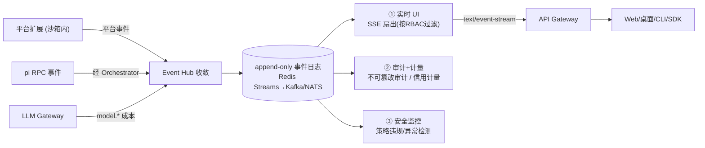

# 08 · 可观测性与 SSE 事件流

覆盖需求 9（SSE 事件流 / 全链路可观测）。核心：**事件溯源为唯一事实源 → SSE 实时投影 → 三类消费者（实时 UI / 审计计量 / 安全监控）**。

---

## 1. 设计基线

| 原则 | 说明 | 依据 |
|---|---|---|
| **事件溯源** | append-only 事件日志是唯一事实源；回放可重建任意运行 | OpenHands EventLog |
| **SSE = 实时投影** | 浏览器/桌面/CLI 经 SSE 订阅同一条流；JSONL headless 与之等价 | Claude Code `stream-json` / Codex `--json` |
| **pi 事件为种子** | pi 的 session/turn/message/tool 事件 + 平台语义事件统一封装 | 见 [04 §1.2](./04-pi-integration-and-multi-llm.md) |
| **作用域标签 + RBAC 过滤** | 每事件带 org/group/project/agent/session/user；订阅按权限过滤 | — |
| **发射即脱敏** | 密钥/敏感参数在写入前脱敏 | — |
| **可断点续传/回放** | `Last-Event-ID` 续订；历史可回放 | SSE 标准 |

---

## 2. 事件信封（Envelope）

```jsonc
{
  "id": "evt_01HX...",                  // 全局单调，SSE 经 Last-Event-ID 续传
  "ts": "2026-06-02T08:21:33.120Z",
  "type": "tool_call.requested",        // 命名空间枚举(见 §3)
  "seq": 1423,                          // 会话内顺序
  "actor": "agent",                     // agent | user | system | subagent | service
  "scope": {
    "org": "acme", "group": "payments", "project": "checkout",
    "agentId": "ag_...", "runId": "run_...", "sessionId": "sess_...",
    "subagentId": null, "userId": "u_..."
  },
  "data": { "tool": "bash", "input": "git status" },  // 类型相关
  "redacted": false                     // 是否做过脱敏
}
```

- **`id` 全局单调** → SSE 重连用 `Last-Event-ID` 精确续传。
- **`seq` 会话内序** → UI 严格排序、检测缺口。
- **`scope`** → RBAC 过滤订阅（项目成员只收到本项目事件）+ 审计归因 + 计量分摊。

---

## 3. 事件分类（Taxonomy）

| 命名空间 | 事件（示例） | 用途 |
|---|---|---|
| `session.*` | `started / ended / forked` | 运行边界 |
| `turn.*` | `started / completed / failed` | 回合 |
| `message.*` | `delta / completed` | 流式文本（映射 pi `message_update.text_delta`） |
| `model.*` | `request / response`（含 tokens/cost/latency/provider/model） | 成本计量 |
| `tool_call.*` | `requested / approved / denied / blocked / started / result` | 工具全生命周期 + 治理 |
| `mcp.*` | `server_started / tool_invoked / error` | MCP（经 pi-mcp-adapter） |
| `subagent.*` | `spawned / event / completed` | 子 Agent 树（经 pi-subagents） |
| `skill.*` | `activated / loaded / revoked_in_run` | Skill 使用 |
| `sandbox.*` | `created / exec / limit_exceeded / destroyed / recovered` | 隔离与资源 |
| `permission.*` | `prompted / decided / escalated / timeout` | 审批往返 + 升级链（见 [16](./16-notification-system.md) §3） |
| `notification.*` | `delivered / failed / bounced / read` | 通知投递状态追踪（见 [16](./16-notification-system.md) §6.3） |
| `prompt.*` | `version_created / rollout_changed / guardrail_violation` | Prompt 版本管理与护栏（见 [15](./15-prompt-management-and-evaluation.md) §A） |
| `evaluation.*` | `auto_evaluated / benchmark_completed / feedback_received` | Agent 评估与用户反馈（见 [15](./15-prompt-management-and-evaluation.md) §B–§C） |
| `security.*` | `flagged`（risk Low/Med/High，含理由） | 安全监控 |
| `audit.*` | `publish / approve / grant / revoke / login / token_issued` | 不可篡改审计 |

> 这套分类同时是 SSE 流、审计日志、计量、安全告警的共同 schema。

---

## 4. 数据流：从沙箱到消费者



### 4.1 ① 实时 UI（SSE）
- 传输：`text/event-stream`；`event:` = 事件 type，`id:` = 信封 id，`data:` = JSON。
- 订阅：`GET /v1/runs/{runId}/events`（单运行）/ `GET /v1/projects/{id}/events`（项目级看板）。
- **断点续传**：客户端断线重连带 `Last-Event-ID`，Gateway 从日志补发缺口。
- **RBAC 过滤**：Gateway 按订阅者权限只下发其 scope 内、且脱敏后的事件。
- **审批桥接**：`permission.prompted`（源自 pi `extension_ui_request`）作为审批卡片推给客户端；客户端应答经控制面回 `extension_ui_response`（见 [03 §3](./03-system-architecture.md) 时序）。
- 备选：浏览器用 SSE；需要双向高频时可选 WebSocket，事件 schema 不变。

### 4.2 ② 审计 + 计量
- **审计**：`audit.*` + 关键 `tool_call.*`/`permission.*` 落不可篡改存储（追加写、可签名/哈希链）；支持检索、导出、回放；操作可归因到人/服务账号。
- **计量计费**：`model.*`（token×单价）+ `sandbox.*`（时长×规格）归一为**信用单位**（参考 Devin ACU）；按 用户/项目/业务组/组织 分摊；配额与预算告警。

### 4.3 ③ 安全监控
- 在 `tool_call.*` / `sandbox.limit_exceeded` / `security.flagged` 上做策略违规与异常检测；触发告警、限流、甚至**自动熔断**某 Skill/Agent。
- 与 [06](./06-capabilities-skills-mcp-subagents.md) 的撤销/熔断联动。

---

## 5. 回放与运行树

- 因为是事件溯源 + pi 会话树（JSONL `id/parentId`），控制台可呈现：
  - **运行时间线**：逐事件回放（含工具调用、审批、成本、子 Agent 派生）。
  - **运行树视图**：父/子 Agent、会话分支（fork/branch）可展开。
  - **Diff/产物**：从 `tool_call.result`（如 `edit` 的 `details.patch` 统一 diff）还原文件变更。
- 回放对审计员与调试同等有用。

---

## 6. 与既有 APM 的关系
- 业务事件流（本文）解决"Agent 干了什么"；OpenTelemetry/Prometheus/Loki 解决"系统健康"。
- 两者用统一的 `runId/sessionId` 关联；trace 注入事件信封便于联查。

---

## 7. 与需求对应
- 需求 9（SSE 全链路可观测）：全文。
- 关联：事件源自 [04](./04-pi-integration-and-multi-llm.md) pi 事件；治理事件源自 [05](./05-rbac-and-governance.md)/[06](./06-capabilities-skills-mcp-subagents.md)；沙箱事件源自 [07](./07-sandbox-isolation.md)；API 出口见 [09](./09-api-clients-and-data-model.md)；通知投递事件见 [16](./16-notification-system.md)；Prompt 与评估事件见 [15](./15-prompt-management-and-evaluation.md)。
