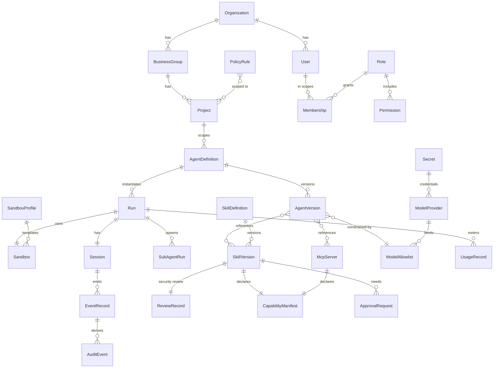

# 09 · API、客户端与数据模型

覆盖需求 4（完整页面管理）、11（API/桌面端等多端）。含 REST/SSE API 面、Agent Run API、控制台信息架构、SDK/CLI/桌面端、数据模型 ER。

---

## 1. API 设计（API-First，多端等价）

所有客户端（Web/桌面/CLI/SDK/集成）共享同一套 **REST + SSE** 契约（OpenAPI 3 描述）。鉴权：用户令牌（OIDC）或服务账号令牌（限作用域、限资源、可设 TTL）。

### 1.1 核心资源端点（节选）

| 资源 | 端点（示例） |
|---|---|
| 认证 | `POST /v1/auth/token`、`/v1/auth/sso/*` |
| 用户 API Key | `GET/POST/DELETE /v1/api-keys`（用户自管 sk-xxx，含作用域/过期/吊销） |
| LLM 代理 | `POST /v1/chat/completions`（OpenAI 兼容）、`POST /v1/messages`（Anthropic 兼容） |
| 组织/组/项目 | `GET/POST /v1/orgs`、`/v1/groups`、`/v1/projects` |
| 用户/角色/策略 | `/v1/users`、`/v1/roles`、`/v1/policies`、`/v1/memberships` |
| 模型/Provider | `/v1/providers`、`/v1/models`（含白名单解析） |
| Agent 定义 | `GET/POST/PUT /v1/agents`、`/v1/agents/{id}/versions` |
| **运行 Run** | `POST /v1/runs`、`GET /v1/runs/{id}`、`POST /v1/runs/{id}/prompt`、`POST /v1/runs/{id}/cancel`、`/fork` |
| **事件流** | `GET /v1/runs/{id}/events` (SSE)、`GET /v1/projects/{id}/events` (SSE) |
| 审批 | `POST /v1/runs/{id}/approvals/{reqId}`（allow/deny） |
| MCP | `/v1/mcp-servers`（CRUD + 接入审批 + 健康） |
| Skill | `/v1/skills`、`/v1/skills/{id}/submit`、`/scan-report`、`/review`、`/revoke` |
| 沙箱画像 | `/v1/sandbox-profiles` |
| 审计/计量 | `/v1/audit`、`/v1/usage`、`/v1/quotas` |
| 密钥 | `/v1/secrets`（仅引用，不回明文） |

### 1.2 Agent Run API（headless/自动化的一等公民）

```jsonc
// 发起一次受治理的 Run（CI/定时/外部系统皆可）
POST /v1/runs
{
  "agentId": "ag_review_bot",
  "projectId": "checkout",
  "input": "审查本次 MR 的安全风险",
  "context": { "git": { "repo": "...", "ref": "mr/123" } },
  "stream": true
}
// → 201 { "runId": "run_...", "eventsUrl": "/v1/runs/run_.../events" }
```
- 然后 SSE 订阅 `eventsUrl` 实时拿进度，或轮询 `GET /v1/runs/{id}` 拿最终结果与产物。
- 与 pi 的 JSON 模式语义对齐，但**全程受 RBAC/策略/沙箱/审计治理**——这正是与本地 codex/claude code 的差异。

---

## 2. Web 控制台信息架构（完整页面管理，需求 4）

```mermaid
flowchart TD
    Root["Polaris 控制台"]
    Root --> WP["① 工作台/对话 Workspace"]
    Root --> OBS["② 运行与可观测 Runs"]
    Root --> AG["③ Agent 管理"]
    Root --> MD["④ 模型管理"]
    Root --> MCP["⑤ MCP 管理"]
    Root --> SK["⑥ Skill 市场与管理"]
    Root --> ORG["⑦ 组织/业务组/项目"]
    Root --> RBAC["⑧ 权限与角色"]
    Root --> AUD["⑨ 审计与合规"]
    Root --> BIL["⑩ 计量与配额"]
    Root --> SET["⑪ 设置"]

    WP --> WP1["发起任务 / 多轮对话"]
    WP --> WP2["实时事件流 + 文件树 + Diff + 终端"]
    WP --> WP3["人工审批弹窗(extension_ui)"]
    OBS --> OBS1["运行列表 / 状态 / 成本"]
    OBS --> OBS2["事件回放 / 运行树(父子Agent/分支)"]
    OBS --> OBS3["沙箱资源 / 日志检索"]
    AG --> AG1["定义 CRUD / 版本 / 可见域 / 试运行"]
    MD --> MD1["Provider 接入 / 白名单 / 默认 / 成本看板"]
    MCP --> MCP1["接入 / 健康 / 工具与能力清单 / 审批"]
    SK --> SK1["浏览搜索 / 创作编辑器"]
    SK --> SK2["发布工作流 / 安全评估报告 / 人审"]
    SK --> SK3["版本 / 撤销熔断"]
    ORG --> ORG1["层级 / 成员 / 邀请"]
    RBAC --> RBAC1["角色 / 权限矩阵 / 策略规则 / 可见域锁定"]
    AUD --> AUD1["审计检索导出 / 安全告警"]
    BIL --> BIL1["用量 / 成本 / 配额 / 预算告警"]
    SET --> SET1["SSO/SCIM / 密钥 / 出网白名单 / 沙箱画像 / 品牌化"]
```



权限驱动渲染：菜单与操作按 RBAC 动态显隐（成员看不到管理面，管理员按作用域看到对应范围）。

---

## 3. 多端客户端（需求 11）

| 客户端 | 形态 | 关键点 |
|---|---|---|
| **Web 控制台** | React SPA | 管理 + 工作台全功能（§2） |
| **桌面端** | Tauri（荐）/Electron 瘦客户端 | 对话 + 工作区 + Diff + 实时事件；**无需本地密钥/环境**；可选**本地目录桥接**（显式授权后让云端 Agent 访问本地文件夹，用于混合工作流） |
| **CLI** | 瘦客户端 | `polaris login` / `run` / `logs -f`（SSE）/ 资源管理；指向组织云，对标 codex/claude code 的用法但治理在云端 |
| **SDK** | TypeScript / Python | 封装 REST+SSE；供 CI、脚本、外部系统集成 |
| **集成** | IDE 插件 / Slack / CI / Webhook | 复用同一 API；触发 Run、回灌结果（如 PR 评论） |

> **瘦客户端原则**：客户端只负责呈现与交互，算力/工具/密钥/Skill 全在云端 → 同项目成员开箱即用、不依赖本地（需求 10）。

---

## 4. 数据模型（ER 概览）



### 4.1 关键实体（职责）

| 实体 | 职责/要点 |
|---|---|
| **Organization / BusinessGroup / Project** | 四级作用域骨架（[05](./05-rbac-and-governance.md)） |
| **User / Membership / Role / Permission** | RBAC：用户在某作用域持某角色；角色含权限点 |
| **PolicyRule** | 运行时工具级 allow/deny/ask 策略，带作用域 + 可锁定 |
| **AgentDefinition / AgentVersion** | Agent 配置模板与版本（系统提示、模型约束、引用的 Skill/MCP/子Agent、权限/沙箱画像） |
| **Run / SubAgentRun** | 一次执行与其子 Agent；绑定 Sandbox + Session |
| **Session / EventRecord** | pi 会话树 + 事件溯源记录（[04](./04-pi-integration-and-multi-llm.md)/[08](./08-observability-and-sse.md)） |
| **Sandbox / SandboxProfile** | 隔离实例与其模板画像（[07](./07-sandbox-isolation.md)） |
| **SkillDefinition / SkillVersion / ReviewRecord / CapabilityManifest** | Skill 及其不可变版本、安审记录、能力清单（[06](./06-capabilities-skills-mcp-subagents.md)） |
| **McpServer** | MCP 接入定义（经 pi-mcp-adapter）+ 能力清单 + 凭据引用 |
| **ModelProvider / ModelAllowlist** | 接入的厂商与各作用域可用模型 |
| **Secret** | 密钥引用（明文存 Vault，库中只存引用） |
| **UsageRecord / AuditEvent / ApprovalRequest** | 计量、不可篡改审计、审批工单 |
| **PromptTemplate / PromptVersion** | Prompt 版本化：不可变版本、模板变量、A/B 配置、护栏策略（[15](./15-prompt-management-and-evaluation.md) §A） |
| **Evaluation / Feedback** | Agent 自动评估记录 + 用户满意度反馈（[15](./15-prompt-management-and-evaluation.md) §B–§C） |
| **NotificationPreference / DeliveryRecord** | 用户通知偏好（渠道/静默时段/digest）+ 投递状态追踪（[16](./16-notification-system.md) §5–§6） |
| **ApprovalEscalation** | 审批升级链状态（级别/超时/受理人）（[16](./16-notification-system.md) §3） |
| **WebhookConfig** | 自定义 Webhook 配置（URL/密钥/事件订阅）（[16](./16-notification-system.md) §4.4） |

### 4.2 存储落位
- PostgreSQL：上述结构化实体（RBAC/目录/审计索引）。
- 对象存储：Session JSONL、Skill 包、运行产物。
- 事件日志（Streams/Kafka）：EventRecord 原始流（[08](./08-observability-and-sse.md)）。
- Vault：Secret 明文。

---

## 5. 与需求对应
- 需求 4（完整页面管理）：§2 信息架构（11 大模块）。
- 需求 11（API/桌面端/多端）：§1、§3。
- 关联：API 鉴权依赖 [05](./05-rbac-and-governance.md)；事件 SSE 依赖 [08](./08-observability-and-sse.md)；Run 编排依赖 [03](./03-system-architecture.md)/[04](./04-pi-integration-and-multi-llm.md)；通知 API（审批/Webhook）见 [16](./16-notification-system.md)；IDE 插件集成协议见 [20](./20-ide-integration-protocol.md)；数据留存与脱敏见 [14](./14-data-retention-and-privacy.md)。

---

> 💡 **如何阅读**：前端/客户端开发者看 §1（API 面 REST+SSE）+ §2（控制台 IA）；架构师看 §4（ER 数据模型）+ §1（Agent Run API）；集成工程师看 §1（API）+ §3（多端客户端：CLI/SDK/桌面）；安全评审看 §1（鉴权）+ §4（数据模型字段安全）。
