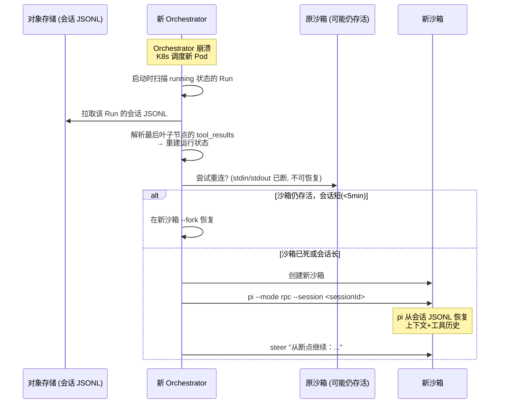
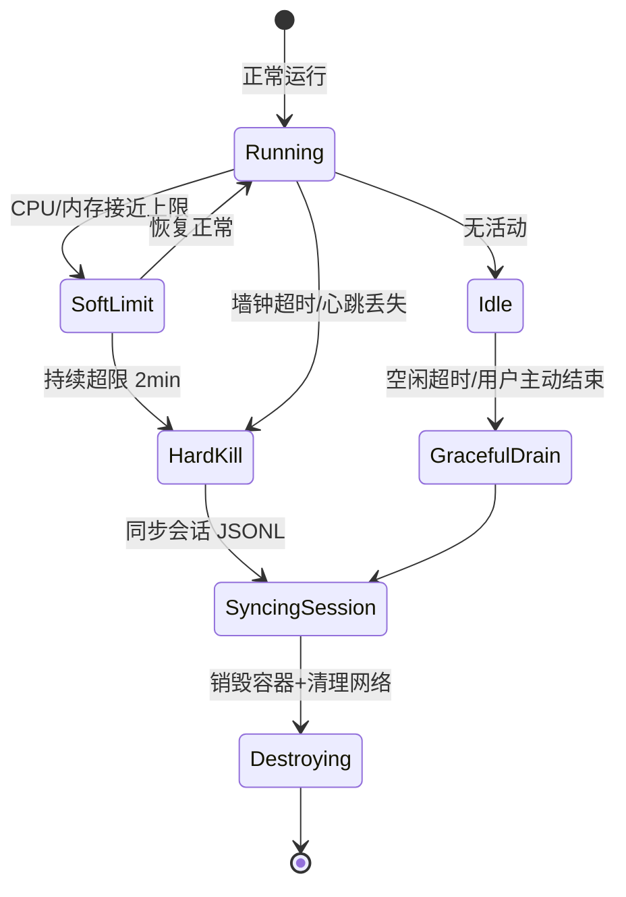

# 13 · 运维手册

本文覆盖 Day-2 运维：故障恢复、备份恢复、资源治理、升级策略、健康检查与告警。目标是把"运维可操作"纳入设计，而非上线后补锅。

---

## 1. 控制面故障恢复

### 1.1 Orchestrator 崩溃

Orchestrator 是**唯一有状态**的控制面组件——它持有到每个沙箱 pi 进程的 RPC 连接（stdin/stdout 子进程句柄）。

```
Orchestrator 崩溃的影响链路：
  Orchestrator Pod 被 Kill / OOM / panic
    → 所有到沙箱的 RPC stdin/stdout 管道断开
    → 沙箱内 pi 进程的 stdin 收到 EOF
    → pi 进程终止（沙箱不立即销毁）
    → 会话 JSONL 的最后一次 flush 状态留在对象存储
```

**恢复策略：基于会话 JSONL 的续跑**



**关键设计决策**：

| 决策点 | 选择 | 理由 |
|---|---|---|
| 会话同步模式 | **分层同步**：增量 append 每秒 flush；完整 JSONL 每次 turn_end 强制 flush | 平衡性能与恢复精度 |
| 恢复粒度 | **从最近 turn_end 叶子续跑**（≤1 个 turn 丢失） | turn 是无副作用的原子边界；丢失最多是最后一个不完整的 turn |
| 沙箱保留 | 崩溃后保留沙箱 5min（GracefulRetention）；超期则回收 | 给恢复窗口；避免资源泄漏 |
| Run 状态标记 | `running → recovering → running`（恢复中）或 `running → crashed`（不可恢复） | 客户端 UI 可展示过渡态 |

### 1.2 会话 JSONL 同步策略

```
分层同步模型：

Layer 1 — 内存写入（每事件）:
  pi 进程 → SessionManager.appendMessage() → 内存 buffer
  延迟: <1ms，无 I/O

Layer 2 — 本地文件写入（增量 append，每 1s）:
  内存 buffer → ~/.pi/agent/sessions/<id>.jsonl
  延迟: 最多 1s 未 flush 数据（可配置）

Layer 3 — 对象存储同步（每次 turn_end）:
  本地 JSONL → S3/MinIO (按 Run 归档)
  触发: turn_end 事件 OR 每 30s（兜底）
  格式: s3://polaris-sessions/<org>/<runId>/session.jsonl

Layer 4 — 事件日志（每事件，独立路径）:
  平台扩展 → Event Hub → append-only event log
  触发: 每事件
  这是审计的 canonical 来源；会话 JSONL 是 pi 恢复的 canonical 来源
```

| 同步层 | 延迟 | 数据完整性 | 用途 |
|---|---|---|---|
| Layer 2 本地 JSONL | ≤1s 丢失 | 可能丢最后 1s | pi 进程内恢复 |
| Layer 3 对象存储 | ≤30s 或一个 turn | turn 原子 | Orchestrator 崩溃恢复 |
| Layer 4 事件日志 | 实时 | 每事件 | 审计、回放、计量 |

### 1.3 其他控制面组件故障

| 组件 | 故障影响 | 恢复 |
|---|---|---|
| **API Gateway** | 新请求无法受理；已有 SSE 连接断开 | K8s 多副本 + 滚动重启；SSE 客户端重连 + `Last-Event-ID` |
| **IAM** | 新鉴权请求失败；已颁发的令牌在 TTL 内仍有效 | 多副本；鉴权降级：令牌缓存（≤5min）+ 本地策略副本 |
| **Catalog** | 新 Run 无法解析 effective config | 多副本；Orchestrator 缓存最近 effective config（≤5min TTL） |
| **Event Hub** | 事件丢失、SSE 无法扇出 | 多副本 + 事件日志持久化；Event Hub 重启后从日志追赶 |
| **LLM Gateway** | Agent 的 LLM 调用失败 | 多副本；内置 provider fallback（主 provider 故障 → 备用） |
| **Review (安审)** | Skill 发布卡在 submitted 状态 | 多副本；状态机幂等重试 |

---

## 2. 备份与恢复

### 2.1 数据分类与 RPO/RTO

```
数据分类：
  A — 元数据 (PG: RBAC/目录/审计索引): 业务关键
  B — 会话 JSONL (对象存储): 运行关键
  C — 事件日志 (Kafka/NATS Streams): 审计关键
  D — Skill 包 + 产物 (对象存储): 可重建
  E — 密钥 (Vault): 不可丢失
```

| 数据 | 存储 | RPO | RTO | 备份方式 | 保留 |
|---|---|---|---|---|---|
| **PG 元数据** | PostgreSQL | < 1h（持续 WAL 归档） | < 1h | `pg_basebackup` 每日全量 + WAL 持续归档；PITR | 30 天 |
| **会话 JSONL** | S3/MinIO | < 30s（turn_end 同步） | < 5min | S3 跨区域复制 / MinIO mirror；版本控制 | 按留存策略（见 [14](./14-data-retention-and-privacy.md)） |
| **事件日志** | Kafka/NATS JetStream | < 1s（同步副本） | < 5min | 日志 → S3 归档（每 15min 或 1GB 滚动） | >= 1 年 |
| **Skill 包** | S3/MinIO | < 1h | < 1h | S3 版本控制 + 跨区域复制 | 永久（不可变版本） |
| **运行产物** | S3/MinIO | < 1h | < 4h | 与 Run 生命周期绑定；可选跨区域复制 | 随 Run 会话 |
| **密钥** | Vault | 0（实时 raft 复制） | < 15min | Vault snapshot 每日 + raft 自动复制 | 永久 |

### 2.2 灾难恢复流程

```
场景：主站故障（PG 主库 + 对象存储不可达）

恢复步骤：
  1. 切 DNS 到备站 (T+5min)
  2. 备站 PG 从最新 WAL 恢复到主站故障点 (T+15min)
  3. 对象存储从备站 S3 mirror 恢复 (T+10min)
  4. 事件日志从归档 S3 重放追赶 (T+20min)
  5. 控制面服务在备站启动，接续在途 Run (T+25min)
  6. 在途 Run 逐个从会话 JSONL 恢复 (T+30min~)

目标 RTO: < 1h（全站故障切换）
目标 RPO: < 1h（元数据）/ < 5min（事件日志）/ < 30s（会话）
```

### 2.3 定期演练

- **每月**：PG PITR 恢复演练（验证 WAL 完整性）
- **每季度**：全站故障切换演练（备站接管）
- **每次 pi 大版本升级前**：回滚演练（升级→发现兼容问题→回滚→数据无损）

---

## 3. 沙箱资源治理

### 3.1 异常检测与强制回收

```
沙箱泄漏场景：
  1. pi 进程僵死（无响应但不退出）
  2. Skill 中的 fork bomb / 内存泄漏
  3. MCP sidecar 进程泄漏
  4. 网络连接泄漏（不释放 egress 连接）
  5. 磁盘泄漏（临时文件不清理 → 配额打满）
```

**检测机制**：

| 检测方式 | 检测对象 | 周期 | 动作 |
|---|---|---|---|
| **心跳检测** | Orchestrator → pi 进程 | 每 30s | 连续 3 次无心跳 → 标记 unresponsive |
| **资源监控** | CPU/内存/磁盘/网络（沙箱 cgroup） | 每 10s | 超限 → 先 throttle，持续超限 2min → force kill |
| **墙钟超时** | Run 运行时长 | 持续 | 超限 → 先 SIGTERM, 30s 后 SIGKILL |
| **空闲超时** | 距上次 prompt/工具调用 | 持续 | 超限 → 优雅回收（同步会话后销毁） |
| **孤儿检测** | 无对应 Orchestrator 的沙箱（Orchestrator 崩溃后未恢复） | 每 5min（独立 goroutine/job） | 超 GracefulRetention(5min)→ 强制回收 |
| **僵尸子进程** | MCP sidecar / 子 Agent 未随父退出 | 每次沙箱销毁前 | 遍历进程树 → 全部 kill |

### 3.2 回收状态机



### 3.3 资源泄漏自动告警

| 告警 | 条件 | 严重性 |
|---|---|---|
| 沙箱泄漏 | 活跃沙箱数 > 活跃 Run 数 × 1.2，持续 5min | P2 |
| 孤儿沙箱 | 检测到无主沙箱 | P2 |
| 沙箱池耗尽 | 可用沙箱 < 池容量的 10% | P1 |
| 单用户异常并发 | 单用户并发 Run > 配额的 150% | P2 |
| 沙箱磁盘使用率异常 | 磁盘增长速率 > 100MB/min 持续 10min | P3 |

---

## 4. 升级策略

### 4.1 控制面滚动更新

```
控制面组件（无状态或可多副本）→ K8s RollingUpdate:

原则: maxUnavailable=0, maxSurge=1
  → 始终有 N 个副本在服务，逐个替换

顺序（按依赖）:
  1. 存储层先升级（PG/Redis/Kafka）— 维护窗口
  2. 基础设施服务: Secrets → Event Hub → LLM Gateway
  3. 核心服务: IAM → Catalog → Review → Audit
  4. 网关: API Gateway → Orchestrator (最后)
```

### 4.2 数据面优雅 Drain（关键——不能杀正在跑的 Agent）

```
Orchestrator 升级策略: "Drain before upgrade"

步骤:
  1. 旧 Orchestrator Pod 标记 draining
     → 不接受新 Run 请求
     → 已有 Run 继续运行
  2. 新 Orchestrator Pod 启动
     → 接管新 Run 请求
  3. 旧 Pod 等待所有在途 Run 完成（最长 drainTimeout=30min）
     → 对仍在运行的 Run: fork 到新 Orchestrator
     → 对空闲 Run: 触发优雅回收
  4. 旧 Pod 所有 Run 移交完成 → 终止
```

### 4.3 数据面 Agent 不中断升级

```
目标: 升级沙箱镜像/平台扩展时，不影响正在运行的 Agent

方案: "Side-by-side" 镜像共存
  - 每个沙箱在创建时绑定沙箱镜像版本（SandboxProfile.imageTag）
  - 新 Run 用新镜像；旧 Run 继续用旧镜像直到结束
  - 平台扩展版本也随 effective config 中 sandbox-profile 版本固定
  - 不强制升级在途 Agent（最长存活 = 墙钟超时）
```

### 4.4 pi / 官方包升级

| 升级类型 | 策略 | 回滚 |
|---|---|---|
| **pi patch**（x.y.Z） | 沙箱镜像中包含新 pi 版本；旧镜像共存 7 天 | 更新 SandboxProfile imageTag → 旧镜像 |
| **pi minor**（x.Y.z） | Staging 验证 + 兼容性 snapshot 测试（见 [12 §6](./12-testing-strategy.md)）→ 灰度 10% → 全量 | 同上 |
| **pi major**（X.y.z） | 维护窗口；需 platform extension 适配；先在 staging 完整回归 | 旧镜像保留 ≥30 天 |
| **pi-mcp-adapter / pi-subagents** | 与 pi 版本锁定；在 Staging 验证工具调用路径无退化 | 回退到旧版本 + 平台扩展中锁定包版本 |

### 4.5 数据库迁移

```
原则:
  - 仅向前（additive）：新增列/表 default null → 填充 → 旧代码兼容
  - 向后兼容：迁移先跑，旧代码继续工作，验证后部署新代码
  - 禁止：DROP COLUMN / RENAME（需多版本兼容周期）

流程:
  1. 迁移脚本 (up + down) PR review
  2. CI 验证: 迁移 up → 旧代码冒烟 → 迁移 down → 恢复
  3. 维护窗口执行迁移
  4. 部署新代码
```

---

## 5. 健康检查与告警

### 5.1 组件健康检查端点

每个服务暴露 `/health`（存活）+ `/health/ready`（就绪）：

| 组件 | 就绪条件 |
|---|---|
| API Gateway | 所有 upstream 可达（IAM/Catalog/Orch/EventHub） |
| IAM | PG 可达 + 令牌签名密钥可用 |
| Catalog | PG 可达 |
| Orchestrator | 沙箱池可用 + 对象存储可达 |
| Event Hub | Redis/Kafka 可达 |
| LLM Gateway | ≥1 个 provider 可达 + Vault 可达 |
| Review | PG 可达 + LLM 风险判定可用 |

### 5.2 SLO 与告警阈值

```
SLO 定义:
  - 控制面可用性: 99.9% (月)
  - API p95 延迟: < 200ms (读) / < 1s (写)
  - SSE 首事件延迟: < 3s p95
  - Run 创建成功率: > 99.5%
```

| 告警 | 条件 | 严重性 | 通知 |
|---|---|---|---|
| **控制面可用性下降** | 错误率 > 1% 持续 5min | P0 | PagerDuty / 电话 |
| **Run 创建失败率** | 失败率 > 5% 持续 5min | P1 | PagerDuty |
| **API p95 延迟飙升** | p95 > 2× baseline 持续 10min | P2 | Slack |
| **沙箱创建延迟** | p95 > 30s 持续 10min | P2 | Slack |
| **SSE 延迟飙升** | p95 > 5s 持续 5min | P2 | Slack |
| **PG 复制延迟** | > 100MB / > 5s 持续 5min | P1 | PagerDuty |
| **Vault 不可达** | 3 次连续健康检查失败 | P0 | PagerDuty |
| **LLM Gateway 所有 provider 不可达** | 3 次连续健康检查失败 | P0 | PagerDuty |
| **证书到期** | < 30d / < 7d | P2/P1 | Slack/PagerDuty |
| **磁盘使用率** | > 80% / > 90% | P2/P1 | Slack/PagerDuty |
| **沙箱池利用率** | > 80% | P2 | Slack |
| **孤儿沙箱数** | > 5 个 | P2 | Slack |
| **事件日志积压** | consumer lag > 1000 条 或 > 30s | P2 | Slack |

### 5.3 关键指标看板

**运维 Dashboard（Grafana）**：

```
Row 1 — 全局健康:
  - 控制面可用性 (gauge, 目标 99.9%)
  - Run 创建成功率 (gauge, 目标 > 99.5%)
  - 各组件健康状态 (status panel: green/yellow/red)

Row 2 — 延迟:
  - API p50/p95/p99 latency (timeseries, 读/写分面)
  - SSE 首事件延迟 p50/p95 (timeseries)
  - 沙箱冷启动延迟 p50/p95 (timeseries)

Row 3 — 容量:
  - 并发 Run 数 (timeseries)
  - 沙箱池利用率 (gauge)
  - PG connection pool (gauge)
  - LLM Gateway rate limit 命中率 (timeseries)

Row 4 — 错误与异常:
  - 4xx/5xx 速率 (timeseries, 按端点)
  - 闸门 deny 速率 (timeseries, 按工具/策略)
  - 沙箱 OOM/超限/崩溃速率 (timeseries)
  - 孤儿沙箱数 (gauge)

Row 5 — 成本:
  - Token 消耗速率 (timeseries, 按模型/provider)
  - 沙箱时长 (timeseries)
  - 信用消耗趋势 (timeseries, 按项目)
```

---

## 6. 日志与排查

### 6.1 日志分层

| 层级 | 内容 | 存储 | 保留 |
|---|---|---|---|
| **业务事件** | Agent 运行事件（SSE/event log） | Kafka → S3 归档 | 按 [14](./14-data-retention-and-privacy.md) |
| **服务日志** | 控制面各组件日志（结构化 JSON） | Loki / ELK | 30 天 |
| **审计日志** | 管理操作 + 安全事件 | PG + 不可变存储 | >= 1 年 |
| **沙箱日志** | pi stdout/stderr（非 RPC 模式）| Loki | 7 天 |

### 6.2 排查工具链

```
排查一次 Run 为什么失败：

  1. 审计日志: runId → 哪个 Orchestrator、哪个沙箱节点、生命周期时间线
  2. 事件回放: runId → 完整 SSE 事件 → 哪步出错了
  3. 服务日志: runId → Orchestrator 日志 → RPC 命令/响应
  4. 沙箱日志: runId → pi stderr → 工具执行错误
  5. 会话 JSONL: runId → 对象存储 → 最后的对话状态

统一关联 ID: runId 贯穿所有层 ← 这是设计原则
```

---

## 7. 运维 Runbook（节选）

### 7.1 单个 Run 卡住

```
症状: Run 状态 running，但 5min 无新事件

排查:
  1. 查 Orchestrator 日志: runId → 最后一次 RPC 通信
  2. 查沙箱心跳: 心跳正常? → pi 可能卡在工具执行 (如长时间 bash)
    心跳丢失? → pi 崩溃或沙箱资源耗尽
  3. 补救:
    - pi 卡住: 发 abort 命令 (RPC) → 引导 Agent 走替代路径
    - pi 崩溃: 启动恢复流程 (见 §1.1)
    - 沙箱不可达: 标记 crashed → 用户可手动 fork 重试
```

### 7.2 沙箱池耗尽

```
症状: 新 Run 创建返回 503 (no available sandbox)

排查:
  1. 活跃 Run 数是否异常 (突增?)
  2. Run 是否阻塞在审批等待 (extension_ui_request 无响应 → 沙箱长期占用)
  3. 是否有沙箱泄漏 (孤儿沙箱 / 僵尸进程)
  4. 预热池配置是否不足

补救:
  1. 先扩容 (增大 maxSandboxes)
  2. 排查阻塞源 (审批超时未处理的 Run → 强制 resolve)
  3. 清理孤立沙箱 (运行孤儿检测 job)
  4. 若紧急: 临时降低空闲超时 (加速回收)
```

### 7.3 LLM Gateway 所有 provider 不可达

```
症状: 所有 Agent 卡在模型调用

排查:
  1. Gateway → provider 连通性 (网络/DNS/TLS 证书)
  2. provider 配额/限流/欠费
  3. Vault 取 key 失败

补救:
  1. 切到备用 provider (如 OpenAI → Azure)
  2. 若所有 external provider 不可达: 降级到本地/自建 vLLM
  3. Gateway 的健康检查探测周期 = 15s (频繁)
```

---

## 8. 与需求对应

- 崩溃恢复：[03 §3](./03-system-architecture.md) 时序 + [04 §3](./04-pi-integration-and-multi-llm.md) 会话持久化
- 沙箱治理：[07](./07-sandbox-isolation.md) 沙箱生命周期
- 备份恢复：本文 §2
- 升级策略：本文 §4
- SLO/告警：[02 §3 NFR 量化指标](./02-product-requirements.md) → 本文 §5
- 数据留存：[14](./14-data-retention-and-privacy.md)

---

> 💡 **如何阅读**：SRE/DevOps 重点看 §1–§5（故障恢复、备份、升级、健康检查）+ §7（Runbook）；架构师看 §1.1（Orchestrator 恢复设计）与 §4（升级策略）；安全看 §3（沙箱治理）。
