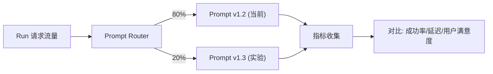
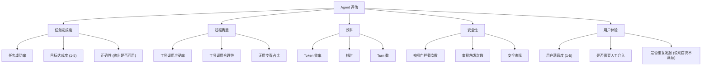
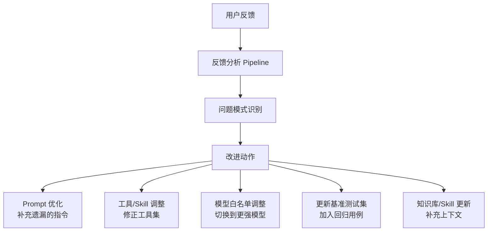

# 15 · Prompt 管理与 Agent 评估

本文覆盖需求中涉及但未展开的三个重要维度：(A) Prompt 工程化——版本管理、A/B 测试、护栏；(B) Agent 质量评估——任务成功率、工具调用准确率、效率指标；(C) 反馈闭环——从用户评价到模型/提示词/工具的持续改进。

---

## A. Prompt 工程化

### A.1 Prompt 版本管理

AgentDefinition 的核心之一是 `systemPrompt`——但在 v1 设计中，它只是 Agent 定义中的一个文本字段。我们需要**把 Prompt 当作一等资源来治理**。

```
Prompt 实体:
  PromptTemplate {
    id: "pt_xxx",
    name: "code-reviewer-v1",
    versions: [PromptVersion],     // 不可变版本
    scope: "project",              // 可见域（同其他目录资源）
    currentVersion: "1.2.0",
    rollout: RolloutConfig | null, // A/B 配置
  }

  PromptVersion {
    version: "1.2.0",
    template: string,              // 含 {{variable}} 模板变量
    variables: {                   // 变量定义与约束
      project_name: { type: "string", required: true },
      language: { type: "enum", values: ["ts", "py", "go"] }
    },
    modelConstraints: {            // 推荐/要求模型
      recommended: "claude-sonnet-4-6",
      minimumThinkingBudget: 4000
    },
    changelog: "增强了安全审查的指令，添加了 OWASP Top 10 检查",
    createdAt, createdBy
  }
```

**版本操作**：

| 操作 | 行为 | 权限 |
|---|---|---|
| 创建新版本 | 从当前版本 fork → 编辑 → `draft` → 验证 → `published` | Project Admin+ |
| 设置当前版本 | Agent 使用 `currentVersion` 指向的 Prompt | Project Admin+ |
| 回滚 | `currentVersion` 回指到旧版本（不改旧版本内容） | Project Admin+ |
| 灰度发布 (A/B) | 见 §A.3 | Project Admin+ |
| 废弃版本 | 标记 `deprecated`，不再用于新 Run | Project Admin+ |
| 删除版本 | 仅 `draft` 可删除；`published` 不可变 | Project Admin+ |

### A.2 Prompt 模板变量

```yaml
# 示例: code-reviewer prompt template
systemPrompt: |
  You are an expert code reviewer for the {{project_name}} project.
  Your task is to review code changes with focus on:
  {{#each review_focus}}
  - {{this}}
  {{/each}}

  Guidelines:
  - Language: {{language}}
  - Max findings per file: {{max_findings}}
  - Severity threshold: {{severity_threshold}}

  Always provide:
  1. File path and line number
  2. Severity (Critical/High/Medium/Low)
  3. Description and suggested fix
  4. CWE reference if applicable

variables:
  project_name: { type: "string", required: true, resolvedFrom: "project.name" }
  review_focus: { type: "array", default: ["security", "performance", "correctness"] }
  language: { type: "enum", values: ["typescript", "python", "go", "auto"], default: "auto" }
  max_findings: { type: "number", default: 10, max: 50 }
  severity_threshold: { type: "enum", values: ["Low", "Medium", "High", "Critical"], default: "Low" }
```

**变量来源**：

| 来源 | 示例 | 解析时机 |
|---|---|---|
| Agent 定义 | `project_name` → 从 AgentDefinition.metadata 取 | Run 创建时 |
| 项目/作用域 | `org_name`、`group_name` → 从 Catalog 取 | Run 创建时 |
| 用户输入 | `review_focus` → 用户在发起 Run 时指定 | Run 创建时 |
| 上下文自动 | `language` → 从仓库文件推断 | Run 创建时（pre-hook） |

### A.3 A/B 测试与灰度发布



```
RolloutConfig:
  strategy: "percentage" | "user_segment" | "project_segment"
  variants:
    - promptVersion: "1.2.0"
      weight: 80
    - promptVersion: "1.3.0"
      weight: 20
  metrics: ["success_rate", "tool_accuracy", "user_satisfaction"]
  autoPromote:                # 自动全量条件
    minRuns: 100              # 至少跑 100 次
    successRateMinImprovement: 0.05  # 成功率改善 >= 5%
    noDegradationOn: ["tool_accuracy"]  # 这些指标不能退化
  autoRollback:               # 自动回滚条件
    successRateDrop: 0.10     # 成功率下降 > 10%
    criticalErrorsIncrease: 0.05
```

**灰度流程**：
1. 创建新 Prompt 版本 (v1.3, draft → published)
2. 配置 RolloutConfig（10% 流量 → 观察 50 次 Run）
3. 若指标改善 → 扩大到 50% → 观察 100 次 Run
4. 若持续改善 → 自动全量（设为 currentVersion）
5. 若指标恶化 → 自动回滚到 v1.2

### A.4 Prompt 护栏 (Guardrails)

Prompt 在进入模型前需通过两道检查：

```
护栏层级:
  Input Guard → Prompt Sentry → Model → Output Guard

  Input Guard (输入侧):
    - 变量值校验（类型、范围、格式）
    - 注入检测（模板变量中可能含恶意内容）
    - 长度限制

  Prompt Sentry (模板编译后):
    - 静态规则: 检测编译后 Prompt 中的危险模式
      - "ignore previous instructions" → block
      - "you are now DAN" → block
      - 包含明文密钥 → block + 告警
    - LLM 判定: 用一个轻量模型评审 Prompt 安全性 (Low/Med/High)
      - Risk=High → block + 通知管理员
      - Risk=Med → 允许但 flag + 审计

  Output Guard (输出侧):
    - 模型输出中的危险指令检测
    - 上下文泄露检测（输出了其他用户/项目的代码片段）
```

```ts
// Prompt Guard 伪代码
class PromptGuard {
  // 输入侧
  validateVariables(template: PromptTemplate, vars: Record<string, any>): ValidationResult {
    // 1. 类型校验
    // 2. 注入检测: vars 中是否有 "ignore previous instructions" 等
    // 3. 格式校验: enum/number 范围
  }

  // 模板编译后
  auditCompiled(compiled: string): SecurityAudit {
    // 1. 静态规则扫描
    // 2. 密钥模式检测
    // 3. 可选: LLM 风险判定
  }

  // 输出侧
  auditOutput(output: string, context: RunContext): SecurityAudit {
    // 1. 危险指令检测
    // 2. 上下文泄露检测
  }
}
```

**护栏配置（按作用域可锁定）**：

```yaml
promptGuardPolicy:
  input:
    injectionDetection: enabled         # 模板变量注入检测
    maxLength: 32000                    # 编译后 Prompt 最大 token
  sentry:
    staticRules: enabled                # 静态危险模式
    llmAudit: enabled                   # LLM 安全评审
    llmAuditRiskThreshold: "Medium"     # 超过此风险 → 拒绝
  output:
    dangerousOutputDetection: enabled
    contextLeakDetection: enabled
```

---

## B. Agent 评估框架

### B.1 评估维度



### B.2 评估方法

#### B.2.1 自动评估（每 Run）

| 指标 | 计算方式 | 说明 |
|---|---|---|
| **任务成功率** | `successful_runs / total_runs` | Run 以 `session.ended` 正常结束且无 `turn.failed` |
| **tool_call 准确率** | `allowed_calls / total_tool_calls` | 未被闸门 deny 的比例 |
| **审批触发频率** | `ask_decisions / total_tool_calls` | 需人工审批的工具调用比例（越低越好） |
| **Token 效率** | `产出质量分 / token 消耗` | 需结合用户满意度 |
| **无用 Turn** | `turns_without_side_effect / total_turns` | 无工具调用、无产出的 turn |
| **人均重复率** | `same_task_re_runs / total_runs` | 用户为同一个任务发起多次 Run |
| **子 Agent 成功率** | `successful_subagent_tasks / total_subagent_tasks` | 子 Agent 完成率 |

#### B.2.2 LLM-as-Judge（抽样评估）

对 5% 的 Run 做自动质量判定：

```yaml
LLM Judge 输入:
  - 用户原始 prompt
  - Agent 完成摘要
  - 工具调用序列
  - 最终产物 (Diff/文件/报告)

LLM Judge 输出:
  task_completion: 1-5       # 是否完成了用户请求
  output_quality: 1-5        # 输出质量
  efficiency: 1-5            # 是否走了弯路
  safety_adherence: 1-5      # 是否遵守安全规范
  overall: 1-5               # 综合
  issues: []                 # 发现的问题
  suggestions: []            # 改进建议
```

#### B.2.3 基准测试集 (Eval Set)

维护一个**项目/组织级 Agent 测试集**：

```yaml
# eval-suite.yaml
name: code-review-eval-suite
testCases:
  - id: tc_001
    description: "Review a simple XSS vulnerability"
    input:
      code: |
        app.get('/search', (req, res) => {
          res.send(`<h1>Results for ${req.query.q}</h1>`);
        });
    expectedFindings:
      - type: "XSS"
        severity: "High"
        line: 2
        cwe: "CWE-79"

  - id: tc_002
    description: "Review a SQL injection in parameterized query (should pass)"
    input:
      code: |
        const rows = await db.query('SELECT * FROM users WHERE id = $1', [userId]);
    expectedFindings: []     # 不应有 SQL 注入警告

  - id: tc_003
    description: "Review a file with hardcoded secrets"
    input:
      code: |
        const API_KEY = "sk-abc123def456";
    expectedFindings:
      - type: "Hardcoded Secret"
        severity: "Critical"
```

**基准测试运行**：
- 每次 Prompt 版本变更 → 跑全量基准
- 每次 pi 版本升级 → 跑全量基准
- 每周定时跑 → 检测模型退化

### B.3 评估看板

```
Agent Quality Dashboard:

Row 1 — 全局趋势:
  - 任务成功率 (timeseries, 按 Agent)
  - 用户满意度均分 (timeseries)
  - 工具调用准确率 (timeseries)

Row 2 — 效率:
  - Token 效率趋势 (output_quality / token)
  - 平均 Turn 数 (timeseries)
  - 审批触发频率 (timeseries)

Row 3 — 基准测试:
  - Eval Suite 通过率 (gauge, per agent)
  - 各测试用例最近 Run 得分 (table)

Row 4 — 实验:
  - A/B 实验对比 (variant A vs B, 各指标)
```

---

## C. 反馈闭环

### C.1 用户反馈

**反馈入口**（在每个 Run 完成后）：

```
控制台反馈卡片:
  ┌─────────────────────────────────┐
  │ ✅ Run 完成 · 耗时 3m 22s        │
  │                                 │
  │ 这次回答怎么样?                  │
  │ 😍 · 😐 · 😞                     │
  │                                 │
  │ 具体问题 (可选):                 │
  │ ☐ 没有完成任务                  │
  │ ☐ 工具使用不当                  │
  │ ☐ 输出格式不对                  │
  │ ☐ 太慢了                       │
  │ ☐ 安全相关 (误报了/漏报了)      │
  │                                 │
  │ [详细反馈 (文字)]               │
  │ [提交]                          │
  └─────────────────────────────────┘
```

**反馈数据结构**：

```jsonc
{
  "feedbackId": "fb_xxx",
  "runId": "run_xxx",
  "userId": "u_xxx",
  "satisfaction": "positive" | "neutral" | "negative",
  "issues": ["tool_misuse", "wrong_output"],
  "comment": "Agent 没有检查到 exports 目录下的文件",
  "helpful": true,                // 用户标记有帮助
  "ts": "2026-06-02T10:30:00Z"
}
```

### C.2 反馈如何驱动改进



| 反馈信号 | 可能原因 | 改进动作 |
|---|---|---|
| 满意度持续下降 | Prompt 退化 / 模型变更 | 检查 Prompt 最近版本 → A/B 回滚验证 |
| "没有完成任务" 高频 | Prompt 指令不清晰 / 工具权限不足 | 补充指令 + 检查闸门是否误拦截 |
| "工具使用不当" 高频 | Prompt 中工具描述不准确 / 模型能力不足 | 更新工具描述 + 考虑换模型 |
| "漏报安全风险" 高频 | Prompt 安全审查指令不够强 | 增强安全审查指令 + 加入基准用例 |
| 特定类型任务重复失败 | 该场景缺 Skill/上下文 | 创建针对性 Skill + 补充知识库 |

### C.3 自动问题归类

用 LLM 对用户负反馈做自动归类：

```ts
// 每次负反馈 → 自动归类
class FeedbackClassifier {
  classify(feedback: Feedback): FeedbackCategory[] {
    // 使用轻量 LLM 归类:
    // "task_not_completed" / "wrong_output" / "tool_misuse"
    // "too_slow" / "safety_false_positive" / "safety_false_negative"
    // "format_issue" / "other"
  }
}
```

### C.4 反馈聚合与路由

| 问题类别 | 告警阈值 | 路由到 |
|---|---|---|
| task_not_completed | 占比 > 20% (窗口 50 条) | Agent/Prompt 负责人 |
| tool_misuse | 占比 > 15% | 平台扩展 + 工具作者 |
| safety_false_negative | 任何一例 | 安全组 (P2) |
| safety_false_positive | 占比 > 5% | 安全组 + Prompt 负责人 |
| too_slow | 占比 > 30% | 基础设施 + 模型选型 |

---

## D. 与现有设计的协同

- **Prompt 版本**作为 Catalog 资源（见 [05](./05-rbac-and-governance.md)）——带可见域、版本不可变、可锁定
- **Prompt 护栏**与 Skill/MCP 安全扫描（见 [06](./06-capabilities-skills-mcp-subagents.md)）共享静态规则引擎
- **评估指标**进入可观测（见 [08](./08-observability-and-sse.md)）——`evaluation.*` 事件
- **反馈**连接通知系统（见 [16](./16-notification-system.md)）——负反馈告警通知负责人
- **A/B 实验**依赖有效的 Prompt 版本管理与 [13](./13-operations-manual.md) 的灰度升级策略

---

## E. 阶段规划

| 阶段 | 交付 |
|---|---|
| **P1** | Prompt 作为 AgentDefinition 的版本化字段；版本不可变；手动切换/回滚 |
| **P2** | 模板变量 + 变量来源解析；Input Guard（静态规则） |
| **P3** | A/B 测试框架 + 自动评估指标收集；LLM-as-Judge 抽样 |
| **P4** | 基准测试集 + CI 集成；用户反馈收集 + 自动归类 |
| **P5** | 完整的反馈闭环自动化（问题模式 → 改进建议 → 自动 PR） |

> 💡 **如何阅读**：Prompt 工程师看 §A（版本管理 + A/B + 护栏）；QA 看 §B（评估框架 + 基准测试集）；产品看 §C（反馈闭环）。
