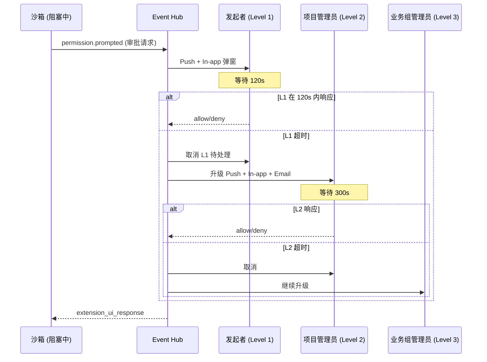
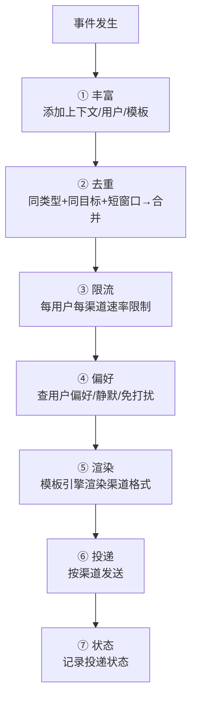

# 16 · 通知系统

当前设计中的审批走的是同步通道（`extension_ui_request/response` 经 SSE 往返），但缺少完整的异步通知体系。本文填补：多渠道通知、审批升级、告警推送、模板管理、用户偏好。

---

## 1. 通知场景全景

```mermaid
flowchart LR
    subgraph Sources["事件源"]
        RunEvt["Run 生命周期"]
        ApprovalEvt["审批与协作"]
        QuotaEvt["配额与成本"]
        ReviewEvt["Skill 安审"]
        SecurityEvt["安全事件"]
        SystemEvt["系统通知"]
    end

    subgraph Engine["通知引擎"]
        Router["路由引擎"]
        Templates["模板引擎"]
        Preference["用户偏好"]
        Throttle["限流/聚合"]
    end

    subgraph Channels["通知渠道"]
        InApp["应用内 (WebSocket/SSE)"]
        Email["邮件"]
        Slack["Slack/Teams"]
        Webhook["自定义 Webhook"]
        Pager["PagerDuty/电话 (P0)"]
    end

    Sources --> Engine --> Channels
```



---

## 2. 通知场景定义

### 2.1 运行生命周期

| 事件 | 触发条件 | 默认渠道 | 说明 |
|---|---|---|---|
| **Run 开始** | Run 成功创建 | In-app | 确认 Run 已被受理 |
| **Run 完成** | `session.ended` | In-app + (Email 可选) | 含概要：耗时、产物、成本 |
| **Run 失败** | `session.ended` with error | In-app + Email | 含失败原因摘要 |
| **Run 超时** | 墙钟超时强制中止 | In-app + Email | — |
| **Run 需审批** | 闸门返回 ask（阻塞中） | **In-app 弹窗 + 所有渠道 push** | 高优先级（见 §3） |
| **长时间 Run 进度更新** | Run 运行 > 30min | In-app | 每 30min 推送进度摘要 |
| **子 Agent 完成** | 子 Agent run 结束 | In-app | 仅当父 Run 还在运行时 |

### 2.2 审批与协作

| 事件 | 触发条件 | 默认渠道 | 升级 |
|---|---|---|---|
| **审批请求** | 闸门 ask → 需要人工确认 | In-app (弹窗) + Push + Email | **超时升级**（见 §3） |
| **审批完成** | 用户/审批人做了决定 | In-app (告知结果) | — |
| **审批超时** | 等待 > 可配置时间 | Push + Email（提醒审批人） | **升级到下一个审批人** |
| **被 @提及** | 协同 Review 中 @user | In-app | — |
| **Skill 发布申请** | 提交安审 | In-app + Email → 对应域审批人 | — |
| **Skill 安审结果** | 批准/拒绝/需修改 | In-app + Email → 作者 | — |
| **Skill 被撤销** | 管理员撤销 | In-app + Email → 作者 + 所有使用者 | 安全相关，需即时 |

### 2.3 配额与成本

| 事件 | 触发条件 | 默认渠道 | 说明 |
|---|---|---|---|
| **预算告警** | 月度消费 > 预算的 50%/80%/90%/100% | In-app + Email | 阈值可配 |
| **配额告警** | 剩余配额 < 20%/10%/0% | In-app + Email | 0% 时阻止新 Run |
| **异常消费检测** | 单次 Run 成本 > 平均的 5× | In-app + Email → 项目管理员 | 可能是失控循环 |
| **月度账单** | 每月 1 日 | Email + In-app | 汇总报告 |

### 2.4 安全事件

| 事件 | 触发条件 | 渠道 | 严重性 |
|---|---|---|---|
| **security.flagged (High)** | 安审/运行时检测到高危 | In-app + Email + Pager（可选） | P1 |
| **Skill 熔断触发** | 自动熔断逻辑触发 | In-app + Email + Pager | P1 |
| **闸门异常大量 deny** | 单用户/项目被 deny 突增 | In-app + Email → 安全组 | P2 |
| **沙箱逃逸尝试** | 沙箱安全测试检测到异常 | Pager + Email | P0 |
| **密钥疑似泄露** | 脱敏规则命中 | Pager + Email | P0 |

### 2.5 系统通知

| 事件 | 触发条件 | 渠道 |
|---|---|---|
| **平台维护预告** | 计划维护前 7d/1d/1h | In-app + Email |
| **新功能发布** | 重大功能 | In-app |
| **pi 版本升级可用** | 新 pi 版本可升级 | In-app → Admin |
| **成员邀请** | 被邀请加入项目/业务组 | In-app + Email |
| **角色变更** | 权限变更 | In-app + Email |
| **SCIM 账号开通** | 自动开通完成 | Email |

---

## 3. 审批超时与升级链

`extension_ui_request/response` 是同步阻塞的，但不能让 Agent 无限等待——需要**超时 + 升级机制**。

### 3.1 审批超时配置

```yaml
approvalPolicy:
  defaultTimeout: 120s         # 默认等待 2 分钟

  escalationChain:
    - level: 1
      target: "requester"      # 发起请求的用户
      timeout: 120s
    - level: 2
      target: "project_admins" # 项目管理员组
      timeout: 300s
    - level: 3
      target: "group_admins"   # 业务组管理员组
      timeout: 600s
    - level: 4
      target: "org_admins"     # 组织管理员组
      timeout: 1800s

  onFinalTimeout: "deny"       # 所有级别超时后 → deny

  urgencyHints:                # 危险度决定初始超时
    destructive_pattern: 60s   # rm -rf → 更短超时, 更快升级
    write_sensitive: 120s
    normal: 120s
```

### 3.2 审批流程时序



### 3.3 审批通知内容

```jsonc
// 审批通知卡片（In-app）
{
  "type": "approval_request",
  "level": 2,                          // 已升级到第几级
  "escalatedFrom": "requester",        // 从谁那里升级来的
    "reason": "timeout",
  "remainingTime": 300,                // 当前级别剩余秒数
  "context": {
    "runId": "run_xxx",
    "project": "checkout",
    "requestedBy": "dev@corp.com",
    "tool": "bash",
    "command": "rm -rf ./node_modules",
    "dangerLevel": "medium",           // destructive/high/medium/low
    "agentReason": "Cleaning up outdated dependencies before reinstall"
  },
  "actions": ["allow_once", "allow_always_pattern", "deny", "deny_and_abort"]
}
```

---

## 4. 通知渠道

### 4.1 应用内 (In-app)

**传输**：WebSocket（双向） + SSE fallback（仅服务端推送）

```
WebSocket 端点: wss://<host>/v1/ws
  - 认证握手: token 参数
  - 消息格式: JSON (同通知 schema)
  - 心跳: 30s ping/pong
  - 重连: exponential backoff (1s/2s/4s/8s/... max 60s)

SSE fallback: GET /v1/notifications/stream
  - 同 Run SSE 类似机制
```

**In-app 通知 UI**：

```
┌────────────────────────────────────────────┐
│ 🔔 通知                          [全部已读] │
├────────────────────────────────────────────┤
│ ⚠️  [审批] bash: rm -rf ./node_modules    │
│     项目 checkout · 2 分钟前              │
│     [允许] [拒绝] [查看详情]              │
├────────────────────────────────────────────┤
│ ✅  [完成] Run "修复登录 bug" 完成        │
│     耗时 3m 22s · 成本 $0.12             │
├────────────────────────────────────────────┤
│ 📊  [预算] 项目 checkout 本月消费达 80%   │
│     已用 $800 / 预算 $1000              │
├────────────────────────────────────────────┤
│ ✍️  [安审] Skill "gen-api-docs" 已批准   │
│     版本 v1.0.0 · 组织域已发布           │
└────────────────────────────────────────────┘
```

### 4.2 邮件

**模板引擎**：MJML + Handlebars → 响应式 HTML 邮件

```
邮件发送策略:
  - 优先级: P0/P1 → 即时发送
  - P2/P3: 聚合发送（每小时 digest）
  - 速率限制: 每用户每小时 ≤20 封
  - 退订: 每封含退订链接 (按通知类型)
```

**邮件模板示例**：

```html
<!-- Run 完成通知 -->
Subject: ✅ [Polaris] Run 完成: "修复登录 bug" · checkout

Run #run_abc123 已完成
├ 耗时: 3 分钟 22 秒
├ 模型: Claude Sonnet 4.6
├ 工具调用: 12 次 (1 次需审批)
├ 产物: 3 个文件变更
│   ├ src/auth/login.ts (+45 -12)
│   ├ src/auth/login.test.ts (+72)
│   └ README.md (+3)
└ 成本: $0.12

[查看详情] [下载产物]
```

```
邮件送达保障:
  - SMTP + SES/SendGrid 作为 provider
  - 送达监控: 投递率、打开率、退信率
  - 退信处理: 连续 3 次硬退信 → 标记 email_invalid → 不再发送
```

### 4.3 Slack / Teams

**集成方式**：Incoming Webhook + OAuth Bot

```
Slack 通知示例:

Polaris Bot [应用]  2 分钟前
⚠️ *审批请求*: `bash rm -rf ./node_modules`
项目: checkout | 发起者: dev@corp.com | Run: #run_abc

[允许] [拒绝] [在 Polaris 中查看]

---

Polaris Bot [应用]  刚刚
✅ *Run 完成*: "修复登录 bug"
项目: checkout · 耗时 3m 22s · 成本 $0.12
```

```
Slack 命令支持:
  /polaris runs          → 查看我的最近 Run
  /polaris approve <id>  → 直接审批
  /polaris run <prompt>  → 发起 Run
```

### 4.4 Webhook（自定义）

**配置**：
```
POST /v1/projects/{id}/webhooks
{
  "url": "https://my-system.com/polaris-hook",
  "description": "通知 CI 系统 Run 完成",
  "events": ["run.completed", "run.failed", "permission.prompted"],
  "active": true,
  "secret": "whsec_..."   // 自动生成或自定义
}
```

**Webhook 交付**：
```
- HTTP Method: POST
- Content-Type: application/json
- 超时: 10s
- 重试: 3 次, exponential backoff (1s / 5s / 25s)
- 成功判定: HTTP 2xx
- 其他状态码: 视为失败，进入重试
- 日志: 交付状态可查（success / failed / pending）
```

**Webhook HMAC 签名验证**（参考 GitHub/Stripe webhook 签名标准）：

平台对每个 Webhook 请求附加签名，接收方验证签名以确保：
- 消息完整性（未被篡改）
- 消息来源真实性（确实来自 Polaris）
- 防重放（结合 timestamp）

```
签名生成（平台侧）:
  1. 取当前 Unix timestamp（秒） → t
  2. 构造 payload: body 的原始 JSON 字符串
  3. 签名消息: `${t}.${payload}`  → signed_payload
  4. 计算 HMAC-SHA256: HMAC-SHA256(webhook_secret, signed_payload) → signature
  5. 发送 HTTP headers:
     - X-Polaris-Signature: t=1700000000,v1=<hex_encoded_signature>
     - X-Polaris-Event: run.completed
     - X-Polaris-Delivery: <unique_delivery_id>
     - Content-Type: application/json

签名验证（接收方）:
  1. 从 X-Polaris-Signature header 提取 t 和 v1 签名
  2. 验证 timestamp 在允许偏差内（推荐 ±5 min），防止重放攻击
  3. 构造 signed_payload: `${t}.${request_body}`
  4. 计算 HMAC-SHA256(webhook_secret, signed_payload)
  5. 使用恒定时间比较（timing-safe compare）自己的签名与 v1 签名
  6. 匹配 → 处理；不匹配 → 返回 401
```

**接收方实现示例**（TypeScript）：
```ts
import crypto from 'crypto';

function verifyWebhookSignature(
  body: string,
  signatureHeader: string,
  secret: string,
  toleranceSeconds = 300
): boolean {
  // 解析 header: "t=1700000000,v1=abc123..."
  const [, tStr, sigHex] = signatureHeader.match(/^t=(\d+),v1=([a-f0-9]+)$/) ?? [];
  if (!tStr || !sigHex) return false;

  const timestamp = parseInt(tStr, 10);
  if (Math.abs(Date.now() / 1000 - timestamp) > toleranceSeconds) {
    return false; // 重放攻击或时钟偏差过大
  }

  const signedPayload = `${timestamp}.${body}`;
  const expectedSig = crypto
    .createHmac('sha256', secret)
    .update(signedPayload)
    .digest('hex');

  // 恒定时间比较
  return crypto.timingSafeEqual(
    Buffer.from(sigHex, 'hex'),
    Buffer.from(expectedSig, 'hex')
  );
}
```

**重放保护**：
```
策略:
  1. Timestamp 偏差窗口: ±5 min（建议，可配）
  2. 已处理 delivery ID 缓存: 接收方缓存最近 1h 内的 X-Polaris-Delivery
     值，拒绝重复 delivery ID（at-least-once → exactly-once）
  3. 若接收方时钟偏差过大，可调大 tolerance 或在 header 中携带 nonce
```

**与 GitHub/GitLab Webhook 的兼容性**：
```
Polaris 签名格式与 GitHub 的 X-Hub-Signature-256 风格一致，
便于使用 GitHub/GitLab webhook 中间件库直接集成:

  GitHub:  X-Hub-Signature-256: sha256=<hex>
  GitLab:  X-Gitlab-Token: <plain_token>
  Polaris: X-Polaris-Signature: t=<unix>,v1=<hex>

差别在于 Polaris 增加了 timestamp 字段用于防重放，
接收方可在支持 GitHub 格式的中间件上做小量适配。
```

### 4.5 PagerDuty / 紧急通知

仅用于 P0/P1 安全事件（见 [11 §7](./11-security-and-threat-model.md)）。

---

## 5. 通知偏好与订阅

### 5.1 用户级偏好

```yaml
notificationPreferences:
  channels:
    inApp: true              # 始终开启
    email: true
    slack: false             # 需先连接
    webhook: false
    push: true               # 桌面/移动推送

  digest:
    enabled: true
    frequency: "hourly"      # none | hourly | daily | weekly
    channels: ["email"]      # digest 只走邮件

  perCategory:
    run_lifecycle:
      run_completed: { email: true, slack: false }
      run_failed: { email: true, slack: true }
    approval:
      approval_requested: { push: true, email: true, slack: true }
    quota:
      budget_warning: { email: true }
    review:
      skill_review_result: { email: true }

  quietHours:                # 静默时段
    enabled: true
    start: "22:00"
    end: "07:00"
    timezone: "Asia/Shanghai"
    except: ["P0", "P1"]     # 紧急通知除外
```

### 5.2 项目级默认

管理员可为项目设置默认通知策略（可锁定）：

```yaml
projectNotificationPolicy:
  approvalTimeout: 120s
  escalationChain: [...]    # 见 §3.1
  mandatoryChannels: ["inApp", "email"]  # 必须开启的渠道
  budgetAlertThresholds: [50, 80, 90, 100]  # 预算告警阈值 %
```

---

## 6. 通知引擎架构

### 6.1 处理流水线



### 6.2 去重与聚合

```
去重规则:
  - 同通知类型 + 同 runId/reviewId/alertId → 合并
  - 窗口: 5 分钟
  - 合并策略: 取最新状态覆盖

示例:
  Run 的 3 个 tool_call 先后触发审批
  → 聚合为 1 条 "Run #xxx 有 3 个待审批操作"
  → 而非 3 条分别推送

Digest 聚合:
  - 每小时（或每日）把非紧急通知打包为 1 封邮件
  - Subject: "[Polaris Digest] 过去 1 小时: 5 个 Run 完成, 2 个审批请求"
```

### 6.3 投递状态追踪

```ts
interface DeliveryRecord {
  id: string;
  notificationId: string;
  channel: "in_app" | "email" | "slack" | "webhook" | "pagerduty";
  recipient: string;         // user_id / email / slack_channel
  status: "pending" | "delivered" | "failed" | "bounced" | "read";
  attempts: number;
  lastAttemptAt: string;
  error?: string;
  readAt?: string;           // 用户已读时间
}
```

**可观测**：投递成功率 / 延迟 / 退信率 进入通知 Dashboard。

---

## 7. 通知模板管理

### 7.1 内置模板

| 模板 ID | 用途 | 变量 |
|---|---|---|
| `run.completed` | Run 完成 | `{runId, agentName, duration, cost, artifacts}` |
| `run.failed` | Run 失败 | `{runId, agentName, error, duration}` |
| `permission.prompted` | 审批请求 | `{runId, tool, command, dangerLevel, timeout}` |
| `permission.escalated` | 审批升级 | `{runId, tool, level, remainingTime}` |
| `permission.resolved` | 审批完成 | `{runId, tool, decision}` |
| `budget.warning` | 预算告警 | `{project, current, budget, percentage}` |
| `quota.exhausted` | 配额耗尽 | `{project, quotaType, resetAt}` |
| `skill.reviewed` | Skill 安审结果 | `{skillName, version, result, reviewer}` |
| `skill.revoked` | Skill 撤销 | `{skillName, version, reason}` |
| `security.flagged` | 安全告警 | `{runId, severity, description}` |

### 7.2 自定义模板

企业可按组织自定义通知文案（品牌化 + 本地化）：

```yaml
customTemplate:
  templateId: "run.completed"
  orgId: "acme"
  locale: "zh-CN"
  subject: "✅ [Polaris] 任务完成: \"{{agentName}}\" · {{projectName}}"
  body: |
    任务 #{{runId}} 已完成
    ├ 耗时: {{duration}}
    ├ 模型: {{modelName}}
    ├ 产物: {{artifactCount}} 个文件
    └ 成本: {{cost}}
    [查看详情]&#x28;{{detailUrl}}&#x29;
```

---

## 8. 与现有设计的协同

| 关联 | 文档 |
|---|---|
| 审批往返 (`extension_ui_request/response`) | [04 §2.1](./04-pi-integration-and-multi-llm.md) |
| SSE 事件流（通知的数据源） | [08](./08-observability-and-sse.md) |
| 安全事件分级（P0–P3） | [11 §7](./11-security-and-threat-model.md) |
| 配额/预算/计量 | [08 §4.2](./08-observability-and-sse.md) |
| Skill 安审状态机 | [06 §2](./06-capabilities-skills-mcp-subagents.md) |
| 用户偏好存储（PG） | [09 §4](./09-api-clients-and-data-model.md) |
| 反馈闭环（用户反馈 → 通知） | [15 §C](./15-prompt-management-and-evaluation.md) |

---

## 9. 阶段规划

| 阶段 | 交付 |
|---|---|
| **P0** | In-app 通知（Run 开始/完成、审批弹窗）；SSE/WebSocket 推送 |
| **P1** | Email 通知（Run 完成/失败、审批请求）；通知偏好基础配置 |
| **P2** | 审批超时 + 升级链；Slack/Webhook 集成；Digest 聚合 |
| **P3** | 配额/预算告警通知；Skill 安审通知；安全事件通知 |
| **P4** | 自定义模板；静默时段；PagerDuty 集成 |
| **P5** | 多渠道统一偏好中心；送达分析 Dashboard |

> 💡 **如何阅读**：产品看 §2（通知场景全景）；架构师看 §6（通知引擎架构）；前端看 §4.1（In-app UI）；SRE 看 §4.4（Webhook）+ §4.5（PagerDuty）。
