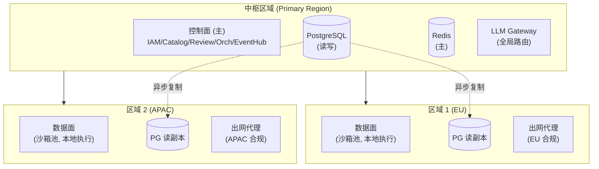

# 19 · 多区域部署架构

本文定义跨区域（Multi-Region）部署策略：数据主权、就近接入、灾难恢复。适用于有全球分支或数据驻留要求的企业。

> ⚠️ 本文属 P5+ 扩展参考，P0–P4 默认为单区域自托管/VPC 部署（见 [03 §6](./03-system-architecture.md)）；多区域部署在企业规模化阶段引入。

---

## 1. 部署拓扑

### 1.1 中心辐射（Hub & Spoke）模型



**关键决策**：

| 决策点 | 选择 | 理由 |
|---|---|---|
| 控制面 | **单区域（中枢）+ 多区域读副本** | 简化一致性；IAM/Catalog 写操作频率低、可接受跨区域延迟 |
| 数据面 | **每区域部署（spoke）** | 就近执行降低延迟；满足数据驻留（会话数据不出区域） |
| 元数据 (PG) | **主写中枢 + 每区域读副本** | 异步复制；区域本地读延迟 < 10ms |
| 会话数据 (S3) | **每区域独立 Bucket** | 满足数据主权；跨区域会话按需同步 |

### 1.2 用户路由

```
用户 → 区域选择:
  1. 显式绑定: 用户在哪个区域的 Organization（创建时指定）
  2. 就近接入: GeoDNS / Anycast → 最近的 API Gateway
  3. 数据面亲和: Run 创建时按 project.region 分配到对应区域沙箱池
  4. 跨区域降级: 本区域沙箱池满 → 路由到备用区域（满足合规的前提下）

控制面请求（管理操作）:
  → 全部路由到中枢区域（或通过中枢转发到本地读副本）

数据面请求（Run/SSE）:
  → 路由到 project 所在区域
```

### 1.3 数据驻留（Data Residency）

```
数据分类与驻留策略:

  元数据 (PG): 中枢存储，区域读副本包含脱敏后元数据
  会话 JSONL: 仅存储在执行区域的对象存储中
  事件日志: 每区域独立 Kafka Cluster → 汇总到中枢归档
  审计日志: 中枢统一存储（合规要求不可分散）
  Skill/Agent 定义: 中枢存储，区域缓存
  模型数据: LLM Gateway 按区域路由到合规 provider
```

---

## 2. 一致性模型

```
C(A)P 取舍:
  - 元数据 (RBAC/Catalog): CP (Consistency + Partition Tolerance)
    → PG 主写中枢（同步），读走本地副本（异步，最终一致）
    → 影响: Catalog 更新后到区域生效有 < 5s 延迟

  - 会话数据: AP (Availability + Partition Tolerance)
    → 每区域独立 S3，无需跨区域同步
    → 跨区域恢复: 按需从源区域 S3 拉取会话 JSONL

  - 事件流: AP
    → 每区域独立 Kafka → 中枢汇总归档（异步）
```

---

## 3. 灾难恢复（DR）

### 3.1 区域级故障

```
区域完全不可用的恢复:

  数据面区域故障:
    1. GeoDNS 摘除该区域 (T+1min)
    2. 该区域在途 Run 标记 crashed
       → Orchestrator(中枢) 检测心跳丢失
       → 等待 GracefulRetention(5min) 后标记 crashed
    3. 用户可选: 手动 fork 到备用区域
       → 从会话 JSONL 恢复（需跨区域复制已启用）
    4. 新 Run 自动路由到备用区域

  中枢区域故障（控制面不可用）:
    1. 这是最坏场景 → 需中枢区域自身做 HA (多 AZ)
    2. 备用中枢（温备）: PG 持续流复制 + 控制面 warm standby
    3. DNS 切到备用中枢 (T+5min)
    4. RPO: PG 流复制延迟 (通常 < 5s)
    5. RTO: DNS + 备用中枢启动 < 15min
```

### 3.2 跨区域备份

| 数据 | 备份目标 | RPO | RTO |
|---|---|---|---|
| PG 元数据 | 备用中枢流复制 + 每日跨区域快照 | < 5s (流复制) / < 24h (快照) | < 15min |
| 会话 JSONL | 跨区域复制（S3 CRR，可选） | < 15min (CRR) | 按需恢复 |
| 事件日志 | 中枢汇总归档（每 15min） | < 15min | — |
| Skill 包 | S3 跨区域复制 | < 15min | < 5min |

---

## 4. 网络与延迟

### 4.1 跨区域延迟预算

| 通信路径 | 典型延迟 | 影响 |
|---|---|---|
| 用户 → 数据面 (同区域) | < 10ms | SSE 低延迟 |
| 用户 → 数据面 (跨区域) | 50–150ms | SSE 可察觉延迟；建议避免 |
| 数据面 → 中枢 PG (跨区域) | 50–150ms | 闸门鉴权延迟（IAM 回调） |
| 数据面 → LLM Gateway (同区域) | < 5ms | 模型调用 |
| LLM Gateway → 外部 Provider | 取决于 provider 位置 | — |

### 4.2 延迟优化

- **闸门鉴权缓存**：IAM 决策在数据面本地缓存（TTL 60s），避免每次 `tool_call` 跨区域回调
- **effective config 预解析**：Run 创建时在中枢解析好后注入沙箱，运行时不跨区域查 Catalog
- **模型就近**：每区域 LLM Gateway 直连本区域 provider（EU → Anthropic EU、APAC → 自建 vLLM）

---

## 5. 合规路由

```yaml
# 模型调用合规路由规则
complianceRouting:
  - region: "EU"
    restrictions:
      - "data must stay in EU/EEA"
      - "no US-headquartered provider for sensitive projects"
    allowedProviders:
      - anthropic-eu
      - mistral-eu
      - vllm-self-hosted-eu
    sensitiveProjectDefault: "vllm-self-hosted-eu"

  - region: "APAC"
    restrictions:
      - "data must stay in APAC"
    allowedProviders:
      - anthropic (via Singapore)
      - gemini (via Singapore)
      - vllm-self-hosted-apac
```

---

## 6. 阶段规划

| 阶段 | 部署形态 | 目标 |
|---|---|---|
| **P0–P2** | 单区域 VPC | MVP + 治理验证 |
| **P3–P4** | 单区域多 AZ（HA） | 生产就绪 |
| **P5** | 中心辐射多区域（EU + US + APAC） | 全球部署 + 数据主权 |
| **Post-P5** | 全分布式（每区域独立控制面） | 完全自治 |

---

> 💡 **如何阅读**：架构师看 §1（拓扑）+ §2（一致性）；SRE 看 §3（DR）+ §4（网络）；合规看 §1.3（数据驻留）+ §5（合规路由）。
