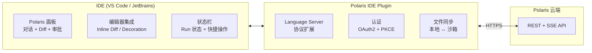

# 20 · IDE 插件集成协议

本文定义 IDE 插件（VS Code / JetBrains）与 Polaris 平台的集成协议。让开发者在自己熟悉的 IDE 中发起 Agent Run、审批操作、查看结果——Agent 跑在云端，交互留在 IDE。

> ⚠️ 本文属 P5+ 扩展参考。插件架构参考 codex CLI 的 IDE 集成、Claude Code 的 VS Code 插件、Continue.dev 的 IDE 扩展。

---

## 1. 集成模式总览



**与 Continue.dev / Claude Code IDE 插件的本质区别**：
- Continue: IDE 内的 LLM 对话 → 调用外部模型 API
- Claude Code: 本地 CLI Agent → 通过插件展示结果
- **Polaris IDE Plugin**: 云端 Agent（不在本地跑）→ IDE 只是"控制面瘦客户端"——发起、观察、审批、接收 Diff

---

## 2. 认证流程

### 2.1 OAuth2 + PKCE

```
IDE 插件认证:
  1. 用户点击 "Connect to Polaris"
  2. 插件生成 PKCE code_verifier + code_challenge
  3. 打开系统浏览器: https://<polaris-host>/oauth/authorize?...
  4. 用户登录 (SSO) + 授权
  5. 回调到 localhost:<random_port> 或 自定义 URI scheme (polaris://callback?...)
  6. 插件用 code + code_verifier 换取 token
  7. token 存储在 IDE 安全存储 (VS Code SecretStorage / JetBrains PasswordSafe)
```

### 2.2 组织发现

```
认证后自动发现:
  GET /v1/auth/whoami
  → { user, organizations, defaultOrg, defaultProject }

用户可选切换组织/项目上下文 (同 CLI: polaris login --org ... --project ...)
```

---

## 3. IDE 面板

### 3.1 对话面板 (Chat Panel)

```
┌─── Polaris Agent ───────────────────────────┐
│ Agent: code-reviewer ▼    Project: checkout  │
│ Model: claude-sonnet-4-6 ▼                  │
├─────────────────────────────────────────────┤
│                                              │
│ 👤 审查 src/auth/login.ts 的安全问题         │
│                                              │
│ 🤖 正在审查 src/auth/login.ts ...            │
│                                              │
│ ## 安全审查结果                              │
│                                              │
│ ### 🔴 Critical: SQL 注入                    │
│ Line 42:                                     │
│ ```ts                                        │
│ - const q = `SELECT * FROM users WHERE       │
│ -   name = '${req.body.name}'`;              │
│ + const q = `SELECT * FROM users WHERE       │
│ +   name = $1`;                              │
│ ```                                          │
│ CWE-89: SQL Injection                       │
│                                              │
│ [Apply Fix] [Ignore] [Details]               │
│                                              │
│ ───────────────────────────────────          │
│ > 也检查一下 middleware/                     │
│                                              │
├─────────────────────────────────────────────┤
│ [📎附件] [📁当前文件] [🌐仓库范围]  [发送]   │
└─────────────────────────────────────────────┘
```

### 3.2 内联 Diff（Inline Suggestion）

Agent 的输出直接以 IDE 原生 Diff 形式展示：

```
VS Code: 使用 vscode.diff 或 InlineCompletionItemProvider
JetBrains: 使用 InlayModel + DiffView

工作流:
  1. Agent 输出结构化 Diff (unified diff 格式)
  2. 插件解析 Diff → IDE API 渲染内联建议
  3. 用户: Accept (Ctrl+Y) / Reject / Modify
  4. 接受后: 写入本地文件 → 可选同步到沙箱
```

### 3.3 审批对话框

工具调用需审批时 → IDE 内弹窗：

```
┌─── Approval Required ───────────────────────┐
│                                              │
│ ⚠️  Agent 请求执行:                          │
│                                              │
│   bash: rm -rf ./node_modules               │
│                                              │
│ 原因: Cleaning up outdated dependencies      │
│ 危险度: Medium                               │
│                                              │
│ [Allow Once] [Always Allow Pattern]          │
│ [Deny] [Deny & Abort Run]                   │
│                                              │
│ ⏱ 等待中... 剩余 45s                         │
└─────────────────────────────────────────────┘
```

---

## 4. 本地文件与沙箱同步

### 4.1 同步模式

| 模式 | 描述 | 适用场景 |
|---|---|---|
| **直接云端** | 不访问本地文件；Agent 在沙箱内操作云端仓库 | 常规任务（默认） |
| **本地桥接** | 授权后 Agent 可读写指定本地目录 | 本地开发环境混合工作流 |
| **双向同步** | 本地目录 ↔ 沙箱工作区实时同步（rsync/watch） | 需要本地运行时 (如本地测试) |

### 4.2 本地桥接协议

```
⚠️ 安全: 本地目录桥接需用户显式授权——每个目录单独确认，且限本次 Run

授权流程:
  1. IDE 插件展示: "Agent 请求访问 ~/projects/checkout"
  2. 用户确认 + 选择权限: read-only / read-write
  3. 插件通过 WebSocket 到控制面建立 bridge channel
  4. Agent 在沙箱内通过特殊的 local-fs MCP 工具访问本地目录
  5. 所有读写经 WebSocket 往返 → 受闸门策略控制
  6. Run 结束 → bridge channel 自动关闭

工具映射:
  沙箱内 read → 本地 fs read → WS → 插件执行 fs.readFile → 返回
  沙箱内 write → 本地 fs write → WS → 插件执行 fs.writeFile → 返回
  沙箱内 bash → 本地终端执行 → WS → 插件执行 exec → 返回
  受同样的闸门策略控制 (含 allow/deny/ask)
```

### 4.3 工作区上下文

```
IDE 上下文自动注入:
  1. 当前打开的文件 + 光标位置
  2. 当前选中的代码行
  3. Git 变更状态 (modified/untracked)
  4. 项目语言/框架检测

这些作为 Run 的 context 参数:
  POST /v1/runs
  {
    "context": {
      "ide": {
        "activeFile": "src/auth/login.ts",
        "selectedLines": "42-58",
        "openFileTabCount": 5,
        "gitBranch": "fix/login-bug"
      }
    }
  }
```

---

## 5. 协议与事件

### 5.1 IDE → Cloud（命令）

与 CLI 共享同一套 REST API（[09 §1](./09-api-clients-and-data-model.md)），增加 IDE 特定上下文：

```
POST /v1/runs
  + context.ide = { activeFile, selectedLines, openTabs, gitStatus }
  + context.source = "vscode" | "jetbrains"

POST /v1/runs/{id}/apply-diff   (IDE 专有)
  { filePath, diffContent, applyToLocal: bool }
  → 将 Agent 输出的 Diff 应用到本地文件
```

### 5.2 Cloud → IDE（事件）

复用 SSE 事件流（[08 §3](./08-observability-and-sse.md)），IDE 插件做呈现适配：

| SSE 事件 | IDE 行为 |
|---|---|
| `message.delta` | 流式文本追加到对话面板 |
| `tool_call.approved` + `tool_call.result` (edit) | 渲染为内联 Diff suggestion |
| `tool_call.result` (bash) | 渲染为终端输出 |
| `permission.prompted` | 弹出审批对话框 |
| `session.ended` | 对话面板显示完成 + 统计摘要 |
| `security.flagged` | IDE 右下角 toast 警告 |

### 5.3 WebSocket 补充通道

SSE 是单向的（Cloud → IDE），审批/确认需双向：

```
wss://<polaris-host>/v1/ws/ide
  - 认证: token 参数
  - 用途: 审批应答、文件同步请求、状态更新
  - 消息格式: JSON (同 REST schema)
```

---

## 6. VS Code 插件架构

```
polaris-vscode/
├── package.json                 # extension manifest
├── src/
│   ├── extension.ts             # activate/deactivate
│   ├── auth/
│   │   └── pkce.ts              # OAuth2 + PKCE flow
│   ├── panel/
│   │   ├── chatPanel.ts         # Webview-based chat panel
│   │   └── diffRenderer.ts      # Inline diff suggestions
│   ├── sync/
│   │   ├── bridgeServer.ts      # WebSocket bridge (local fs → cloud)
│   │   └── fileWatcher.ts       # Watch local files for sync
│   ├── statusBar.ts             # Status bar integration
│   ├── commands.ts              # Register VS Code commands
│   └── sseClient.ts             # SSE event consumer
└── webview/
    └── chat/                    # React-based chat UI (webview)
        ├── ChatView.tsx
        ├── ApprovalCard.tsx
        └── DiffView.tsx
```

**权限**（VS Code `package.json` contributes）:
- `workspace.fs`: 本地文件桥接
- `terminal`: 本地终端执行
- `secrets`: 安全存储 token
- `notifications`: 审批提醒
- `scm`: Git 状态读取

---

## 7. JetBrains 插件架构

```
polaris-jetbrains/
├── src/main/kotlin/com/polaris/plugin/
│   ├── PolarisPlugin.kt         # Plugin entry
│   ├── auth/
│   │   └── OAuthService.kt      # PKCE + browser auth
│   ├── toolwindow/
│   │   └── ChatToolWindow.kt    # Side panel (JComponent)
│   ├── editor/
│   │   ├── InlineDiffRenderer.kt  # Inlay-based diff
│   │   └── EditorContextProvider.kt  # Active file/selection
│   ├── sync/
│   │   └── BridgeService.kt     # WebSocket bridge
│   ├── config/
│   │   └── PolarisSettings.kt   # Plugin settings (PersistentStateComponent)
│   └── notifications/
│       └── ApprovalNotifier.kt  # Modal approval dialog
└── src/main/resources/
    └── META-INF/
        └── plugin.xml           # Plugin descriptor
```

---

## 8. 与 Continue.dev / Claude Code IDE 插件的对比

| 维度 | Continue.dev | Claude Code IDE | **Polaris IDE** |
|---|---|---|---|
| Agent 运行位置 | 本地 / IDE 进程内 | 本地 CLI 进程 | **云端沙箱**（IDE 是瘦客户端） |
| 模型密钥 | 用户自填 | 用户自填 | **集中托管（密钥零暴露）** |
| 企业配置 | IDE settings.json 手工同步 | 配置规则 + MDM | **中央目录 + 可见域继承 + 锁定** |
| MCP 接入 | 本地配置 `.mcp.json` | 本地配置 | **云端治理 + 接入审批** |
| Skill 共享 | Hub 市场（手动安装） | Plugin 市场 | **中央 Catalog + 可见域 + 安审** |
| 审批 | 无 | 本地终端交互 | **云端闸门 + IDE 审批弹窗 + 升级链** |
| 审计 | 无 | 无 | **全链路可观测 + 不可变审计** |

---

## 9. 阶段规划

| 阶段 | 交付 |
|---|---|
| **P3** | VS Code 插件原型：认证 + 对话面板 + SSE 事件 + 状态栏 |
| **P4** | VS Code 插件完整：内联 Diff + 审批对话框 + 本地目录桥接 |
| **P5** | JetBrains 插件（复用同一协议）；VS Code 插件发布 Marketplace |

---

> 💡 **如何阅读**：IDE 插件开发者看 §3（面板设计）+ §5（协议）+ §6/§7（架构）；产品看 §8（竞争对比）；安全看 §4.2（本地桥接安全）。
