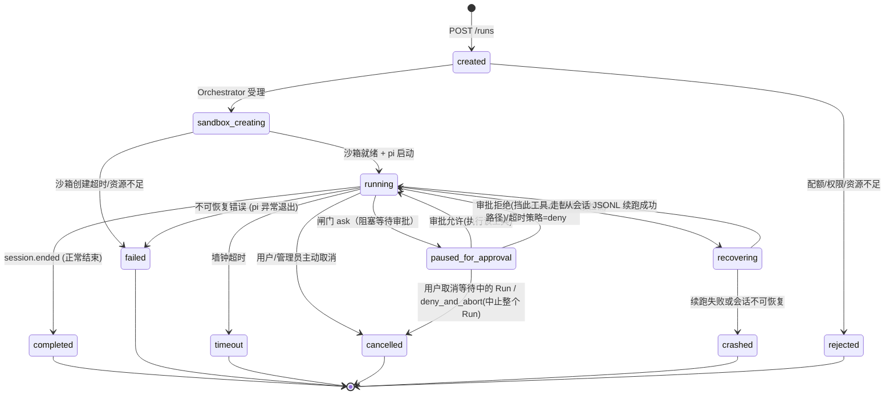

# 21 · Agent Run 生命周期状态机

本文定义 Agent Run 从创建到终态的**统一状态机**，作为各组件（Orchestrator/沙箱/Event Hub/客户端）的 single source of truth。Run 的状态散见于 [03](./03-system-architecture.md)（架构）、[04](./04-pi-integration-and-multi-llm.md)（pi 驱动）、[07](./07-sandbox-isolation.md)（沙箱生命周期）、[08](./08-observability-and-sse.md)（事件流）、[13](./13-operations-manual.md)（故障恢复），本文将其收敛为一张明确的图 + 一张转换表。

---

## 1. 状态机总图



## 2. 状态定义

| 状态 | 含义 | 沙箱状态 | pi 进程状态 | 客户端可见 |
|---|---|---|---|---|
| **created** | Run 已受理，等待调度 | 未分配 | 未启动 | 工作台显示"排队中" |
| **sandbox_creating** | 正在创建/预热沙箱、注入配置 | 创建中 | 未启动 | 工作台显示"准备环境中" |
| **running** | pi 正在执行 Agent 循环 | 运行中 | 运行中 | SSE 实时事件流 |
| **paused_for_approval** | 闸门 ask，等待人工审批，pi 阻塞在 `extension_ui_request/response` | 运行中（挂起） | 运行中（阻塞） | 弹窗等待审批决定 |
| **recovering** | Orchestrator 崩溃后新实例正在恢复 | 保留中 → 新沙箱 | 新 pi 启动中 | 工作台显示"恢复中" |
| **completed** | 正常结束，所有 turn 完成 | 保留/回收中 | 已退出 | 显示结果摘要 |
| **failed** | 因错误终止（pi 异常、工具执行失败等） | 保留/回收中 | 已退出 | 显示失败原因 |
| **timeout** | 墙钟时间耗尽，强制中止 | 回收中 | 已 kill | 显示超时通知 |
| **cancelled** | 用户或管理员主动取消 | 回收中 | 已 kill | 显示已取消 |
| **crashed** | 恢复失败，不可续跑 | 已回收 | 已退出 | 显示崩溃信息 |
| **rejected** | 受理阶段被拒绝（配额/权限/资源） | 未分配 | 未启动 | 显示拒绝原因 |

## 3. 状态转换表

| # | 源状态 | 目标状态 | 触发事件 | 守护条件 (Guard) | 副作用 |
|---|---|---|---|---|---|
| T1 | `created` | `sandbox_creating` | Orchestrator 分配调度槽位 | 并发 Run 未超限 + 配额充足 | 更新 Run 状态、记审计 |
| T2 | `created` | `rejected` | 调度拒绝 | 并发超限 or 配额不足 or 权限拒绝 | 返回 429/402/403、记审计 |
| T3 | `sandbox_creating` | `running` | 沙箱就绪 + pi RPC 握手成功 | 沙箱创建成功 + 配置注入完成 + pi 进程启动 | 发射 `run.started`、开始计时 |
| T4 | `sandbox_creating` | `failed` | 沙箱创建超时（默认 60s）或资源不足 | 超时 or K8s 调度失败 | 回收残资源、通知用户、记审计 |
| T5 | `running` | `paused_for_approval` | 闸门 `tool_call` 钩子返回 `ask` | 策略决定需要人工审批 | 发射 `permission.prompted`、暂停墙钟计时（可选） |
| T6 | `paused_for_approval` | `running` | 审批人 `allow` | — | 发射 `permission.resolved`、执行该工具并恢复运行 |
| T7 | `paused_for_approval` | `running` | 审批人 `deny`（仅挡此工具）或审批超时策略为 `deny` | — | 发射 `permission.denied`、对该工具返回 `{block:true}`，Agent 走替代路径继续运行（**不终止整个 Run**） |
| T8 | `paused_for_approval` | `cancelled` | 用户主动取消等待中的 Run，或审批人选择 `deny_and_abort` | — | 发射 `run.cancelled`、SIGTERM→SIGKILL pi、资源回收 |
| T9 | `running` | `completed` | pi 发射 `session.ended` | 正常结束（exit code 0） | 发射 `run.completed`、flush 会话 JSONL、启动回收计时器 |
| T10 | `running` | `failed` | pi 异常退出或平台扩展检测到不可恢复错误 | exit code ≠ 0 or 平台扩展错误 | 发射 `run.failed`、保留沙箱现场（可配保留时长） |
| T11 | `running` | `timeout` | 墙钟计时器到期 | `wallClockTimeout` 耗尽 | 发射 `run.timeout`、SIGTERM → SIGKILL pi、回收沙箱 |
| T12 | `running` | `cancelled` | 用户/管理员调用 `POST /runs/{id}/cancel` | 调用者有权限（发起者/项目管理员/组织管理员） | 发射 `run.cancelled`、SIGTERM → SIGKILL pi、回收沙箱 |
| T13 | `running` | `recovering` | Orchestrator 崩溃（K8s Pod 被 Kill/OOM） | 检测到 RPC 管道断开 | 发射 `run.recovering`、保留沙箱 5min、新 Orchestrator 取会话 JSONL |
| T14 | `recovering` | `running` | 新沙箱从 JSONL 续跑成功 | 会话 JSONL 可解析 + 最后 turn 完整 | 发射 `run.recovered`、继续执行 |
| T15 | `recovering` | `crashed` | 续跑失败（JSONL 损坏/不可恢复） | 会话 JSONL 不可用 or 续跑 3 次失败 | 发射 `run.crashed`、回收残资源、通知用户 |

## 4. 各状态下的合法操作

| 操作 | created | sandbox_creating | running | paused_for_approval | recovering | completed | failed | timeout | cancelled | crashed | rejected |
|---|---|---|---|---|---|---|---|---|---|---|---|
| **查看事件流 (SSE)** | ❌ | ✅ | ✅ | ✅ | ✅ | ✅ (回放) | ✅ (回放) | ✅ (回放) | ✅ (回放) | ✅ (回放) | ❌ |
| **取消 (cancel)** | ✅ | ✅ | ✅ | ✅ | ✅ | ❌ | ❌ | ❌ | ❌ | ❌ | ❌ |
| **审批 (allow/deny)** | ❌ | ❌ | ❌ | ✅ | ❌ | ❌ | ❌ | ❌ | ❌ | ❌ | ❌ |
| **暂停 (pause)** | ❌ | ❌ | ✅ (P3+) | ❌ | ❌ | ❌ | ❌ | ❌ | ❌ | ❌ | ❌ |
| **恢复 (resume)** | ❌ | ❌ | ❌ | ❌ | ❌ | ❌ | ✅ (部分场景) | ❌ | ❌ | ❌ | ❌ |
| **重试 (retry)** | ❌ | ❌ | ❌ | ❌ | ❌ | ✅ | ✅ | ✅ | ❌ | ✅ | ❌ |
| **查看会话 JSONL** | ❌ | ❌ | ✅ (实时) | ✅ (实时) | ✅ | ✅ | ✅ | ✅ | ❌ | ✅ | ❌ |
| **下载产物** | ❌ | ❌ | ❌ | ❌ | ❌ | ✅ | ✅ | ✅ | ❌ | ❌ | ❌ |
| **事件回放** | ❌ | ❌ | ❌ | ❌ | ❌ | ✅ | ✅ | ✅ | ✅ | ✅ | ❌ |

> ⚠️ **关于 `pause`/`resume`**：二者是 **P3+ 规划能力**，当前 v1 状态机（§1，11 状态 / 15 转换）**未建模**用户主动的 `paused` 状态——P3+ 引入时将补充对应状态与转换。`failed` 行的 `resume`（"部分场景"）实为 **fork 重跑**（基于会话 JSONL 新建 Run，见 §8「重试」入口），而非原 Run 原地恢复；区别于 `recovering`（Orchestrator 崩溃后的自动续跑，T13–T14）。

## 5. 计时器与超时

```
Run 涉及的计时器:

1. 调度等待超时 (created → rejected):
   - 默认: 300s (可配)
   - 超时自动拒绝

2. 沙箱创建超时 (sandbox_creating → failed):
   - 默认: 60s (预热池命中) / 180s (冷启动)
   - 超时自动失败

3. 墙钟超时 (running → timeout):
   - 默认: 3600s (1h, 可配，由 AgentDefinition 或 Run 请求指定)
   - 超时: SIGTERM (graceful 30s) → SIGKILL
   - 即将超时 (剩余 5min): 发射 run.timeout_warning → 通知用户

4. 审批超时 (paused_for_approval → running，按超时策略处置该工具):
   - 见 [16 §3](./16-notification-system.md)
   - 多级升级链
   - 最终超时策略: deny(挡此工具，默认) or allow_once(执行该工具，可配)——两者均回到 running，不终止 Run；仅 deny_and_abort → cancelled

5. 沙箱保留计时器 (completed/failed/timeout/cancelled → 沙箱回收):
   - 保留现场: 5min (默认，可配 0-60min)
   - 超时后强制回收

6. 心跳超时 (running → recovering):
   - Orchestrator 与沙箱心跳: 15s
   - 连续 3 次无心跳 → 判定崩溃
```

## 6. 终态的回收策略

| 终态 | 沙箱保留时长 | 会话 JSONL | 产物保留 | 审计事件 |
|---|---|---|---|---|
| **completed** | 5min (可配) | 按保留策略（默认 90d） | 按保留策略（默认 90d） | 永久 |
| **failed** | 30min (可配，便于排查) | 按保留策略 | 按保留策略 | 永久 |
| **timeout** | 5min | 按保留策略 | 按保留策略 | 永久 |
| **cancelled** | 5min | 按保留策略 | 按保留策略 | 永久 |
| **crashed** | 5min | 按保留策略 | 按保留策略 | 永久 |
| **rejected** | N/A | N/A | N/A | 记录拒绝原因 |

## 7. 事件映射

每个状态转换产生对应的事件（`run.status` 事件类型）：

| 转换 | 事件 type | 关键字段 |
|---|---|---|
| T3 (→ running) | `run.started` | `{runId, sandboxId, effectiveConfig}` |
| T5 (→ paused) | `permission.prompted` | `{runId, tool, command, dangerLevel, timeout}` |
| T6 (→ running) | `permission.resolved` | `{runId, decision: "allow", by}` |
| T7 (→ running) | `permission.denied` | `{runId, decision: "deny", by, reason}`（仅挡此工具，Run 继续） |
| T9 (→ completed) | `run.completed` | `{runId, duration, tokenUsage, cost, artifactSummary}` |
| T10 (→ failed) | `run.failed` | `{runId, error, lastTurn, exitCode}` |
| T11 (→ timeout) | `run.timeout` | `{runId, wallClockLimit, duration}` |
| T12 (→ cancelled) | `run.cancelled` | `{runId, cancelledBy, reason}` |
| T13 (→ recovering) | `run.recovering` | `{runId, crashReason, lastFlushedTurn}` |
| T14 (→ running) | `run.recovered` | `{runId, recoveredFromTurn, lostEvents}` |
| T15 (→ crashed) | `run.crashed` | `{runId, reason, recoverable: false}` |
| T2 (→ rejected) | `run.rejected` | `{runId, reason, quotaRemaining}` |

## 8. 客户端 UI 状态映射

| 内部状态 | 用户可见文案 | UI 元素 | 操作入口 |
|---|---|---|---|
| `created` | 排队中… | 排队位置指示器 | 取消 |
| `sandbox_creating` | 正在准备环境… | 进度条（沙箱创建） | 取消 |
| `running` | 运行中 | 实时事件流 + 终端 + Diff | 取消、审批（弹窗） |
| `paused_for_approval` | 等待审批… | 审批弹窗（含超时倒计时） | 允许/拒绝/取消 |
| `recovering` | 正在恢复… | 恢复进度提示 | 取消 |
| `completed` | 已完成 | 结果摘要 + 产物列表 + 事件回放 | 重试、下载产物 |
| `failed` | 运行失败 | 失败原因 + 日志 + 事件回放 | 重试 |
| `timeout` | 运行超时 | 超时信息 + 部分产物 | 重试（加大超时） |
| `cancelled` | 已取消 | 取消信息 + 部分产物 | 重试 |
| `crashed` | 运行崩溃 | 崩溃信息 + 建议重试 | 重试 |
| `rejected` | 已拒绝 | 拒绝原因 | 修改参数后重试 |

---

> 📎 **相关文档**：沙箱生命周期见 [07 §5](./07-sandbox-isolation.md)；故障恢复细节见 [13 §1](./13-operations-manual.md)；审批超时见 [16 §3](./16-notification-system.md)；事件 schema 见 [08 §2](./08-observability-and-sse.md)。

> 💡 **如何阅读**：架构师看 §1（状态机总图）+ §3（状态定义）+ §4（合法操作矩阵）；前端开发者看 §8（UI 状态映射）；SRE 看 §5（6 个计时器）+ §6（终态回收策略）；集成工程师看 §7（事件映射）。
