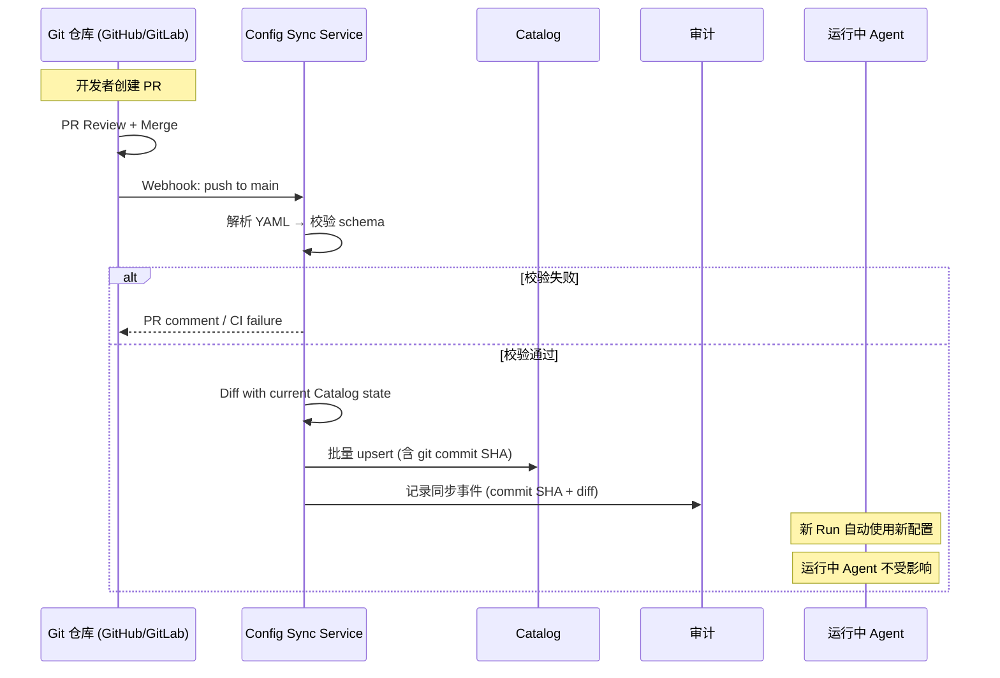

# 22 · GitOps 与 Configuration as Code

当前设计中的 Agent/MCP/Skill 定义主要通过 Web 控制台和 Catalog API 管理。对于企业级场景，**Configuration as Code (CaC)**——将平台配置以 YAML 文件存放在 Git 仓库中，通过 PR 审批 → 合并 → 自动同步到平台——是实现 SOC 2 变更管理（Change Management）和审计一致性的关键能力。

> ⚠️ 本文属 P2+ 特性——P1 的 Catalog 以 API/UI 驱动为主；GitOps 作为企业级变更管理的增强路径并行引入。

---

## 1. 设计目标

| 目标 | 说明 |
|---|---|
| **声明式配置** | Agent/MCP/Skill/Prompt/策略定义以 YAML 描述，存放于 Git 仓库 |
| **Git 驱动的变更管理** | PR → Review → 合并 = 生效，无需平台 UI 手动操作 |
| **与 Catalog 双向同步** | Git 为源头时，Catalog 为镜像；UI 创建的资源亦可导出为 YAML 回写 Git |
| **不可变审计** | 每次同步产生带 Git commit SHA 的审计事件，变更可追溯到具体 PR 与审批人 |
| **渐进式采用** | 不影响现有 UI 驱动的配置管理；GitOps 和 UI 可共存 |

## 2. 仓库结构约定

```
polaris-config/
├── .polaris/
│   └── config.yaml              # 元信息：平台 URL、同步策略
├── agents/
│   ├── code-reviewer.yaml       # Agent 定义
│   └── security-auditor.yaml
├── mcps/
│   ├── github-enterprise.yaml   # MCP server 定义
│   └── jira.yaml
├── skills/
│   ├── gen-api-docs/
│   │   ├── skill.yaml           # Skill 元数据 + 能力清单
│   │   └── SKILL.md             # Skill 正文
│   └── k8s-deploy-check/
│       ├── skill.yaml
│       └── SKILL.md
├── prompts/
│   └── code-reviewer/
│       ├── prompt.yaml           # Prompt 模板定义（见 [15 §A](./15-prompt-management-and-evaluation.md)）
│       └── v1.2.0.md            # 各版本正文
├── policies/
│   ├── tool-policies.yaml       # 工具策略（闸门规则）
│   └── model-whitelist.yaml     # 模型白名单
└── sandbox-profiles/
    └── default.yaml             # 沙箱画像
```

### 2.1 资源 YAML Schema

**Agent 定义** (`agents/code-reviewer.yaml`)：
```yaml
apiVersion: polaris/v1
kind: AgentDefinition
metadata:
  name: code-reviewer
  visibility: project               # private | project | group | org
  project: checkout                 # visibility=project 时必填
  labels:
    team: platform
    language: typescript
spec:
  systemPromptRef: prompts/code-reviewer  # 引用 prompt 目录
  model:
    default: claude-sonnet-4-6
    fallback: claude-haiku-4-5
    constraints:
      minThinkingBudget: 4000
  tools:
    builtin: [read, write, edit, bash, glob, grep]
    mcpRefs: [mcps/github-enterprise]
    skillRefs: [skills/gen-api-docs]
  policyRef: policies/code-review-tool-policy  # 可选，引用工具策略
  sandboxProfileRef: sandbox-profiles/medium
  limits:
    wallClockTimeout: 3600
    maxTokens: 200000
```

**MCP Server 定义** (`mcps/github-enterprise.yaml`)：
```yaml
apiVersion: polaris/v1
kind: MCPServer
metadata:
  name: github-enterprise
  visibility: org
spec:
  transport:
    type: http
    url: https://github-enterprise.internal/api/mcp
  auth:
    type: oauth
    provider: github-enterprise
    secretRef: secret://org/github-mcp-creds
  capabilityManifest:
    tools:
      - name: search_code
        dangerLevel: low
      - name: create_pr
        dangerLevel: high
        requireApproval: true
  healthCheck:
    endpoint: /health
    interval: 30s
```

**Skill 定义** (`skills/gen-api-docs/skill.yaml`)：
```yaml
apiVersion: polaris/v1
kind: Skill
metadata:
  name: gen-api-docs
  version: 1.0.0
  visibility: project
spec:
  entrypoint: SKILL.md
  capabilityManifest:
    fsRead: ["src/**/*.ts", "openapi.yaml"]
    fsWrite: ["docs/api/**"]
    network:
      egress: []
      allowedDomains: []
    executables: ["npx", "node"]
    dependencies:
      npm: ["@redocly/cli@^1.0.0"]
```

**工具策略** (`policies/tool-policies.yaml`)：
```yaml
apiVersion: polaris/v1
kind: ToolPolicy
metadata:
  name: code-review-tool-policy
  visibility: project
spec:
  rules:
    - pattern: "bash rm -rf *"
      mode: deny
      reason: "破坏性删除操作"
    - pattern: "write **/.env"
      mode: deny
      reason: "环境变量文件包含密钥风险"
    - pattern: "bash git push *"
      mode: ask
      reason: "推送操作需确认"
    - pattern: "mcp:* destructive"
      mode: ask
  defaultMode: allow
```

## 3. 同步架构



### 3.1 同步策略

| 策略 | 行为 | 适用场景 |
|---|---|---|
| **自动同步（推荐）** | push to 受保护分支 → Webhook → 同步 | 已通过 PR review 的变更 |
| **手动同步** | 管理员在控制台触发 `POST /v1/config/sync` | 紧急热修复、手动审计 |
| **Dry Run** | 校验 + 展示 diff，不实际写入 Catalog | PR CI 检查、pre-merge 验证 |
| **定时轮询** | 每 N 分钟拉取最新 commit 并 diff | Webhook 不可用时的 fallback |

### 3.2 冲突处理

当 Git 中的定义与 UI 中的定义存在冲突时：

```
冲突检测:
  - Catalog 中每个资源记录 `source` 字段: "gitops" | "ui"
  - 同时记录 `lastModifiedAt` 与 `lastModifiedBy`
  - 同时记录 `gitCommitSHA`（仅 source=gitops）

冲突裁决规则:
  1. 资源 source="gitops" 且 Git 有更新:
     → 应用 Git 更新（Git 是源头）
  2. 资源 source="ui" 且 Git 中新出现同名资源:
     → 以 Git 为准，覆盖 UI 版本（需管理员确认）
  3. 资源同时在 Git 和 UI 中被修改:
     → 标记冲突，通知管理员手动裁决
  4. 资源仅在 UI 中被创建（source="ui"），Git 中不存在:
     → 保持不变；可选"导出为 YAML → PR 回写 Git"
```

### 3.3 锁定与受管配置

借鉴 [05 §4](./05-rbac-and-governance.md) 的 `managed:true` 语义：

```yaml
# 上级管理员可锁定某些资源，禁止子级通过 Git 或 UI 覆盖
metadata:
  managed: true              # 由上级设定，下级不可覆盖
  managedBy: org             # 设定来源（治理作用域：org | group | project）
```

当 Git 中的配置与 Catalog 中的 `managed:true` 定义冲突时，Catalog 中的锁定优先（管理链路不因 GitOps 而短路）。

## 4. CI 集成：Pre-Merge 校验

```
PR 合并前 CI Pipeline:
  1. YAML Schema 校验 (polaris config validate)
  2. 引用完整性检查 (skillRefs/mcpRefs 指向的资源存在)
  3. 能力清单静态分析 (capability manifest 合理性)
  4. Dry-run 同步 (展示将要变更的资源 diff)
  5. 安全扫描 (Key 泄露、可疑域名、过高权限)
  6. 可选: 策略冲突检测 (新策略是否与父级锁定策略冲突)

CI 通过 → PR 可合并 → 合并后自动同步
```

## 5. 导出与迁移

### 5.1 UI → Git 导出

```
POST /v1/catalog/export
{
  "resources": ["agents", "mcps", "skills", "policies"],
  "scope": "project:checkout",
  "format": "yaml-directory"     # 输出为 Git 仓库结构
}
→ 返回 tar.gz 或直接创建 PR 到配置仓库
```

### 5.2 从零开始：Git → 平台引导

```
polaris bootstrap --repo git@github.com:corp/polaris-config.git --branch main
  → 读取仓库中所有 YAML
  → 批量创建/更新 Catalog 资源
  → 标记 source="gitops"
  → 输出同步报告
```

## 6. 审计与回滚

### 6.1 审计事件

每次 GitOps 同步产生：
```json
{
  "type": "config.synced",
  "source": "gitops",
  "repo": "corp/polaris-config",
  "commitSHA": "abc123def",
  "commitMessage": "feat: add security-auditor agent",
  "commitAuthor": "admin@corp.com",
  "prNumber": 42,
  "prApprover": "security-lead@corp.com",
  "changes": [
    {"resource": "agents/code-reviewer", "action": "update", "diff": "..."},
    {"resource": "agents/security-auditor", "action": "create", "diff": "..."}
  ],
  "timestamp": "2026-06-02T10:30:00Z"
}
```

### 6.2 回滚

```
方法 1 — Git revert:
  git revert <bad-commit> → PR → 合并 → 自动同步还原

方法 2 — 管理员即时回滚:
  POST /v1/config/rollback
  { "commitSHA": "last-known-good" }
  → 将 Catalog 状态回滚到指定 commit 的快照

方法 3 — 资源级撤销:
  POST /v1/catalog/agents/code-reviewer/rollback
  { "version": "previous" }
```

## 7. 与非 GitOps 模式的共存

| 场景 | 推荐模式 | 共存策略 |
|---|---|---|
| **企业级变更管理（SOC 2）** | GitOps 为主 | Git 为 source of truth，UI 只读（或仅草稿） |
| **快速原型 / 个人探索** | UI 为主 | 用户在 UI 创建私有资源 → 成熟后导出为 YAML → PR 发布 |
| **混合模式** | Git + UI 共存 | 资源的 `source` 字段区分来源；Git 优先于 UI 同名资源 |
| **紧急热修复** | UI 覆盖 | 管理员可临时在 UI 修改（记录 `override` 审计事件）→ 事后回写 Git |

## 8. 安全考量

| 关注点 | 控制 |
|---|---|
| **Git 仓库访问控制** | 仅 Config Sync Service 的服务账号可读（Deploy Key / GitHub App）；不暴露给普通用户 |
| **YAML 注入** | Schema 严格校验；未知字段拒绝；`secretRef` 仅允许 `secret://` 前缀 |
| **权限绕过** | GitOps 同步的变更同样受 RBAC 约束——Sync Service 以平台服务账号身份写入 Catalog；若 Git 试图修改 parent-managed 资源，同步被拒绝 |
| **合并冲突** | 见 §3.2 冲突裁决规则 |
| **密钥泄露** | YAML 中不应含明文密钥（仅 `secret://` 引用）；pre-commit hook CI 扫描 |
| **供应链** | 配置仓库本身也需分支保护 + 强制 PR review + CI 门禁 |

---

> 📎 **相关文档**：RBAC 与治理见 [05](./05-rbac-and-governance.md)；能力层与 Skill 管理见 [06](./06-capabilities-skills-mcp-subagents.md)；Prompt 版本管理见 [15](./15-prompt-management-and-evaluation.md)；运维变更管理见 [13](./13-operations-manual.md)。

> 💡 **如何阅读**：平台工程师看 §1（仓库结构）+ §2（YAML Schema）+ §3（双向同步架构）；DevOps 看 §4（CI Pre-Merge 校验）+ §6（审计与回滚）；管理员看 §7（与非 GitOps 共存策略）；安全评审看 §8（安全考量）。
