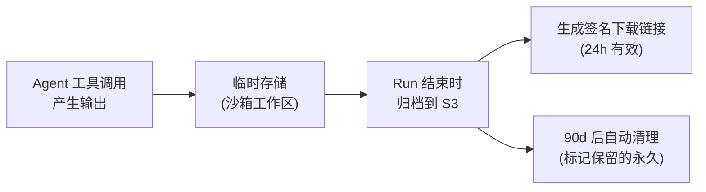

# 24 · 交付物与外部集成目录

本文系统梳理 Agent Run 的交付物类型与外部系统集成方式（GitHub/GitLab/Jira/Slack/飞书/CI/知识库），作为 [09 API 面](./09-api-clients-and-data-model.md) 与 [16 通知系统](./16-notification-system.md) 的补充。原始需求调研 §13 提出了交付物问题，本文统一回答。

---

## 1. 交付物类型

### 1.1 交付物清单

| 交付物 | 格式 | 产生时机 | 存储 | 保留期 | 访问控制 |
|---|---|---|---|---|---|
| **代码 Diff** | Unified diff / Patch 文件 | 每次文件编辑 (`write`/`edit` 工具) | 会话 JSONL + S3（产物归档） | 90d (R2) | 项目成员 |
| **Pull Request / Merge Request** | PR/MR URL | Agent 调用 `create_pr` 工具（需用户确认） | 外部 Git 平台 | 永久（在 Git 平台侧） | 按 Git 平台权限 |
| **终端输出** | 纯文本（ANSI 可选） | 每次 `bash` 工具调用 | 会话 JSONL + S3（产物归档） | 90d (R2) | 项目成员 |
| **测试报告** | JSON/JUnit XML/HTML | Agent 运行测试后生成 | S3（产物归档） | 90d (R2) | 项目成员 |
| **生成的文档** | Markdown/PDF | Agent 生成文档任务完成 | S3（产物归档） | 90d (R2) | 项目成员 |
| **构建产物** | 二进制/包 | Agent 执行构建任务 | S3（产物归档） | 90d (R2) | 项目成员 |
| **分析报告** | JSON/HTML | 安全扫描、性能分析等 | S3（产物归档） | 90d (R2) | 项目成员 |
| **API Response** | JSON | Agent 调用外部 API 的结果 | 会话 JSONL（工具输出） | 90d (R2) | 项目成员 |
| **审计报告** | 不可变事件日志 | 每次 Run 自动产生 | PG + 不可变存储 | ≥1 年 (R3) | 审计员 |

### 1.2 产物下载

```
# 获取产物列表
GET /v1/runs/{runId}/artifacts
 → [{id, type, name, size, createdAt}]

# 下载单个产物
GET /v1/runs/{runId}/artifacts/{artifactId}/download
 → 文件流 (application/octet-stream)

# 批量下载
GET /v1/runs/{runId}/artifacts/download-all
 → tar.gz
```

### 1.3 产物生命周期



---

## 2. 外部集成概览

```
集成强度分级:
  L1 — 深度集成 (双向数据流 + 认证 + 平台 UI 嵌入):  GitHub/GitLab
  L2 — 操作集成 (Agent 可调用其 API + 平台推送通知):  Jira/Linear/Slack/飞书
  L3 — 通知集成 (仅平台推送单向通知):  企业微信/邮件
  L4 — 触发集成 (外部系统触发 Agent Run):  CI/CD (GitHub Actions/Jenkins)
  L5 — 知识集成 (Agent 搜索/引用):  内部知识库/Confluence/Notion
```

## 3. L1 深度集成：GitHub / GitLab

### 3.1 认证方式

| 方式 | 适用场景 | 说明 |
|---|---|---|
| **GitHub App**（推荐） | 组织级安装 | 细粒度权限（按仓库）、OAuth、Webhook 事件订阅 |
| **OAuth App** | 用户个人授权 | 用户授权平台访问其有权限的仓库 |
| **Deploy Key** | 单仓库只读/读写 | 平台管理的 SSH 密钥，间接下发（`secret://`） |
| **Personal Access Token** | 开发/测试 | 不推荐生产 |

### 3.2 Agent 中访问仓库

```
Agent Run 中仓库访问流程:
  1. AgentDefinition 中声明 repo 访问需求
  2. Orchestrator 从 Catalog 解析 effective config
  3. 密钥服务生成短期 deploy token（有效期=Run 时长+1h）
  4. 平台扩展将 token 注入沙箱环境变量 (GIT_TOKEN)
  5. 沙箱内 git clone 使用该 token
  6. Run 结束时 token 自动失效
```

### 3.3 创建 PR / MR

```
POST /v1/runs/{runId}/create-pr
{
  "title": "Fix: resolve login race condition",
  "body": "Generated by Polaris Agent: code-reviewer\n\nCloses #1234",
  "baseBranch": "main",
  "headBranch": "fix/login-race-condition",  // Agent 在沙箱中创建的分支
  "repo": "corp/checkout"
}
→ 201 { "prUrl": "https://github.com/corp/checkout/pull/5678" }
```

**流程**：
1. Agent 在沙箱内完成代码修改 → 提交到本地 git
2. Agent 请求 `create_pr` 工具 → 闸门拦截（破坏性操作，默认 ask）
3. 用户审批允许
4. 平台通过 GitHub/GitLab API 创建 PR → 返回 URL
5. 事件：`delivery.pr_created`

### 3.4 Webhook 事件订阅

平台可订阅仓库事件触发 Agent Run：

```yaml
# 触发器配置
triggers:
  - name: "PR Review on checkout"
    source: github
    events: [pull_request.opened, pull_request.synchronize]
    repo: corp/checkout
    agentRef: agents/code-reviewer
    mode: auto             # auto | manual_confirm
    branches: ["main", "develop"]
```

---

## 4. L2 操作集成

### 4.1 Jira / Linear

| 能力 | 方向 | 认证 | 说明 |
|---|---|---|---|
| Agent 查询 Issue | 平台 → Jira | OAuth 2.0 (3LO) + `secret://` | Agent 调用 Jira API 获取 Issue 详情 |
| Agent 创建/更新 Issue | 平台 → Jira | OAuth 2.0 | 需闸门审批（写入型外部操作） |
| Agent 评论 Issue | 平台 → Jira | OAuth 2.0 | 如 PR 审查结果自动评论到关联 Issue |
| Run 状态通知 | 平台 → Jira | Webhook（若支持） | Run 完成/失败通知 |
| Issue 触发 Run | Jira → 平台 | REST API | Jira Automation 触发 Agent Run |

### 4.2 Slack / 飞书

| 能力 | 方向 | 说明 |
|---|---|---|
| 通知推送 | 平台 → Slack | Incoming Webhook / Bot（见 [16 §4.3](./16-notification-system.md)） |
| 审批操作 | Slack → 平台 | 交互式消息：直接在 Slack 中点"允许/拒绝" |
| 发起 Run | Slack → 平台 | Slash Command: `/polaris run "审查 PR #1234"` |
| 查询 Run 状态 | Slack → 平台 | Slash Command: `/polaris runs` |

---

## 5. L3 通知集成

### 5.1 邮件

见 [16 §4.2](./16-notification-system.md)。

### 5.2 企业微信

| 能力 | 说明 |
|---|---|
| 通知推送 | 企业微信机器人 Webhook / 应用消息 |
| 审批操作 | 模板卡片消息（"允许/拒绝"按钮） |
| Run 状态查询 | 机器人消息回复 |

---

## 6. L4 触发集成：CI/CD

### 6.1 GitHub Actions

```yaml
# .github/workflows/polaris-review.yml
name: Polaris Code Review
on:
  pull_request:
    types: [opened, synchronize]

jobs:
  review:
    runs-on: ubuntu-latest
    steps:
      - uses: corp/polaris-action@v1
        with:
          agent: code-reviewer
          prompt: "Review this PR for security issues and code quality"
          waitForResult: true
          postAsComment: true
```

### 6.2 Jenkins / GitLab CI

```groovy
// Jenkinsfile
stage('Polaris Review') {
    steps {
        script {
            def runId = polaris.createRun(
                agent: 'code-reviewer',
                prompt: "Review changes in ${env.CHANGE_ID}"
            )
            polaris.waitForRun(runId, timeout: 600)
            def result = polaris.getArtifacts(runId)
            // 回写评论到 MR
        }
    }
}
```

### 6.3 通用 Webhook 触发

```
POST /v1/runs/trigger
{
  "trigger": "ci-pr-review",
  "context": {
    "repo": "corp/checkout",
    "pr": 1234,
    "commit": "abc123"
  }
}
→ 202 { "runId": "run_xxx" }
```

---

## 7. L5 知识集成

### 7.1 内部知识库

Agent 可通过 MCP server（如 `confluence-mcp`、`notion-mcp`）搜索和引用内部文档：

| 知识源 | 接入方式 | 说明 |
|---|---|---|
| **Confluence** | MCP server | 搜索页面、获取内容 |
| **Notion** | MCP server | 搜索数据库、获取页面 |
| **SharePoint** | MCP server / REST API | 文件搜索与读取 |
| **RAG 知识库** | 平台内置 RAG 工具 | 向量检索 + 引用（P4+） |
| **内部 API 文档** | OpenAPI spec → MCP | 将内部 API 文档转为 MCP 工具 |

### 7.2 代码搜索

| 能力 | 实现 | 说明 |
|---|---|---|
| 仓库内搜索 | pi 内置 `grep` + `glob` 工具 | 沙箱内工作区搜索 |
| 跨仓库搜索 | GitHub/GitLab MCP `search_code` 工具 | 经 MCP adapter 接入 |
| 语义搜索 | P4+ 引入 | 基于 embedding 的代码语义搜索 |

---

## 8. 集成安全控制

| 控制 | 说明 |
|---|---|
| **认证隔离** | 外部系统凭据通过 `secret://` 间接引用，永不明文出现在 Agent 定义或会话中 |
| **最小权限** | 每个集成使用独立凭据 + 最小权限（如 GitHub App 限制仓库范围） |
| **写入保护** | 创建 PR/Issue/评论等写入型外部操作默认走闸门 ask/deny |
| **审计** | 所有外部 API 调用记录为 `tool_call` 事件，含目标系统、操作、结果状态 |
| **速率限制** | 平台侧对外部 API 调用做速率限制，防止误操作或恶意爆破 |
| **Webhook 签名校验** | 接收外部 Webhook 时强制 HMAC 签名校验（GitHub/GitLab 原生支持） |

---

## 9. 集成优先级与路线图

| 集成 | 优先級 | 阶段 | 理由 |
|---|---|---|---|
| **GitHub** (Git 操作 + PR + Webhook) | P0 | MVP | 核心代码工作流依赖 |
| **GitLab** (Git 操作 + MR + Webhook) | P1 | P1 | 企业常用自托管 GitLab |
| **GitHub Actions 触发** | P2 | P2 | CI 集成的核心入口 |
| **Slack 通知 + 审批** | P2 | P2 | 协作审批高频场景 |
| **Jira 查询 + 评论** | P2 | P2 | 需求追溯与交付闭环 |
| **飞书 通知 + 审批** | P2 | P2 | 国内市场必需 |
| **企业微信 通知** | P3 | P3 | 国内企业常用 |
| **Confluence / Notion 知识** | P3 | P3 | 内部知识查询 |
| **Jenkins / GitLab CI 触发** | P3 | P3 | 传统 CI 集成 |
| **RAG 知识库** | P4 | P4 | 需自建向量检索基建 |

---

> 📎 **相关文档**：API 面见 [09](./09-api-clients-and-data-model.md)；通知系统见 [16](./16-notification-system.md)；MCP 接入治理见 [06 §3](./06-capabilities-skills-mcp-subagents.md)；GitOps 配置管理见 [22](./22-gitops-configuration-as-code.md)；IDE 集成见 [20](./20-ide-integration-protocol.md)。
