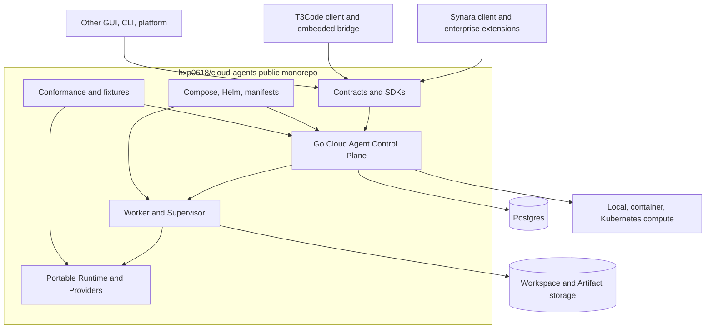

# 02. 目标架构

## 0. 当前目标：基础设施底座与应用分层

产品边界与优先级依据 [ADR-0031](../adr/0031-foundation-first-cloud-workspace-platform.md)。本节是据此整理的
目标方案，不是当前实现声明；原有 Agent/Host 协议、安全和消费者兼容要求仍保留。

### 0.1 逻辑结构与最小部署

```text
用户 CloudAgents（后续）       Workspace CLI/SDK/通用客户端       Admin Web（阶段配套）
         └──────────────────────────┬─────────────────────────────┘
                         公共基础设施 API / 专用 Admin API
                                    │
                 Go Control Plane + PostgreSQL（唯一控制状态 writer）
                 Workspace / Sandbox / Operation / Policy / Placement
                                    │
                       Controller：持久化任务与状态调谐
                                    │
             单 Region 执行与访问层（区域边界保留，先不拆业务微服务）
               ├── Runtime Adapter → OpenSandbox 候选 → Docker / Kubernetes
               ├── Access Gateway → PTY / Files / Preview / SSH
               └── Worker Gateway ← 客户节点主动连接的 RemoteWorker
                                          └── 本地受控执行器 → Sandbox
```

Control Plane 先复用当前 Go 模块做模块化单体；Controller 必须能脱离请求、独立恢复，不要求先拆独立仓库。
高带宽 Access/Worker Gateway 按访问阶段交付可独立运行的进程；单 Region 可同机部署。
图是职责和信任边界，不要求每个框一个微服务。底座部署不要求启动 Agent Runtime。

### 0.2 聚合、归属与生命周期

| 对象 | 生命周期/authority | 关键关系 |
| --- | --- | --- |
| Workspace | 长期；CP 管理元数据与删除意图 | tenant/project、Volume、模板/仓库引用、保留策略、允许 region |
| Volume / WorkspaceSnapshot | 独立于计算实例；CP 写绑定，存储 adapter 写物理资源 | workspaceId、backendRef、容量、快照 manifest/digest、保留期 |
| SandboxSession | 一次可替换运行；CP 写 desired/observed/generation | workspaceId、runtimeProfile、placement、operation、endpoint 引用 |
| Region / ResourcePool / DeploymentTarget | 调度与物理接入范围 | ownership、位置、runtime/arch/capacity；Kubernetes 保留自身节点调度 |
| RemoteWorker | 客户或平台节点上的长期 Agent | ownerScope、节点身份/证书、incarnation、能力、心跳、drain 状态 |
| SandboxAgent / 执行 Worker | Sandbox 内的受控命令和文件服务 | 不作为 RemoteWorker；Agent Runtime 可选安装 |
| Operation / UsageEvent | durable；CP 校验后持久化 | 幂等键、对象/generation、receipt、重试、不可变用量事实 |
| AgentSession / Turn / Execution | 上层应用 authority | 引用 Workspace/Sandbox，不拥有物理卷的销毁权 |

`infraProvider` 表示资源归属/来源，`isolationRuntime` 表示 runc/gVisor/Kata 等隔离方式，
`agentProvider` 才表示 Codex/Claude。现有 `EnvironmentProfile.providerKinds` 属于第三类，不能改名冒充
前两类。基础 RuntimeProfile 不要求 providerCredentialRef；Agent 专属默认值通过上层模板/绑定组合。

停止 Sandbox、TTL 到期或清理计算残留，只回收计算与访问授权；默认保留 Workspace/Volume。
Workspace 删除是独立的、带授权与影响范围的操作；快照保留/删除规则须单列。暂停仅在 runtime 已验证支持时
开放，不把停止后重建声称为进程内存无损恢复。默认一个 Workspace 只有一个 writable attachment，
按 generation fencing；跨节点重挂必须先证明旧写入者失效，不能仅凭心跳超时强挂。

### 0.3 调谐和单一副作用 owner

创建/变更 API 在事务中写入 desired state、Operation 和待执行事实后返回 `202 + operationId`；
Controller 认领任务，调用 adapter，验证 observation/receipt 后推进状态，使用有界退避、重试和告警。
浏览器关闭、请求断开或 CP/Controller 重启都不撤销已接受的用户意图；取消须是显式操作。
外部资源仍携带 tenant/project/workspace/sandbox/generation/operation/release 的归属信息。

CP 负责产品意图与恢复；OpenSandbox/底层 runtime 负责物理执行，二者不争抢同一物理对象的写入权。
复用现有幂等、outbox、租约认领、fencing 和 receipt 机制，先接通真实循环，不重建第二套任务内核。
Resource health observer 只提供观察，不替代生命周期调谐、到期回收与 orphan adoption。

### 0.4 Runtime、节点接入与访问安全

- OpenSandbox 是优先验证候选。BASE-M0 固定版本并验证生命周期、Exec/Files、卷挂载、标签/引用恢复，
  不假定上游已满足本平台的持久性、多租户和凭据语义。旧直连 actuator 保留兼容；同一对象不同时交两套执行器管理。
- RemoteWorker 使用一次性短期 enrollment、CSR、短期 mTLS 证书和主动 outbound 长连接。
  注册令牌由授权 CLI 的独立 `no-store` 一次性交付通道领取，不因增加节点注册而让 Admin Web 读取 Secret bytes。
  命令绑定 ownerScope、sandbox/generation、commandId、deadline；断线后先对账，不盲目重放。
- 离线节点停止新调度，既有 workload 按明确 lease/expiry 策略处理；失联不等于已销毁，不触发 Workspace 删除。
  未 fence 的旧节点恢复不能覆盖新 generation；支持 drain、证书轮换/吊销和节点版本兼容检查。
- 用户 PTY/Files/Preview/SSH 通过 Access Gateway 校验 tenant/project/workspace/sandbox/generation 与短期 grant。
  不接受用户指定任意跳转目标；Preview 默认私有；SSH 使用短期凭据而非客户主机长期 SSH 登录。
- 网络策略必须在执行环境实际生效：受控 DNS、metadata/宿主机/控制面/跨租户阻断、出网规则及撤销。
  policy CRUD、单独 mTLS 或 container non-root 不构成完整隔离证据；不支持的策略和 runtime tier 必须 fail closed。
- User/Admin API 使用独立 audience/scope；RemoteWorker、Gateway、actuator 身份不能替代用户或管理员身份。
  Admin 只看运维元数据，不看用户内容；数据接口返回内容必须经过用户所有权与路径边界检查。

### 0.5 现有实现的承接边界

现有 Lease-backed Worker、HTTP 内同步 actuator、Agent Profile、健康观察和 JWKS 接入均作为可复用的当前基础，
不把它们改名宣称为新模型已完成。以新 API/schema 的兼容扩展接入 Workspace/Sandbox，保留旧调用方和活动 Lease。
旧 Lease 的卷仍按其原语义处理；向长期 Workspace 转换须有显式 adopt/migration 操作、归属核验与恢复方案，
不能因本次文档调整就自动改 TTL、保留策略、绑定或删除任何现有数据。

实施顺序见 [04 的 BASE-M0～M5](04-extraction-and-migration.md#0-当前实施顺序底座先行)，
不再按下文旧消费者拓扑的出现顺序决定优先级。

## 1. 既有消费者与兼容拓扑



Synara/T3/其他宿主都不 import Control Plane 的私有 Go 包；它们消费公共 OpenAPI/TS/Go SDK、CLI 或
immutable service image。公共仓自身必须能在 Compose 和 Kubernetes profile 中完成部署。

### 1.1 P1 contract 与 transport authority

P1 不用一个 IDL 模糊覆盖所有链路。每条公开 wire 的唯一 source of truth 固定如下；详细 rationale 由
[ADR-0007](../adr/0007-p1-contract-data-toolchain-foundation.md) 记录，冻结 digest 进入 P1 contract evidence。

| Surface                                 | Transport                             | Wire source of truth                                                                                                                      | 生成/消费规则                                                                                                                    |
| --------------------------------------- | ------------------------------------- | ----------------------------------------------------------------------------------------------------------------------------------------- | -------------------------------------------------------------------------------------------------------------------------------- |
| Management、Managed Agent、Managed Host | OpenAPI 3.1 HTTP/JSON                 | domain/common/platform JSON Schema 是 JSON data model authority；OpenAPI 只拥有 path、operation、status、header/security 并 `$ref` schema | 生成 TS/Go HTTP client、server interface 和 validator；禁止从 Go/TS struct 反向生成 schema                                       |
| Worker/Supervisor、Platform Adapter     | Proto3 + ConnectRPC；仓外 HTTP/2 mTLS | `.proto` 是该 RPC message/service 的唯一 wire authority                                                                                   | 生成 Go message/Connect client/server 并保持声明的 gRPC compatibility；需要 TS consumer 时从同一 descriptor 生成，不手写平行 DTO |
| Portable Runtime/Provider process       | 现有 stdio/event protocol             | `contracts/runtime/v2` 与七包既有 schema                                                                                                  | P1 不改 wire identity；平台只按 immutable Runtime contract digest 引用                                                           |

公共 `contracts/common/v1alpha1` 保存 `NamespaceRef`、stable error、cursor、idempotency 等跨 domain JSON
primitive；`contracts/platform/v1alpha1` 保存 tenant/organization/project、neutral RBAC 与 authority facts。
managed-agent/managed-host 的 OpenAPI 只能引用这些公共 JSON Schema，不得复制 field definition。
worker/platform-adapter 的共用 RPC message 放在其 Proto import graph 中，不得以 OpenAPI component 作为 RPC
descriptor。

JSON Schema 不从 OpenAPI 或语言类型生成；OpenAPI bundle 解析并校验所有 `$ref` 后再驱动 HTTP client/server
生成。Proto 与 JSON Schema 也不互相生成：同一语义跨两条 transport 出现时，以显式 mapping、共同
`NamespaceRef` canonical rule 和 golden/negative semantic fixture 检验等价，不制造两个 writer。所有生成
命令必须读取仓内 generator lock，产物 manifest 绑定输入 digest、generator name/version/image-or-binary
digest、参数和输出 digest；CI 在 clean tree 重生成并要求 byte-identical。

## 2. 既有 Control Plane 的两条消费者业务平面（兼容保留）

### 2.1 Managed Agent API

最小 API：

- PlatformTenant/PlatformOrganization/PlatformProject/basic membership；
- Session create/get/close；
- Turn create/get/interrupt/steer；
- approval/user-input response；
- event stream + durable cursor；
- Artifact/checkpoint/usage projection；
- credential profile reference；
- execution retry/recovery。

该平面是 Synara native 的公共替代路径。公共 CP、Worker 和 Workspace 是同一 authority chain。

### 2.2 Managed Host API

最小 API：

- CloudEnvironmentLease create/get/terminate/watch；
- Generation claim/heartbeat/ready/revoke/reap；
- T3 release/runtime manifest pin；
- volume/workload/endpoint/broker lifecycle；
- generation-bound pairing mint/revoke；mint 通过独立 ephemeral `no-store` response 返回一次性 URL；
- audit/metering facts。

该平面只供给环境。T3 Turn、Git 和 checkpoint 仍由 lease 内 T3 server 处理。

## 3. 既有 Agent/Host 服务职责（兼容与复用）

| 服务/组件                       | 职责                                                     | 持久化                                                 |
| ------------------------------- | -------------------------------------------------------- | ------------------------------------------------------ |
| `cloud-agent-control-plane`     | API、auth、state machine、idempotency、outbox、reconcile | Postgres                                               |
| `cloud-agent-worker-supervisor` | claim、heartbeat、workload start/stop、generation fence  | local cache；operation/receipt/finalizer 由 CP durable |
| `cloud-agent-worker`            | Workspace、Runtime、Provider、Artifact、Broker client    | volume + runtime state                                 |
| `cloud-agent-runtime`           | Provider session/Turn/event normalization                | host-bound cursor/state                                |
| `cloud-agent-cli`               | bootstrap、admin、diagnostic、upgrade/rollback           | local config only                                      |
| SDKs                            | TS/Go API client、watch cursor、stable errors            | consumer owned                                         |

## 4. 既有 Agent/Host 数据聚合（新底座聚合见 0.2）

```text
PlatformTenant / PlatformOrganization / PlatformProject / Membership

CloudAgentSession
└── Turn
    └── Execution
        ├── WorkerBinding / Generation
        ├── WorkspaceBinding / CheckpointRef
        ├── CredentialGrantRef
        ├── ArtifactRef
        └── Event / UsageFact

CloudEnvironmentLease
└── CloudEnvironmentGeneration
    ├── WorkloadBinding
    ├── VolumeBinding
    ├── EndpointBinding
    ├── CredentialGrantRef
    └── Attestation / MeteringFact

PlatformOperation
└── OperationAttempt / Receipt / Finalizer
```

Managed Agent 与 Managed Host 可以共享 Organization、Project、Worker、Release、Artifact 和 Credential
primitive，但不能把 `Turn` 和 `CloudEnvironmentLease` 合成一张表，也不能让 T3 Thread 成为 CP Turn。

## 5. 状态与清理

所有长生命周期聚合分别记录：

- `desired_phase`：调用者期望；
- `observed_phase`：系统观察；
- `cleanup_phase`：`none|pending|revoking|draining|reaping|complete|blocked`；
- `generation` 与 `resource_version`；
- stable failure code + redacted detail；
- finalizer/revoke/reap evidence。

`failed` 不等于已回收。只有 cleanup complete 才能停止 reconciliation；`blocked` 必须 fence admission、告警
并创建人工恢复 record。

所有外部资源都携带 aggregate/generation/operation/release labels。`PlatformOperation`、Attempt、Receipt 与
Finalizer 在 Postgres 持久化；Supervisor 的本地状态只作 cache。资源创建成功但 receipt 提交前 crash 时，
reconciler 必须能按标签发现、adopt 或补偿回收。

持久化模型只记录可重放的非秘密控制事实。一次性 pairing URL/token、Provider secret 和 broker grant secret
不是 Receipt payload，必须走独立 ephemeral secret channel；durable Receipt 只保存引用、scope、expiry、
generation、摘要与状态。

## 6. Adapter 与扩展模型

公共服务直接内置可部署 adapter：

- Postgres store/outbox/leader；
- standard OIDC/JWKS 与 local admin；
- local process、rootless Podman/受控 remote container actuator 与 Kubernetes scheduler；CP/Worker 不挂载
  Docker socket；
- local filesystem、PVC 与 S3-compatible object storage；
- static/Kubernetes ingress；
- local encrypted secret、Vault/KMS-compatible broker interface；
- OTLP audit/metrics sink。

Synara 专属能力通过版本化、out-of-process Platform Adapter Protocol 接入，不能要求重编公共 binary：

- identity/entitlement decision；
- private scheduler/volume/ingress；
- enterprise KMS/HSM/credential broker；
- billing/audit/compliance sink。

Adapter protocol 使用 mTLS/workload identity、capability negotiation、lease/generation/operationId/fencing token、
bounded deadline 和 idempotent receipt。公共 deployment 不配置任何 Synara adapter 时仍必须完整可运行。

这里的 adapter wire 固定为 [ADR-0007](../adr/0007-p1-contract-data-toolchain-foundation.md) 所述
Proto3/ConnectRPC/mTLS；HTTP/JSON management API 不作为私有 adapter 的旁路。mTLS 只建立 workload
identity，仍须逐请求校验 capability、scope、lease/generation、fencing token 与 deadline。

## 7. 五类身份

| 身份                    | 用途                                 | 不得替代          |
| ----------------------- | ------------------------------------ | ----------------- |
| Management user/client  | 创建项目、Session、Lease             | Supervisor/Worker |
| Supervisor workload     | claim/heartbeat/ready/reap           | 用户 session      |
| T3 proof-bound session  | 连接 leased T3                       | CP admin/Broker   |
| Credential Broker grant | 单 Provider/operation secret access  | CP/用户 token     |
| Platform actuator       | scheduler/volume/ingress side effect | Supervisor/user   |

generation 只是排序和 fencing sequence；每一类身份仍需不可猜测、短时、可撤销的 credential/scope。

## 8. T3 managed 连接

T3 当前 direct pairing 保存 Bearer，而 Relay 路径已有 DPoP。目标设计固定为：

- 新增 T3 内部 `ManagedConnectionTarget`/profile/credential；
- direct 使用 `bootstrapRemoteDpopSession` 或等价 proof challenge/exchange；
- relay 复用 `authorizeDpop`；
- 两条 transport 共用 issuer/audience/scope/proof/revoke conformance；
- managed profile 不广告、不保存、不自动回退 Bearer；
- pairing token 单次、TTL 不超过 5 分钟、仅放 URL fragment，响应 `Cache-Control: no-store`。

Pairing authority 固定在 lease 内 T3 auth service，且 secret delivery 与 durable operation 完全分离：

1. CP 通过 generation-bound Supervisor admin operation 请求创建 pairing；
2. T3 mint token、只持久化 token hash + lease/generation/subject/scope/expiry；它同时产生两种不同结果：
   - request-scoped ephemeral response：一次性 URL/token，只允许在内存中沿 `Cache-Control: no-store`、
     全链路 redacted 的响应通道转发给调用者；
   - durable receipt：只含 opaque `pairingRef`、lease/generation/subject/scope/expiry/status，不含 URL、token
     或 hash，可进入 PlatformOperation/outbox/audit；
3. T3 `/oauth/token` 原子 consume hash、校验当前 generation/proof challenge，并签发 proof-bound session；
4. CP rollover/terminate 先 fence ingress，再要求 T3 revoke 旧 generation 的 link/session，并等待
   generation-bound receipt；未收到 receipt 时保持 endpoint fenced；
5. T3 是 link/session mint/consume/revoke writer；CP 是 lease generation/admission writer。双方只通过
   `pairingRef` 与 operation receipt 协调；
6. ephemeral response 若在客户端确认前丢失，CP 必须先按 `pairingRef` 请求 T3 revoke，再发起新的 mint；
   不得从 receipt、outbox、audit、log 或 trace 重放 pairing secret。同一个 claim/idempotency retry 也不
   返回旧 secret，只能明确 rotate/reissue；HTTP response 最多记录 `delivery-attempted`，不能声称客户端
   已收到。

建议 API 将 Lease ready 与 secret issuance 分开：
`POST /v1alpha1/environment-leases/{leaseId}:claimPairing` 返回一次性 ephemeral
response，`GET/WATCH /leases/{leaseId}` 只返回 endpoint、pairingRef、expiry 和 operation status。异步 watch
和 webhook 永不携带 token。

T3 auth store 的 verification record 只保存 grant ID、keyed verifier、verifier key version、lease/environment/
generation、subject ref、scope digest、proof-required、issued/expiry/consumed/revoked timestamps。verifier 使用
KMS/secret-store key 做 domain-separated HMAC-SHA-256，比较必须 constant-time；consume 与 DPoP `cnf.jkt`
session issuance 原子完成，并发 consume 只能一个成功。原始 secret、verifier key、DPoP private key 均不得
进入 durable receipt。

## 9. API 可靠性 contract

所有 Management/Managed Agent/Managed Host/Worker API 在 v1alpha1 freeze 前必须定义：

- cursor pagination、稳定排序和最大 page size；
- Idempotency-Key 的 tenant/action scope、TTL、canonical request hash 与 payload-conflict；
- watch cursor 的 retention、compaction、gap、resync snapshot 和 reconnect backoff；
- per-aggregate event ordering、全局不承诺 total order；
- request/message/frame/payload 上限，大内容 Artifact 化；
- stable error code、retryable flag、`Retry-After`、deadline/cancellation；
- N/N-1 reader 与 unknown-field preservation；
- quota/admission/backpressure 与 noisy-neighbor 隔离。

## 10. 独立部署 profile

### Local / Docker Compose

- Control Plane、Postgres、MinIO-compatible storage、Worker/Supervisor；
- local/container scheduler；
- local OIDC/dev admin；
- Provider credential 只通过显式 Compose secret/CLI bootstrap 注入；生成独立 master key 并支持 rotation，
  不读取 ambient shell login；
- 适合开发、CI、单机自托管，不标生产 HA。

### Kubernetes / Helm

- 多副本 API + 单 leader/reconciler；
- external Postgres、S3/PVC、Kubernetes scheduler/ingress；
- OIDC/JWKS、mTLS workload identity、network policy；
- Provider credential 通过 Kubernetes Secret/Vault/KMS adapter 显式引用；
- backup/restore、expand/contract migration、rolling upgrade/rollback；
- single-region first；multi-region active-active 延后。

### Embedded Runtime only

- 只安装七包/standalone；
- 不启动 Postgres/CP/Worker；
- 保持 T3 本地轻量路径。

## 11. 管理体验边界

底座提供完整 API、generated SDK、CLI bootstrap/admin/diagnostic 和可重放示例，不依赖用户 CloudAgents
或 Synara/T3 才能操作。Admin Web 不再整体延后：按 [07](07-admin-web-requirements-and-design.md)
随各 BASE 阶段提供真实资源、Operation、策略和审计视图。用户内容只能由有权用户通过数据接口访问。
阶段后端开发不等待整套视觉页面，但底座配套交付必须完成对应 Admin 安全、操作和视觉验收。
