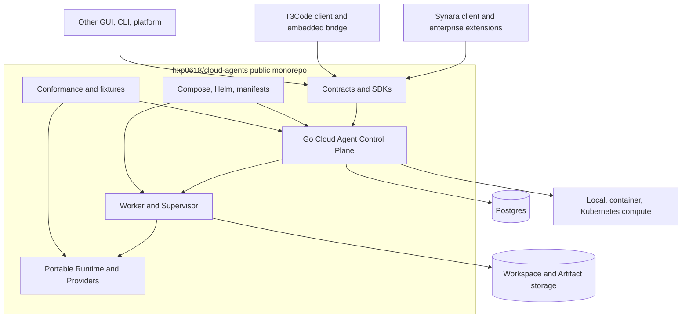

# 02. 目标架构

## 1. 总体拓扑



Synara/T3/其他宿主都不 import Control Plane 的私有 Go 包；它们消费公共 OpenAPI/TS/Go SDK、CLI 或
immutable service image。公共仓自身必须能在 Compose 和 Kubernetes profile 中完成部署。

## 2. Control Plane 的两条业务平面

### 2.1 Managed Agent API

最小 API：

- PlatformTenant/PlatformOrganization/PlatformProject/basic membership；
- Session create/get/close；
- Turn create/get/interrupt/steer；
- approval/user-input response；
- event stream + durable cursor；
- Artifact/checkpoint/usage projection；
- credential profile reference；
- execution retry/recovery。

该平面是 Synara native 的公共替代路径。公共 CP、Worker 和 Workspace 是同一 authority chain。

### 2.2 Managed Host API

最小 API：

- CloudEnvironmentLease create/get/terminate/watch；
- Generation claim/heartbeat/ready/revoke/reap；
- T3 release/runtime manifest pin；
- volume/workload/endpoint/broker lifecycle；
- generation-bound pairing mint/revoke；mint 通过独立 ephemeral `no-store` response 返回一次性 URL；
- audit/metering facts。

该平面只供给环境。T3 Turn、Git 和 checkpoint 仍由 lease 内 T3 server 处理。

## 3. 核心服务

| 服务/组件                       | 职责                                                     | 持久化                                                 |
| ------------------------------- | -------------------------------------------------------- | ------------------------------------------------------ |
| `cloud-agent-control-plane`     | API、auth、state machine、idempotency、outbox、reconcile | Postgres                                               |
| `cloud-agent-worker-supervisor` | claim、heartbeat、workload start/stop、generation fence  | local cache；operation/receipt/finalizer 由 CP durable |
| `cloud-agent-worker`            | Workspace、Runtime、Provider、Artifact、Broker client    | volume + runtime state                                 |
| `cloud-agent-runtime`           | Provider session/Turn/event normalization                | host-bound cursor/state                                |
| `cloud-agent-cli`               | bootstrap、admin、diagnostic、upgrade/rollback           | local config only                                      |
| SDKs                            | TS/Go API client、watch cursor、stable errors            | consumer owned                                         |

## 4. 公共数据聚合

```text
PlatformTenant / PlatformOrganization / PlatformProject / Membership

CloudAgentSession
└── Turn
    └── Execution
        ├── WorkerBinding / Generation
        ├── WorkspaceBinding / CheckpointRef
        ├── CredentialGrantRef
        ├── ArtifactRef
        └── Event / UsageFact

CloudEnvironmentLease
└── CloudEnvironmentGeneration
    ├── WorkloadBinding
    ├── VolumeBinding
    ├── EndpointBinding
    ├── CredentialGrantRef
    └── Attestation / MeteringFact

PlatformOperation
└── OperationAttempt / Receipt / Finalizer
```

Managed Agent 与 Managed Host 可以共享 Organization、Project、Worker、Release、Artifact 和 Credential
primitive，但不能把 `Turn` 和 `CloudEnvironmentLease` 合成一张表，也不能让 T3 Thread 成为 CP Turn。

## 5. 状态与清理

所有长生命周期聚合分别记录：

- `desired_phase`：调用者期望；
- `observed_phase`：系统观察；
- `cleanup_phase`：`none|pending|revoking|draining|reaping|complete|blocked`；
- `generation` 与 `resource_version`；
- stable failure code + redacted detail；
- finalizer/revoke/reap evidence。

`failed` 不等于已回收。只有 cleanup complete 才能停止 reconciliation；`blocked` 必须 fence admission、告警
并创建人工恢复 record。

所有外部资源都携带 aggregate/generation/operation/release labels。`PlatformOperation`、Attempt、Receipt 与
Finalizer 在 Postgres 持久化；Supervisor 的本地状态只作 cache。资源创建成功但 receipt 提交前 crash 时，
reconciler 必须能按标签发现、adopt 或补偿回收。

持久化模型只记录可重放的非秘密控制事实。一次性 pairing URL/token、Provider secret 和 broker grant secret
不是 Receipt payload，必须走独立 ephemeral secret channel；durable Receipt 只保存引用、scope、expiry、
generation、摘要与状态。

## 6. Adapter 与扩展模型

公共服务直接内置可部署 adapter：

- Postgres store/outbox/leader；
- standard OIDC/JWKS 与 local admin；
- local process、rootless Podman/受控 remote container actuator 与 Kubernetes scheduler；CP/Worker 不挂载
  Docker socket；
- local filesystem、PVC 与 S3-compatible object storage；
- static/Kubernetes ingress；
- local encrypted secret、Vault/KMS-compatible broker interface；
- OTLP audit/metrics sink。

Synara 专属能力通过版本化、out-of-process Platform Adapter Protocol 接入，不能要求重编公共 binary：

- identity/entitlement decision；
- private scheduler/volume/ingress；
- enterprise KMS/HSM/credential broker；
- billing/audit/compliance sink。

Adapter protocol 使用 mTLS/workload identity、capability negotiation、lease/generation/operationId/fencing token、
bounded deadline 和 idempotent receipt。公共 deployment 不配置任何 Synara adapter 时仍必须完整可运行。

## 7. 五类身份

| 身份                    | 用途                                 | 不得替代          |
| ----------------------- | ------------------------------------ | ----------------- |
| Management user/client  | 创建项目、Session、Lease             | Supervisor/Worker |
| Supervisor workload     | claim/heartbeat/ready/reap           | 用户 session      |
| T3 proof-bound session  | 连接 leased T3                       | CP admin/Broker   |
| Credential Broker grant | 单 Provider/operation secret access  | CP/用户 token     |
| Platform actuator       | scheduler/volume/ingress side effect | Supervisor/user   |

generation 只是排序和 fencing sequence；每一类身份仍需不可猜测、短时、可撤销的 credential/scope。

## 8. T3 managed 连接

T3 当前 direct pairing 保存 Bearer，而 Relay 路径已有 DPoP。目标设计固定为：

- 新增 T3 内部 `ManagedConnectionTarget`/profile/credential；
- direct 使用 `bootstrapRemoteDpopSession` 或等价 proof challenge/exchange；
- relay 复用 `authorizeDpop`；
- 两条 transport 共用 issuer/audience/scope/proof/revoke conformance；
- managed profile 不广告、不保存、不自动回退 Bearer；
- pairing token 单次、TTL 不超过 5 分钟、仅放 URL fragment，响应 `Cache-Control: no-store`。

Pairing authority 固定在 lease 内 T3 auth service，且 secret delivery 与 durable operation 完全分离：

1. CP 通过 generation-bound Supervisor admin operation 请求创建 pairing；
2. T3 mint token、只持久化 token hash + lease/generation/subject/scope/expiry；它同时产生两种不同结果：
   - request-scoped ephemeral response：一次性 URL/token，只允许在内存中沿 `Cache-Control: no-store`、
     全链路 redacted 的响应通道转发给调用者；
   - durable receipt：只含 opaque `pairingRef`、lease/generation/subject/scope/expiry/status，不含 URL、token
     或 hash，可进入 PlatformOperation/outbox/audit；
3. T3 `/oauth/token` 原子 consume hash、校验当前 generation/proof challenge，并签发 proof-bound session；
4. CP rollover/terminate 先 fence ingress，再要求 T3 revoke 旧 generation 的 link/session，并等待
   generation-bound receipt；未收到 receipt 时保持 endpoint fenced；
5. T3 是 link/session mint/consume/revoke writer；CP 是 lease generation/admission writer。双方只通过
   `pairingRef` 与 operation receipt 协调；
6. ephemeral response 若在客户端确认前丢失，CP 必须先按 `pairingRef` 请求 T3 revoke，再发起新的 mint；
   不得从 receipt、outbox、audit、log 或 trace 重放 pairing secret。同一个 claim/idempotency retry 也不
   返回旧 secret，只能明确 rotate/reissue；HTTP response 最多记录 `delivery-attempted`，不能声称客户端
   已收到。

建议 API 将 Lease ready 与 secret issuance 分开：
`POST /v1alpha1/environment-leases/{leaseId}:claimPairing` 返回一次性 ephemeral
response，`GET/WATCH /leases/{leaseId}` 只返回 endpoint、pairingRef、expiry 和 operation status。异步 watch
和 webhook 永不携带 token。

T3 auth store 的 verification record 只保存 grant ID、keyed verifier、verifier key version、lease/environment/
generation、subject ref、scope digest、proof-required、issued/expiry/consumed/revoked timestamps。verifier 使用
KMS/secret-store key 做 domain-separated HMAC-SHA-256，比较必须 constant-time；consume 与 DPoP `cnf.jkt`
session issuance 原子完成，并发 consume 只能一个成功。原始 secret、verifier key、DPoP private key 均不得
进入 durable receipt。

## 9. API 可靠性 contract

所有 Management/Managed Agent/Managed Host/Worker API 在 v1alpha1 freeze 前必须定义：

- cursor pagination、稳定排序和最大 page size；
- Idempotency-Key 的 tenant/action scope、TTL、canonical request hash 与 payload-conflict；
- watch cursor 的 retention、compaction、gap、resync snapshot 和 reconnect backoff；
- per-aggregate event ordering、全局不承诺 total order；
- request/message/frame/payload 上限，大内容 Artifact 化；
- stable error code、retryable flag、`Retry-After`、deadline/cancellation；
- N/N-1 reader 与 unknown-field preservation；
- quota/admission/backpressure 与 noisy-neighbor 隔离。

## 10. 独立部署 profile

### Local / Docker Compose

- Control Plane、Postgres、MinIO-compatible storage、Worker/Supervisor；
- local/container scheduler；
- local OIDC/dev admin；
- Provider credential 只通过显式 Compose secret/CLI bootstrap 注入；生成独立 master key 并支持 rotation，
  不读取 ambient shell login；
- 适合开发、CI、单机自托管，不标生产 HA。

### Kubernetes / Helm

- 多副本 API + 单 leader/reconciler；
- external Postgres、S3/PVC、Kubernetes scheduler/ingress；
- OIDC/JWKS、mTLS workload identity、network policy；
- Provider credential 通过 Kubernetes Secret/Vault/KMS adapter 显式引用；
- backup/restore、expand/contract migration、rolling upgrade/rollback；
- single-region first；multi-region active-active 延后。

### Embedded Runtime only

- 只安装七包/standalone；
- 不启动 Postgres/CP/Worker；
- 保持 T3 本地轻量路径。

## 11. 管理体验边界

首个 Platform RC 必须提供完整 API、generated SDK、`cloud-agent-cli` bootstrap/admin/diagnostic 和可重放
示例。公共管理 Web UI 明确列为 Deferred UI track，不阻塞首个 API-first RC；Synara/T3 可以作为首批 UI
consumer，但不能成为独立部署的安装前提。
